# Introduction to box and violin plots

Box plots and their cousins, violin plots, are some of the simplest
visualizations. These plots are a means of visualizing the distribution
of a single continuous variable. Box and violin plots can be split to
compare distributions between groups.

## Box plot

The rectangular box that gives a box plot its name is drawn around the
interquartile range (IQR) of the distribution, with a line marking the
median, and whiskers extending to 1.5 times the IQR on either side.
Outliers may be indicated with points.

## Violin plot

Instead of quantile markings, violin plot has variable width designed to
help the reader perceive the density of data.

# Set-up

In this chapter, we will begin with the fundamentals of assembling a box
plot, and then layer on additional information using graphical
attributes like color and annotation text, and modify plot elements to
customize figure appearance and improve readability.

## Packages

We will be working extensively with ggplot2 over the course of this
workshop. Part of the tidyverse ecosystem, ggplot2 is a comprehensive,
flexible framework for producing highly customizable graphics of many
types. We will also make use of dplyr, another tidyverse package, to
clean and reshape data before plotting.

``` r
library(dplyr)
library(tidyr)
library(magrittr)
library(kableExtra)
library(ggplot2)
library(ggsignif)
library(ggExtra)
```

## Data

We’ll use gene expression data from a single cell experiment for these
plots. Typically this sort of data is stored in a complex structure
which retains expression data and experiment metadata together in a
single object. In this case, we will be using a Seurat object created in
one of our single cell RNA-Seq workshops.

``` r
experiment.data <- readRDS("scRNA_workshop-05.rds")
```

This workshop does not aim to give a comprehensive understanding of the
Seurat workflow and object; the relevant data for the purposes of box
and violin plots are the scaled counts and experiment metadata.

Normalized expression data is stored in the “data” slot, and can be
accessed as follows:

``` r
experiment.data@assays$RNA$data
```

The metadata is stored in another slot within this object.

``` r
experiment.data@meta.data %>%
  slice(1:50) %>%
  kable() %>%
  kable_styling("striped", fixed_thead = TRUE) %>%
  scroll_box(height = "200px")
```

<div style="border: 1px solid #ddd; padding: 0px; overflow-y: scroll; height:200px; ">

<table class="table table-striped" style="margin-left: auto; margin-right: auto;">

<thead>

<tr>

<th style="text-align:left;position: sticky; top:0; background-color: #FFFFFF;position: sticky; top:0; background-color: #FFFFFF;">

</th>

<th style="text-align:left;position: sticky; top:0; background-color: #FFFFFF;position: sticky; top:0; background-color: #FFFFFF;">

orig.ident
</th>

<th style="text-align:right;position: sticky; top:0; background-color: #FFFFFF;position: sticky; top:0; background-color: #FFFFFF;">

nCount_RNA
</th>

<th style="text-align:right;position: sticky; top:0; background-color: #FFFFFF;position: sticky; top:0; background-color: #FFFFFF;">

nFeature_RNA
</th>

<th style="text-align:left;position: sticky; top:0; background-color: #FFFFFF;position: sticky; top:0; background-color: #FFFFFF;">

group
</th>

<th style="text-align:left;position: sticky; top:0; background-color: #FFFFFF;position: sticky; top:0; background-color: #FFFFFF;">

run
</th>

<th style="text-align:right;position: sticky; top:0; background-color: #FFFFFF;position: sticky; top:0; background-color: #FFFFFF;">

percent_MT
</th>

<th style="text-align:right;position: sticky; top:0; background-color: #FFFFFF;position: sticky; top:0; background-color: #FFFFFF;">

S.Score
</th>

<th style="text-align:right;position: sticky; top:0; background-color: #FFFFFF;position: sticky; top:0; background-color: #FFFFFF;">

G2M.Score
</th>

<th style="text-align:left;position: sticky; top:0; background-color: #FFFFFF;position: sticky; top:0; background-color: #FFFFFF;">

Phase
</th>

<th style="text-align:left;position: sticky; top:0; background-color: #FFFFFF;position: sticky; top:0; background-color: #FFFFFF;">

old.ident
</th>

<th style="text-align:left;position: sticky; top:0; background-color: #FFFFFF;position: sticky; top:0; background-color: #FFFFFF;">

RNA_snn_res.0.1
</th>

<th style="text-align:left;position: sticky; top:0; background-color: #FFFFFF;position: sticky; top:0; background-color: #FFFFFF;">

RNA_snn_res.0.2
</th>

<th style="text-align:left;position: sticky; top:0; background-color: #FFFFFF;position: sticky; top:0; background-color: #FFFFFF;">

RNA_snn_res.0.3
</th>

<th style="text-align:left;position: sticky; top:0; background-color: #FFFFFF;position: sticky; top:0; background-color: #FFFFFF;">

RNA_snn_res.0.4
</th>

<th style="text-align:left;position: sticky; top:0; background-color: #FFFFFF;position: sticky; top:0; background-color: #FFFFFF;">

seurat_clusters
</th>

<th style="text-align:left;position: sticky; top:0; background-color: #FFFFFF;position: sticky; top:0; background-color: #FFFFFF;">

res.0.4_merged
</th>

<th style="text-align:left;position: sticky; top:0; background-color: #FFFFFF;position: sticky; top:0; background-color: #FFFFFF;">

subcluster
</th>

<th style="text-align:left;position: sticky; top:0; background-color: #FFFFFF;position: sticky; top:0; background-color: #FFFFFF;">

subcluster_ScType
</th>

<th style="text-align:left;position: sticky; top:0; background-color: #FFFFFF;position: sticky; top:0; background-color: #FFFFFF;">

subcluster_ScType_filtered
</th>

<th style="text-align:left;position: sticky; top:0; background-color: #FFFFFF;position: sticky; top:0; background-color: #FFFFFF;">

finalcluster
</th>

</tr>

</thead>

<tbody>

<tr>

<td style="text-align:left;">

AAACCCAAGTTATGGA_A001-C-007
</td>

<td style="text-align:left;">

A001-C-007
</td>

<td style="text-align:right;">

2043
</td>

<td style="text-align:right;">

1513
</td>

<td style="text-align:left;">

Colorectal Cancer
</td>

<td style="text-align:left;">

A00509:126:HTLFWDMXX:1
</td>

<td style="text-align:right;">

0.5717008
</td>

<td style="text-align:right;">

0.0242106
</td>

<td style="text-align:right;">

-0.1155330
</td>

<td style="text-align:left;">

S
</td>

<td style="text-align:left;">

A001-C-007
</td>

<td style="text-align:left;">

1
</td>

<td style="text-align:left;">

1
</td>

<td style="text-align:left;">

1
</td>

<td style="text-align:left;">

2
</td>

<td style="text-align:left;">

2
</td>

<td style="text-align:left;">

2
</td>

<td style="text-align:left;">

2
</td>

<td style="text-align:left;">

ENS glia
</td>

<td style="text-align:left;">

Unknown
</td>

<td style="text-align:left;">

2
</td>

</tr>

<tr>

<td style="text-align:left;">

AAACGCTTCTCTGCTG_A001-C-007
</td>

<td style="text-align:left;">

A001-C-007
</td>

<td style="text-align:right;">

1402
</td>

<td style="text-align:right;">

1038
</td>

<td style="text-align:left;">

Colorectal Cancer
</td>

<td style="text-align:left;">

A00509:126:HTLFWDMXX:1
</td>

<td style="text-align:right;">

1.1409396
</td>

<td style="text-align:right;">

0.2751272
</td>

<td style="text-align:right;">

0.8966284
</td>

<td style="text-align:left;">

G2M
</td>

<td style="text-align:left;">

A001-C-007
</td>

<td style="text-align:left;">

6
</td>

<td style="text-align:left;">

7
</td>

<td style="text-align:left;">

10
</td>

<td style="text-align:left;">

10
</td>

<td style="text-align:left;">

10
</td>

<td style="text-align:left;">

10
</td>

<td style="text-align:left;">

10
</td>

<td style="text-align:left;">

Lymphoid cells
</td>

<td style="text-align:left;">

Lymphoid cells
</td>

<td style="text-align:left;">

10
</td>

</tr>

<tr>

<td style="text-align:left;">

AAAGAACGTGCTTATG_A001-C-007
</td>

<td style="text-align:left;">

A001-C-007
</td>

<td style="text-align:right;">

1634
</td>

<td style="text-align:right;">

1136
</td>

<td style="text-align:left;">

Colorectal Cancer
</td>

<td style="text-align:left;">

A00509:126:HTLFWDMXX:1
</td>

<td style="text-align:right;">

0.4191617
</td>

<td style="text-align:right;">

-0.0708949
</td>

<td style="text-align:right;">

-0.0599297
</td>

<td style="text-align:left;">

G1
</td>

<td style="text-align:left;">

A001-C-007
</td>

<td style="text-align:left;">

1
</td>

<td style="text-align:left;">

1
</td>

<td style="text-align:left;">

5
</td>

<td style="text-align:left;">

5
</td>

<td style="text-align:left;">

5
</td>

<td style="text-align:left;">

5
</td>

<td style="text-align:left;">

5_1
</td>

<td style="text-align:left;">

Intestinal epithelial cells
</td>

<td style="text-align:left;">

Intestinal epithelial cells
</td>

<td style="text-align:left;">

5_1
</td>

</tr>

<tr>

<td style="text-align:left;">

AAAGAACGTTTCGCTC_A001-C-007
</td>

<td style="text-align:left;">

A001-C-007
</td>

<td style="text-align:right;">

1704
</td>

<td style="text-align:right;">

1193
</td>

<td style="text-align:left;">

Colorectal Cancer
</td>

<td style="text-align:left;">

A00509:126:HTLFWDMXX:1
</td>

<td style="text-align:right;">

0.4545455
</td>

<td style="text-align:right;">

0.0654961
</td>

<td style="text-align:right;">

1.0354100
</td>

<td style="text-align:left;">

G2M
</td>

<td style="text-align:left;">

A001-C-007
</td>

<td style="text-align:left;">

3
</td>

<td style="text-align:left;">

3
</td>

<td style="text-align:left;">

3
</td>

<td style="text-align:left;">

3
</td>

<td style="text-align:left;">

3
</td>

<td style="text-align:left;">

3
</td>

<td style="text-align:left;">

3
</td>

<td style="text-align:left;">

Intestinal epithelial cells
</td>

<td style="text-align:left;">

Unknown
</td>

<td style="text-align:left;">

3
</td>

</tr>

<tr>

<td style="text-align:left;">

AAAGAACTCTGGCTGG_A001-C-007
</td>

<td style="text-align:left;">

A001-C-007
</td>

<td style="text-align:right;">

949
</td>

<td style="text-align:right;">

814
</td>

<td style="text-align:left;">

Colorectal Cancer
</td>

<td style="text-align:left;">

A00509:126:HTLFWDMXX:1
</td>

<td style="text-align:right;">

0.6937562
</td>

<td style="text-align:right;">

-0.0377334
</td>

<td style="text-align:right;">

0.1175223
</td>

<td style="text-align:left;">

G2M
</td>

<td style="text-align:left;">

A001-C-007
</td>

<td style="text-align:left;">

4
</td>

<td style="text-align:left;">

5
</td>

<td style="text-align:left;">

7
</td>

<td style="text-align:left;">

8
</td>

<td style="text-align:left;">

8
</td>

<td style="text-align:left;">

8
</td>

<td style="text-align:left;">

8
</td>

<td style="text-align:left;">

Stromal cells
</td>

<td style="text-align:left;">

Stromal cells
</td>

<td style="text-align:left;">

8
</td>

</tr>

<tr>

<td style="text-align:left;">

AAAGGATTCATTACCT_A001-C-007
</td>

<td style="text-align:left;">

A001-C-007
</td>

<td style="text-align:right;">

1194
</td>

<td style="text-align:right;">

945
</td>

<td style="text-align:left;">

Colorectal Cancer
</td>

<td style="text-align:left;">

A00509:126:HTLFWDMXX:1
</td>

<td style="text-align:right;">

0.8071025
</td>

<td style="text-align:right;">

-0.0244222
</td>

<td style="text-align:right;">

0.1248186
</td>

<td style="text-align:left;">

G2M
</td>

<td style="text-align:left;">

A001-C-007
</td>

<td style="text-align:left;">

3
</td>

<td style="text-align:left;">

3
</td>

<td style="text-align:left;">

3
</td>

<td style="text-align:left;">

3
</td>

<td style="text-align:left;">

3
</td>

<td style="text-align:left;">

3
</td>

<td style="text-align:left;">

3
</td>

<td style="text-align:left;">

Intestinal epithelial cells
</td>

<td style="text-align:left;">

Unknown
</td>

<td style="text-align:left;">

3
</td>

</tr>

<tr>

<td style="text-align:left;">

AAAGTGACACGCTTAA_A001-C-007
</td>

<td style="text-align:left;">

A001-C-007
</td>

<td style="text-align:right;">

2731
</td>

<td style="text-align:right;">

1805
</td>

<td style="text-align:left;">

Colorectal Cancer
</td>

<td style="text-align:left;">

A00509:126:HTLFWDMXX:1
</td>

<td style="text-align:right;">

0.3216583
</td>

<td style="text-align:right;">

-0.0743887
</td>

<td style="text-align:right;">

0.0186249
</td>

<td style="text-align:left;">

G2M
</td>

<td style="text-align:left;">

A001-C-007
</td>

<td style="text-align:left;">

1
</td>

<td style="text-align:left;">

1
</td>

<td style="text-align:left;">

5
</td>

<td style="text-align:left;">

5
</td>

<td style="text-align:left;">

5
</td>

<td style="text-align:left;">

5
</td>

<td style="text-align:left;">

5_2
</td>

<td style="text-align:left;">

Stromal cells
</td>

<td style="text-align:left;">

Unknown
</td>

<td style="text-align:left;">

5_2
</td>

</tr>

<tr>

<td style="text-align:left;">

AACAAAGAGGCTAAAT_A001-C-007
</td>

<td style="text-align:left;">

A001-C-007
</td>

<td style="text-align:right;">

1607
</td>

<td style="text-align:right;">

1155
</td>

<td style="text-align:left;">

Colorectal Cancer
</td>

<td style="text-align:left;">

A00509:126:HTLFWDMXX:1
</td>

<td style="text-align:right;">

0.8928571
</td>

<td style="text-align:right;">

-0.1237838
</td>

<td style="text-align:right;">

0.0419251
</td>

<td style="text-align:left;">

G2M
</td>

<td style="text-align:left;">

A001-C-007
</td>

<td style="text-align:left;">

4
</td>

<td style="text-align:left;">

5
</td>

<td style="text-align:left;">

7
</td>

<td style="text-align:left;">

8
</td>

<td style="text-align:left;">

8
</td>

<td style="text-align:left;">

8
</td>

<td style="text-align:left;">

8
</td>

<td style="text-align:left;">

Stromal cells
</td>

<td style="text-align:left;">

Stromal cells
</td>

<td style="text-align:left;">

8
</td>

</tr>

<tr>

<td style="text-align:left;">

AACAAAGTCTTGGTCC_A001-C-007
</td>

<td style="text-align:left;">

A001-C-007
</td>

<td style="text-align:right;">

2538
</td>

<td style="text-align:right;">

1746
</td>

<td style="text-align:left;">

Colorectal Cancer
</td>

<td style="text-align:left;">

A00509:126:HTLFWDMXX:1
</td>

<td style="text-align:right;">

0.1922338
</td>

<td style="text-align:right;">

0.1545636
</td>

<td style="text-align:right;">

-0.1093509
</td>

<td style="text-align:left;">

S
</td>

<td style="text-align:left;">

A001-C-007
</td>

<td style="text-align:left;">

3
</td>

<td style="text-align:left;">

3
</td>

<td style="text-align:left;">

3
</td>

<td style="text-align:left;">

3
</td>

<td style="text-align:left;">

3
</td>

<td style="text-align:left;">

3
</td>

<td style="text-align:left;">

3
</td>

<td style="text-align:left;">

Intestinal epithelial cells
</td>

<td style="text-align:left;">

Unknown
</td>

<td style="text-align:left;">

3
</td>

</tr>

<tr>

<td style="text-align:left;">

AACAAGACATAGAGGC_A001-C-007
</td>

<td style="text-align:left;">

A001-C-007
</td>

<td style="text-align:right;">

1897
</td>

<td style="text-align:right;">

1445
</td>

<td style="text-align:left;">

Colorectal Cancer
</td>

<td style="text-align:left;">

A00509:126:HTLFWDMXX:1
</td>

<td style="text-align:right;">

0.7139215
</td>

<td style="text-align:right;">

0.6718581
</td>

<td style="text-align:right;">

0.1696297
</td>

<td style="text-align:left;">

S
</td>

<td style="text-align:left;">

A001-C-007
</td>

<td style="text-align:left;">

3
</td>

<td style="text-align:left;">

3
</td>

<td style="text-align:left;">

3
</td>

<td style="text-align:left;">

3
</td>

<td style="text-align:left;">

3
</td>

<td style="text-align:left;">

3
</td>

<td style="text-align:left;">

3
</td>

<td style="text-align:left;">

Intestinal epithelial cells
</td>

<td style="text-align:left;">

Unknown
</td>

<td style="text-align:left;">

3
</td>

</tr>

<tr>

<td style="text-align:left;">

AACAAGAGTTTAGACC_A001-C-007
</td>

<td style="text-align:left;">

A001-C-007
</td>

<td style="text-align:right;">

4235
</td>

<td style="text-align:right;">

2540
</td>

<td style="text-align:left;">

Colorectal Cancer
</td>

<td style="text-align:left;">

A00509:126:HTLFWDMXX:1
</td>

<td style="text-align:right;">

0.2511416
</td>

<td style="text-align:right;">

0.5910065
</td>

<td style="text-align:right;">

0.1868783
</td>

<td style="text-align:left;">

S
</td>

<td style="text-align:left;">

A001-C-007
</td>

<td style="text-align:left;">

3
</td>

<td style="text-align:left;">

3
</td>

<td style="text-align:left;">

3
</td>

<td style="text-align:left;">

3
</td>

<td style="text-align:left;">

3
</td>

<td style="text-align:left;">

3
</td>

<td style="text-align:left;">

3
</td>

<td style="text-align:left;">

Intestinal epithelial cells
</td>

<td style="text-align:left;">

Unknown
</td>

<td style="text-align:left;">

3
</td>

</tr>

<tr>

<td style="text-align:left;">

AACAGGGCAATAGGAT_A001-C-007
</td>

<td style="text-align:left;">

A001-C-007
</td>

<td style="text-align:right;">

2084
</td>

<td style="text-align:right;">

1491
</td>

<td style="text-align:left;">

Colorectal Cancer
</td>

<td style="text-align:left;">

A00509:126:HTLFWDMXX:1
</td>

<td style="text-align:right;">

0.4659832
</td>

<td style="text-align:right;">

0.0874241
</td>

<td style="text-align:right;">

0.2063970
</td>

<td style="text-align:left;">

G2M
</td>

<td style="text-align:left;">

A001-C-007
</td>

<td style="text-align:left;">

3
</td>

<td style="text-align:left;">

3
</td>

<td style="text-align:left;">

3
</td>

<td style="text-align:left;">

3
</td>

<td style="text-align:left;">

3
</td>

<td style="text-align:left;">

3
</td>

<td style="text-align:left;">

3
</td>

<td style="text-align:left;">

Intestinal epithelial cells
</td>

<td style="text-align:left;">

Unknown
</td>

<td style="text-align:left;">

3
</td>

</tr>

<tr>

<td style="text-align:left;">

AACAGGGCATCTGTTT_A001-C-007
</td>

<td style="text-align:left;">

A001-C-007
</td>

<td style="text-align:right;">

6668
</td>

<td style="text-align:right;">

3543
</td>

<td style="text-align:left;">

Colorectal Cancer
</td>

<td style="text-align:left;">

A00509:126:HTLFWDMXX:1
</td>

<td style="text-align:right;">

0.1450537
</td>

<td style="text-align:right;">

0.3685904
</td>

<td style="text-align:right;">

0.3005523
</td>

<td style="text-align:left;">

S
</td>

<td style="text-align:left;">

A001-C-007
</td>

<td style="text-align:left;">

3
</td>

<td style="text-align:left;">

3
</td>

<td style="text-align:left;">

3
</td>

<td style="text-align:left;">

3
</td>

<td style="text-align:left;">

3
</td>

<td style="text-align:left;">

3
</td>

<td style="text-align:left;">

3
</td>

<td style="text-align:left;">

Intestinal epithelial cells
</td>

<td style="text-align:left;">

Unknown
</td>

<td style="text-align:left;">

3
</td>

</tr>

<tr>

<td style="text-align:left;">

AACAGGGGTCCCTGAG_A001-C-007
</td>

<td style="text-align:left;">

A001-C-007
</td>

<td style="text-align:right;">

980
</td>

<td style="text-align:right;">

719
</td>

<td style="text-align:left;">

Colorectal Cancer
</td>

<td style="text-align:left;">

A00509:126:HTLFWDMXX:1
</td>

<td style="text-align:right;">

0.7835455
</td>

<td style="text-align:right;">

-0.0068710
</td>

<td style="text-align:right;">

0.0132416
</td>

<td style="text-align:left;">

G2M
</td>

<td style="text-align:left;">

A001-C-007
</td>

<td style="text-align:left;">

6
</td>

<td style="text-align:left;">

7
</td>

<td style="text-align:left;">

10
</td>

<td style="text-align:left;">

10
</td>

<td style="text-align:left;">

10
</td>

<td style="text-align:left;">

10
</td>

<td style="text-align:left;">

10
</td>

<td style="text-align:left;">

Lymphoid cells
</td>

<td style="text-align:left;">

Lymphoid cells
</td>

<td style="text-align:left;">

10
</td>

</tr>

<tr>

<td style="text-align:left;">

AACAGGGGTGTTACAC_A001-C-007
</td>

<td style="text-align:left;">

A001-C-007
</td>

<td style="text-align:right;">

1396
</td>

<td style="text-align:right;">

1045
</td>

<td style="text-align:left;">

Colorectal Cancer
</td>

<td style="text-align:left;">

A00509:126:HTLFWDMXX:1
</td>

<td style="text-align:right;">

0.6250000
</td>

<td style="text-align:right;">

0.0274687
</td>

<td style="text-align:right;">

0.0553581
</td>

<td style="text-align:left;">

G2M
</td>

<td style="text-align:left;">

A001-C-007
</td>

<td style="text-align:left;">

3
</td>

<td style="text-align:left;">

3
</td>

<td style="text-align:left;">

3
</td>

<td style="text-align:left;">

3
</td>

<td style="text-align:left;">

3
</td>

<td style="text-align:left;">

3
</td>

<td style="text-align:left;">

3
</td>

<td style="text-align:left;">

Intestinal epithelial cells
</td>

<td style="text-align:left;">

Unknown
</td>

<td style="text-align:left;">

3
</td>

</tr>

<tr>

<td style="text-align:left;">

AACCAACCATGGGCAA_A001-C-007
</td>

<td style="text-align:left;">

A001-C-007
</td>

<td style="text-align:right;">

3302
</td>

<td style="text-align:right;">

2055
</td>

<td style="text-align:left;">

Colorectal Cancer
</td>

<td style="text-align:left;">

A00509:126:HTLFWDMXX:1
</td>

<td style="text-align:right;">

0.3233392
</td>

<td style="text-align:right;">

0.0038243
</td>

<td style="text-align:right;">

0.0125395
</td>

<td style="text-align:left;">

G2M
</td>

<td style="text-align:left;">

A001-C-007
</td>

<td style="text-align:left;">

3
</td>

<td style="text-align:left;">

3
</td>

<td style="text-align:left;">

3
</td>

<td style="text-align:left;">

3
</td>

<td style="text-align:left;">

3
</td>

<td style="text-align:left;">

3
</td>

<td style="text-align:left;">

3
</td>

<td style="text-align:left;">

Intestinal epithelial cells
</td>

<td style="text-align:left;">

Unknown
</td>

<td style="text-align:left;">

3
</td>

</tr>

<tr>

<td style="text-align:left;">

AACCACAGTCAACCAT_A001-C-007
</td>

<td style="text-align:left;">

A001-C-007
</td>

<td style="text-align:right;">

4054
</td>

<td style="text-align:right;">

2387
</td>

<td style="text-align:left;">

Colorectal Cancer
</td>

<td style="text-align:left;">

A00509:126:HTLFWDMXX:1
</td>

<td style="text-align:right;">

0.2655081
</td>

<td style="text-align:right;">

0.2146213
</td>

<td style="text-align:right;">

0.5965836
</td>

<td style="text-align:left;">

G2M
</td>

<td style="text-align:left;">

A001-C-007
</td>

<td style="text-align:left;">

3
</td>

<td style="text-align:left;">

3
</td>

<td style="text-align:left;">

3
</td>

<td style="text-align:left;">

3
</td>

<td style="text-align:left;">

3
</td>

<td style="text-align:left;">

3
</td>

<td style="text-align:left;">

3
</td>

<td style="text-align:left;">

Intestinal epithelial cells
</td>

<td style="text-align:left;">

Unknown
</td>

<td style="text-align:left;">

3
</td>

</tr>

<tr>

<td style="text-align:left;">

AACCATGGTACGATTC_A001-C-007
</td>

<td style="text-align:left;">

A001-C-007
</td>

<td style="text-align:right;">

1802
</td>

<td style="text-align:right;">

1300
</td>

<td style="text-align:left;">

Colorectal Cancer
</td>

<td style="text-align:left;">

A00509:126:HTLFWDMXX:1
</td>

<td style="text-align:right;">

0.2686728
</td>

<td style="text-align:right;">

0.4236822
</td>

<td style="text-align:right;">

0.1838327
</td>

<td style="text-align:left;">

S
</td>

<td style="text-align:left;">

A001-C-007
</td>

<td style="text-align:left;">

3
</td>

<td style="text-align:left;">

3
</td>

<td style="text-align:left;">

3
</td>

<td style="text-align:left;">

3
</td>

<td style="text-align:left;">

3
</td>

<td style="text-align:left;">

3
</td>

<td style="text-align:left;">

3
</td>

<td style="text-align:left;">

Intestinal epithelial cells
</td>

<td style="text-align:left;">

Unknown
</td>

<td style="text-align:left;">

3
</td>

</tr>

<tr>

<td style="text-align:left;">

AACCCAACACAGCATT_A001-C-007
</td>

<td style="text-align:left;">

A001-C-007
</td>

<td style="text-align:right;">

5411
</td>

<td style="text-align:right;">

2959
</td>

<td style="text-align:left;">

Colorectal Cancer
</td>

<td style="text-align:left;">

A00509:126:HTLFWDMXX:1
</td>

<td style="text-align:right;">

0.4321210
</td>

<td style="text-align:right;">

0.1802900
</td>

<td style="text-align:right;">

0.4591222
</td>

<td style="text-align:left;">

G2M
</td>

<td style="text-align:left;">

A001-C-007
</td>

<td style="text-align:left;">

3
</td>

<td style="text-align:left;">

3
</td>

<td style="text-align:left;">

3
</td>

<td style="text-align:left;">

3
</td>

<td style="text-align:left;">

3
</td>

<td style="text-align:left;">

3
</td>

<td style="text-align:left;">

3
</td>

<td style="text-align:left;">

Intestinal epithelial cells
</td>

<td style="text-align:left;">

Unknown
</td>

<td style="text-align:left;">

3
</td>

</tr>

<tr>

<td style="text-align:left;">

AACCCAAGTCGGTGTC_A001-C-007
</td>

<td style="text-align:left;">

A001-C-007
</td>

<td style="text-align:right;">

1834
</td>

<td style="text-align:right;">

1364
</td>

<td style="text-align:left;">

Colorectal Cancer
</td>

<td style="text-align:left;">

A00509:126:HTLFWDMXX:1
</td>

<td style="text-align:right;">

0.4253057
</td>

<td style="text-align:right;">

-0.0934836
</td>

<td style="text-align:right;">

-0.0775423
</td>

<td style="text-align:left;">

G1
</td>

<td style="text-align:left;">

A001-C-007
</td>

<td style="text-align:left;">

1
</td>

<td style="text-align:left;">

1
</td>

<td style="text-align:left;">

1
</td>

<td style="text-align:left;">

2
</td>

<td style="text-align:left;">

2
</td>

<td style="text-align:left;">

2
</td>

<td style="text-align:left;">

2
</td>

<td style="text-align:left;">

ENS glia
</td>

<td style="text-align:left;">

Unknown
</td>

<td style="text-align:left;">

2
</td>

</tr>

<tr>

<td style="text-align:left;">

AACCTGAAGATTCGAA_A001-C-007
</td>

<td style="text-align:left;">

A001-C-007
</td>

<td style="text-align:right;">

3848
</td>

<td style="text-align:right;">

2333
</td>

<td style="text-align:left;">

Colorectal Cancer
</td>

<td style="text-align:left;">

A00509:126:HTLFWDMXX:1
</td>

<td style="text-align:right;">

0.4527163
</td>

<td style="text-align:right;">

0.5221604
</td>

<td style="text-align:right;">

0.6572811
</td>

<td style="text-align:left;">

G2M
</td>

<td style="text-align:left;">

A001-C-007
</td>

<td style="text-align:left;">

3
</td>

<td style="text-align:left;">

3
</td>

<td style="text-align:left;">

3
</td>

<td style="text-align:left;">

3
</td>

<td style="text-align:left;">

3
</td>

<td style="text-align:left;">

3
</td>

<td style="text-align:left;">

3
</td>

<td style="text-align:left;">

Intestinal epithelial cells
</td>

<td style="text-align:left;">

Unknown
</td>

<td style="text-align:left;">

3
</td>

</tr>

<tr>

<td style="text-align:left;">

AACCTGACAGTCAGCC_A001-C-007
</td>

<td style="text-align:left;">

A001-C-007
</td>

<td style="text-align:right;">

3938
</td>

<td style="text-align:right;">

2321
</td>

<td style="text-align:left;">

Colorectal Cancer
</td>

<td style="text-align:left;">

A00509:126:HTLFWDMXX:1
</td>

<td style="text-align:right;">

0.2229378
</td>

<td style="text-align:right;">

0.2688958
</td>

<td style="text-align:right;">

0.8493498
</td>

<td style="text-align:left;">

G2M
</td>

<td style="text-align:left;">

A001-C-007
</td>

<td style="text-align:left;">

1
</td>

<td style="text-align:left;">

1
</td>

<td style="text-align:left;">

1
</td>

<td style="text-align:left;">

7
</td>

<td style="text-align:left;">

7
</td>

<td style="text-align:left;">

7
</td>

<td style="text-align:left;">

7
</td>

<td style="text-align:left;">

Lymphatic endothelial cells
</td>

<td style="text-align:left;">

Unknown
</td>

<td style="text-align:left;">

7
</td>

</tr>

<tr>

<td style="text-align:left;">

AACCTGAGTTGGTAGG_A001-C-007
</td>

<td style="text-align:left;">

A001-C-007
</td>

<td style="text-align:right;">

1318
</td>

<td style="text-align:right;">

1039
</td>

<td style="text-align:left;">

Colorectal Cancer
</td>

<td style="text-align:left;">

A00509:126:HTLFWDMXX:1
</td>

<td style="text-align:right;">

0.9572901
</td>

<td style="text-align:right;">

0.1681216
</td>

<td style="text-align:right;">

0.8078883
</td>

<td style="text-align:left;">

G2M
</td>

<td style="text-align:left;">

A001-C-007
</td>

<td style="text-align:left;">

1
</td>

<td style="text-align:left;">

1
</td>

<td style="text-align:left;">

1
</td>

<td style="text-align:left;">

7
</td>

<td style="text-align:left;">

7
</td>

<td style="text-align:left;">

7
</td>

<td style="text-align:left;">

7
</td>

<td style="text-align:left;">

Lymphatic endothelial cells
</td>

<td style="text-align:left;">

Unknown
</td>

<td style="text-align:left;">

7
</td>

</tr>

<tr>

<td style="text-align:left;">

AACCTTTTCGCTCATC_A001-C-007
</td>

<td style="text-align:left;">

A001-C-007
</td>

<td style="text-align:right;">

981
</td>

<td style="text-align:right;">

776
</td>

<td style="text-align:left;">

Colorectal Cancer
</td>

<td style="text-align:left;">

A00509:126:HTLFWDMXX:1
</td>

<td style="text-align:right;">

0.6979063
</td>

<td style="text-align:right;">

0.0040267
</td>

<td style="text-align:right;">

-0.0166809
</td>

<td style="text-align:left;">

S
</td>

<td style="text-align:left;">

A001-C-007
</td>

<td style="text-align:left;">

1
</td>

<td style="text-align:left;">

1
</td>

<td style="text-align:left;">

5
</td>

<td style="text-align:left;">

5
</td>

<td style="text-align:left;">

5
</td>

<td style="text-align:left;">

5
</td>

<td style="text-align:left;">

5_2
</td>

<td style="text-align:left;">

Stromal cells
</td>

<td style="text-align:left;">

Unknown
</td>

<td style="text-align:left;">

5_2
</td>

</tr>

<tr>

<td style="text-align:left;">

AACGAAAGTATGTCTG_A001-C-007
</td>

<td style="text-align:left;">

A001-C-007
</td>

<td style="text-align:right;">

1172
</td>

<td style="text-align:right;">

721
</td>

<td style="text-align:left;">

Colorectal Cancer
</td>

<td style="text-align:left;">

A00509:126:HTLFWDMXX:1
</td>

<td style="text-align:right;">

0.6639004
</td>

<td style="text-align:right;">

-0.0661428
</td>

<td style="text-align:right;">

-0.0747148
</td>

<td style="text-align:left;">

G1
</td>

<td style="text-align:left;">

A001-C-007
</td>

<td style="text-align:left;">

1
</td>

<td style="text-align:left;">

1
</td>

<td style="text-align:left;">

5
</td>

<td style="text-align:left;">

5
</td>

<td style="text-align:left;">

5
</td>

<td style="text-align:left;">

5
</td>

<td style="text-align:left;">

5_1
</td>

<td style="text-align:left;">

Intestinal epithelial cells
</td>

<td style="text-align:left;">

Intestinal epithelial cells
</td>

<td style="text-align:left;">

5_1
</td>

</tr>

<tr>

<td style="text-align:left;">

AACGGGAAGAGGGTGG_A001-C-007
</td>

<td style="text-align:left;">

A001-C-007
</td>

<td style="text-align:right;">

1387
</td>

<td style="text-align:right;">

1099
</td>

<td style="text-align:left;">

Colorectal Cancer
</td>

<td style="text-align:left;">

A00509:126:HTLFWDMXX:1
</td>

<td style="text-align:right;">

1.1243851
</td>

<td style="text-align:right;">

0.5242471
</td>

<td style="text-align:right;">

0.0287247
</td>

<td style="text-align:left;">

S
</td>

<td style="text-align:left;">

A001-C-007
</td>

<td style="text-align:left;">

3
</td>

<td style="text-align:left;">

3
</td>

<td style="text-align:left;">

3
</td>

<td style="text-align:left;">

3
</td>

<td style="text-align:left;">

3
</td>

<td style="text-align:left;">

3
</td>

<td style="text-align:left;">

3
</td>

<td style="text-align:left;">

Intestinal epithelial cells
</td>

<td style="text-align:left;">

Unknown
</td>

<td style="text-align:left;">

3
</td>

</tr>

<tr>

<td style="text-align:left;">

AAGACAACAACACGTT_A001-C-007
</td>

<td style="text-align:left;">

A001-C-007
</td>

<td style="text-align:right;">

1137
</td>

<td style="text-align:right;">

885
</td>

<td style="text-align:left;">

Colorectal Cancer
</td>

<td style="text-align:left;">

A00509:126:HTLFWDMXX:1
</td>

<td style="text-align:right;">

0.5132592
</td>

<td style="text-align:right;">

0.4208438
</td>

<td style="text-align:right;">

0.3445698
</td>

<td style="text-align:left;">

S
</td>

<td style="text-align:left;">

A001-C-007
</td>

<td style="text-align:left;">

3
</td>

<td style="text-align:left;">

3
</td>

<td style="text-align:left;">

3
</td>

<td style="text-align:left;">

3
</td>

<td style="text-align:left;">

3
</td>

<td style="text-align:left;">

3
</td>

<td style="text-align:left;">

3
</td>

<td style="text-align:left;">

Intestinal epithelial cells
</td>

<td style="text-align:left;">

Unknown
</td>

<td style="text-align:left;">

3
</td>

</tr>

<tr>

<td style="text-align:left;">

AAGACTCCAGCTACAT_A001-C-007
</td>

<td style="text-align:left;">

A001-C-007
</td>

<td style="text-align:right;">

1379
</td>

<td style="text-align:right;">

1038
</td>

<td style="text-align:left;">

Colorectal Cancer
</td>

<td style="text-align:left;">

A00509:126:HTLFWDMXX:1
</td>

<td style="text-align:right;">

0.3531073
</td>

<td style="text-align:right;">

-0.0201581
</td>

<td style="text-align:right;">

-0.0812678
</td>

<td style="text-align:left;">

G1
</td>

<td style="text-align:left;">

A001-C-007
</td>

<td style="text-align:left;">

1
</td>

<td style="text-align:left;">

1
</td>

<td style="text-align:left;">

5
</td>

<td style="text-align:left;">

5
</td>

<td style="text-align:left;">

5
</td>

<td style="text-align:left;">

5
</td>

<td style="text-align:left;">

5_2
</td>

<td style="text-align:left;">

Stromal cells
</td>

<td style="text-align:left;">

Unknown
</td>

<td style="text-align:left;">

5_2
</td>

</tr>

<tr>

<td style="text-align:left;">

AAGATAGCATTGGGAG_A001-C-007
</td>

<td style="text-align:left;">

A001-C-007
</td>

<td style="text-align:right;">

1494
</td>

<td style="text-align:right;">

1114
</td>

<td style="text-align:left;">

Colorectal Cancer
</td>

<td style="text-align:left;">

A00509:126:HTLFWDMXX:1
</td>

<td style="text-align:right;">

0.7115136
</td>

<td style="text-align:right;">

-0.0343704
</td>

<td style="text-align:right;">

-0.0056271
</td>

<td style="text-align:left;">

G1
</td>

<td style="text-align:left;">

A001-C-007
</td>

<td style="text-align:left;">

3
</td>

<td style="text-align:left;">

3
</td>

<td style="text-align:left;">

3
</td>

<td style="text-align:left;">

3
</td>

<td style="text-align:left;">

3
</td>

<td style="text-align:left;">

3
</td>

<td style="text-align:left;">

3
</td>

<td style="text-align:left;">

Intestinal epithelial cells
</td>

<td style="text-align:left;">

Unknown
</td>

<td style="text-align:left;">

3
</td>

</tr>

<tr>

<td style="text-align:left;">

AAGCATCCATCCCACT_A001-C-007
</td>

<td style="text-align:left;">

A001-C-007
</td>

<td style="text-align:right;">

2231
</td>

<td style="text-align:right;">

1391
</td>

<td style="text-align:left;">

Colorectal Cancer
</td>

<td style="text-align:left;">

A00509:126:HTLFWDMXX:1
</td>

<td style="text-align:right;">

0.5510810
</td>

<td style="text-align:right;">

0.0518141
</td>

<td style="text-align:right;">

0.0255571
</td>

<td style="text-align:left;">

S
</td>

<td style="text-align:left;">

A001-C-007
</td>

<td style="text-align:left;">

6
</td>

<td style="text-align:left;">

7
</td>

<td style="text-align:left;">

10
</td>

<td style="text-align:left;">

10
</td>

<td style="text-align:left;">

10
</td>

<td style="text-align:left;">

10
</td>

<td style="text-align:left;">

10
</td>

<td style="text-align:left;">

Lymphoid cells
</td>

<td style="text-align:left;">

Lymphoid cells
</td>

<td style="text-align:left;">

10
</td>

</tr>

<tr>

<td style="text-align:left;">

AAGCCATCAAGACCTT_A001-C-007
</td>

<td style="text-align:left;">

A001-C-007
</td>

<td style="text-align:right;">

1814
</td>

<td style="text-align:right;">

1265
</td>

<td style="text-align:left;">

Colorectal Cancer
</td>

<td style="text-align:left;">

A00509:126:HTLFWDMXX:1
</td>

<td style="text-align:right;">

0.4841313
</td>

<td style="text-align:right;">

0.0483830
</td>

<td style="text-align:right;">

-0.0533808
</td>

<td style="text-align:left;">

S
</td>

<td style="text-align:left;">

A001-C-007
</td>

<td style="text-align:left;">

2
</td>

<td style="text-align:left;">

2
</td>

<td style="text-align:left;">

2
</td>

<td style="text-align:left;">

1
</td>

<td style="text-align:left;">

1
</td>

<td style="text-align:left;">

1
</td>

<td style="text-align:left;">

1
</td>

<td style="text-align:left;">

Tuft cells
</td>

<td style="text-align:left;">

Tuft cells
</td>

<td style="text-align:left;">

1
</td>

</tr>

<tr>

<td style="text-align:left;">

AAGCGAGCACGAGAAC_A001-C-007
</td>

<td style="text-align:left;">

A001-C-007
</td>

<td style="text-align:right;">

1256
</td>

<td style="text-align:right;">

980
</td>

<td style="text-align:left;">

Colorectal Cancer
</td>

<td style="text-align:left;">

A00509:126:HTLFWDMXX:1
</td>

<td style="text-align:right;">

0.4604758
</td>

<td style="text-align:right;">

-0.0403860
</td>

<td style="text-align:right;">

-0.0059914
</td>

<td style="text-align:left;">

G1
</td>

<td style="text-align:left;">

A001-C-007
</td>

<td style="text-align:left;">

6
</td>

<td style="text-align:left;">

7
</td>

<td style="text-align:left;">

9
</td>

<td style="text-align:left;">

10
</td>

<td style="text-align:left;">

10
</td>

<td style="text-align:left;">

10
</td>

<td style="text-align:left;">

10
</td>

<td style="text-align:left;">

Lymphoid cells
</td>

<td style="text-align:left;">

Lymphoid cells
</td>

<td style="text-align:left;">

10
</td>

</tr>

<tr>

<td style="text-align:left;">

AAGCGTTCAGCCTATA_A001-C-007
</td>

<td style="text-align:left;">

A001-C-007
</td>

<td style="text-align:right;">

942
</td>

<td style="text-align:right;">

761
</td>

<td style="text-align:left;">

Colorectal Cancer
</td>

<td style="text-align:left;">

A00509:126:HTLFWDMXX:1
</td>

<td style="text-align:right;">

0.7960199
</td>

<td style="text-align:right;">

-0.0316891
</td>

<td style="text-align:right;">

0.0644262
</td>

<td style="text-align:left;">

G2M
</td>

<td style="text-align:left;">

A001-C-007
</td>

<td style="text-align:left;">

6
</td>

<td style="text-align:left;">

7
</td>

<td style="text-align:left;">

9
</td>

<td style="text-align:left;">

11
</td>

<td style="text-align:left;">

11
</td>

<td style="text-align:left;">

10
</td>

<td style="text-align:left;">

10
</td>

<td style="text-align:left;">

Lymphoid cells
</td>

<td style="text-align:left;">

Lymphoid cells
</td>

<td style="text-align:left;">

10
</td>

</tr>

<tr>

<td style="text-align:left;">

AAGGAATAGACTCCGC_A001-C-007
</td>

<td style="text-align:left;">

A001-C-007
</td>

<td style="text-align:right;">

3295
</td>

<td style="text-align:right;">

2008
</td>

<td style="text-align:left;">

Colorectal Cancer
</td>

<td style="text-align:left;">

A00509:126:HTLFWDMXX:1
</td>

<td style="text-align:right;">

0.4461630
</td>

<td style="text-align:right;">

-0.0135791
</td>

<td style="text-align:right;">

0.7699682
</td>

<td style="text-align:left;">

G2M
</td>

<td style="text-align:left;">

A001-C-007
</td>

<td style="text-align:left;">

3
</td>

<td style="text-align:left;">

3
</td>

<td style="text-align:left;">

3
</td>

<td style="text-align:left;">

3
</td>

<td style="text-align:left;">

3
</td>

<td style="text-align:left;">

3
</td>

<td style="text-align:left;">

3
</td>

<td style="text-align:left;">

Intestinal epithelial cells
</td>

<td style="text-align:left;">

Unknown
</td>

<td style="text-align:left;">

3
</td>

</tr>

<tr>

<td style="text-align:left;">

AAGGAATTCGTTCATT_A001-C-007
</td>

<td style="text-align:left;">

A001-C-007
</td>

<td style="text-align:right;">

2668
</td>

<td style="text-align:right;">

1821
</td>

<td style="text-align:left;">

Colorectal Cancer
</td>

<td style="text-align:left;">

A00509:126:HTLFWDMXX:1
</td>

<td style="text-align:right;">

0.4730713
</td>

<td style="text-align:right;">

0.2752857
</td>

<td style="text-align:right;">

0.3133345
</td>

<td style="text-align:left;">

G2M
</td>

<td style="text-align:left;">

A001-C-007
</td>

<td style="text-align:left;">

3
</td>

<td style="text-align:left;">

3
</td>

<td style="text-align:left;">

3
</td>

<td style="text-align:left;">

3
</td>

<td style="text-align:left;">

3
</td>

<td style="text-align:left;">

3
</td>

<td style="text-align:left;">

3
</td>

<td style="text-align:left;">

Intestinal epithelial cells
</td>

<td style="text-align:left;">

Unknown
</td>

<td style="text-align:left;">

3
</td>

</tr>

<tr>

<td style="text-align:left;">

AAGTACCTCGCCACTT_A001-C-007
</td>

<td style="text-align:left;">

A001-C-007
</td>

<td style="text-align:right;">

2246
</td>

<td style="text-align:right;">

1549
</td>

<td style="text-align:left;">

Colorectal Cancer
</td>

<td style="text-align:left;">

A00509:126:HTLFWDMXX:1
</td>

<td style="text-align:right;">

0.4778454
</td>

<td style="text-align:right;">

0.2451425
</td>

<td style="text-align:right;">

0.6566478
</td>

<td style="text-align:left;">

G2M
</td>

<td style="text-align:left;">

A001-C-007
</td>

<td style="text-align:left;">

3
</td>

<td style="text-align:left;">

3
</td>

<td style="text-align:left;">

3
</td>

<td style="text-align:left;">

3
</td>

<td style="text-align:left;">

3
</td>

<td style="text-align:left;">

3
</td>

<td style="text-align:left;">

3
</td>

<td style="text-align:left;">

Intestinal epithelial cells
</td>

<td style="text-align:left;">

Unknown
</td>

<td style="text-align:left;">

3
</td>

</tr>

<tr>

<td style="text-align:left;">

AAGTCGTGTCGCAGTC_A001-C-007
</td>

<td style="text-align:left;">

A001-C-007
</td>

<td style="text-align:right;">

1591
</td>

<td style="text-align:right;">

1205
</td>

<td style="text-align:left;">

Colorectal Cancer
</td>

<td style="text-align:left;">

A00509:126:HTLFWDMXX:1
</td>

<td style="text-align:right;">

0.1820388
</td>

<td style="text-align:right;">

-0.0900911
</td>

<td style="text-align:right;">

-0.0757283
</td>

<td style="text-align:left;">

G1
</td>

<td style="text-align:left;">

A001-C-007
</td>

<td style="text-align:left;">

3
</td>

<td style="text-align:left;">

3
</td>

<td style="text-align:left;">

3
</td>

<td style="text-align:left;">

3
</td>

<td style="text-align:left;">

3
</td>

<td style="text-align:left;">

3
</td>

<td style="text-align:left;">

3
</td>

<td style="text-align:left;">

Intestinal epithelial cells
</td>

<td style="text-align:left;">

Unknown
</td>

<td style="text-align:left;">

3
</td>

</tr>

<tr>

<td style="text-align:left;">

AAGTCGTGTGCGAACA_A001-C-007
</td>

<td style="text-align:left;">

A001-C-007
</td>

<td style="text-align:right;">

2662
</td>

<td style="text-align:right;">

1773
</td>

<td style="text-align:left;">

Colorectal Cancer
</td>

<td style="text-align:left;">

A00509:126:HTLFWDMXX:1
</td>

<td style="text-align:right;">

0.4330567
</td>

<td style="text-align:right;">

-0.0938635
</td>

<td style="text-align:right;">

-0.1193087
</td>

<td style="text-align:left;">

G1
</td>

<td style="text-align:left;">

A001-C-007
</td>

<td style="text-align:left;">

3
</td>

<td style="text-align:left;">

3
</td>

<td style="text-align:left;">

3
</td>

<td style="text-align:left;">

3
</td>

<td style="text-align:left;">

3
</td>

<td style="text-align:left;">

3
</td>

<td style="text-align:left;">

3
</td>

<td style="text-align:left;">

Intestinal epithelial cells
</td>

<td style="text-align:left;">

Unknown
</td>

<td style="text-align:left;">

3
</td>

</tr>

<tr>

<td style="text-align:left;">

AAGTTCGAGAACTGAT_A001-C-007
</td>

<td style="text-align:left;">

A001-C-007
</td>

<td style="text-align:right;">

1145
</td>

<td style="text-align:right;">

894
</td>

<td style="text-align:left;">

Colorectal Cancer
</td>

<td style="text-align:left;">

A00509:126:HTLFWDMXX:1
</td>

<td style="text-align:right;">

0.1700680
</td>

<td style="text-align:right;">

-0.0307752
</td>

<td style="text-align:right;">

-0.0470116
</td>

<td style="text-align:left;">

G1
</td>

<td style="text-align:left;">

A001-C-007
</td>

<td style="text-align:left;">

3
</td>

<td style="text-align:left;">

3
</td>

<td style="text-align:left;">

3
</td>

<td style="text-align:left;">

3
</td>

<td style="text-align:left;">

3
</td>

<td style="text-align:left;">

3
</td>

<td style="text-align:left;">

3
</td>

<td style="text-align:left;">

Intestinal epithelial cells
</td>

<td style="text-align:left;">

Unknown
</td>

<td style="text-align:left;">

3
</td>

</tr>

<tr>

<td style="text-align:left;">

AAGTTCGCAGAAGTTA_A001-C-007
</td>

<td style="text-align:left;">

A001-C-007
</td>

<td style="text-align:right;">

1001
</td>

<td style="text-align:right;">

772
</td>

<td style="text-align:left;">

Colorectal Cancer
</td>

<td style="text-align:left;">

A00509:126:HTLFWDMXX:1
</td>

<td style="text-align:right;">

2.6239067
</td>

<td style="text-align:right;">

0.0998638
</td>

<td style="text-align:right;">

0.0772789
</td>

<td style="text-align:left;">

S
</td>

<td style="text-align:left;">

A001-C-007
</td>

<td style="text-align:left;">

3
</td>

<td style="text-align:left;">

3
</td>

<td style="text-align:left;">

3
</td>

<td style="text-align:left;">

3
</td>

<td style="text-align:left;">

3
</td>

<td style="text-align:left;">

3
</td>

<td style="text-align:left;">

3
</td>

<td style="text-align:left;">

Intestinal epithelial cells
</td>

<td style="text-align:left;">

Unknown
</td>

<td style="text-align:left;">

3
</td>

</tr>

<tr>

<td style="text-align:left;">

AAGTTCGGTACCTATG_A001-C-007
</td>

<td style="text-align:left;">

A001-C-007
</td>

<td style="text-align:right;">

1514
</td>

<td style="text-align:right;">

1149
</td>

<td style="text-align:left;">

Colorectal Cancer
</td>

<td style="text-align:left;">

A00509:126:HTLFWDMXX:1
</td>

<td style="text-align:right;">

0.5148005
</td>

<td style="text-align:right;">

0.0105391
</td>

<td style="text-align:right;">

-0.0305894
</td>

<td style="text-align:left;">

S
</td>

<td style="text-align:left;">

A001-C-007
</td>

<td style="text-align:left;">

2
</td>

<td style="text-align:left;">

2
</td>

<td style="text-align:left;">

2
</td>

<td style="text-align:left;">

1
</td>

<td style="text-align:left;">

1
</td>

<td style="text-align:left;">

1
</td>

<td style="text-align:left;">

1
</td>

<td style="text-align:left;">

Tuft cells
</td>

<td style="text-align:left;">

Tuft cells
</td>

<td style="text-align:left;">

1
</td>

</tr>

<tr>

<td style="text-align:left;">

AAGTTCGTCCTCCACA_A001-C-007
</td>

<td style="text-align:left;">

A001-C-007
</td>

<td style="text-align:right;">

6237
</td>

<td style="text-align:right;">

3355
</td>

<td style="text-align:left;">

Colorectal Cancer
</td>

<td style="text-align:left;">

A00509:126:HTLFWDMXX:1
</td>

<td style="text-align:right;">

0.1555452
</td>

<td style="text-align:right;">

0.1787459
</td>

<td style="text-align:right;">

0.4338195
</td>

<td style="text-align:left;">

G2M
</td>

<td style="text-align:left;">

A001-C-007
</td>

<td style="text-align:left;">

3
</td>

<td style="text-align:left;">

3
</td>

<td style="text-align:left;">

3
</td>

<td style="text-align:left;">

3
</td>

<td style="text-align:left;">

3
</td>

<td style="text-align:left;">

3
</td>

<td style="text-align:left;">

3
</td>

<td style="text-align:left;">

Intestinal epithelial cells
</td>

<td style="text-align:left;">

Unknown
</td>

<td style="text-align:left;">

3
</td>

</tr>

<tr>

<td style="text-align:left;">

AATAGAGTCGCGTGCA_A001-C-007
</td>

<td style="text-align:left;">

A001-C-007
</td>

<td style="text-align:right;">

2041
</td>

<td style="text-align:right;">

1402
</td>

<td style="text-align:left;">

Colorectal Cancer
</td>

<td style="text-align:left;">

A00509:126:HTLFWDMXX:1
</td>

<td style="text-align:right;">

0.5725191
</td>

<td style="text-align:right;">

0.0017802
</td>

<td style="text-align:right;">

0.0003999
</td>

<td style="text-align:left;">

S
</td>

<td style="text-align:left;">

A001-C-007
</td>

<td style="text-align:left;">

3
</td>

<td style="text-align:left;">

3
</td>

<td style="text-align:left;">

3
</td>

<td style="text-align:left;">

3
</td>

<td style="text-align:left;">

3
</td>

<td style="text-align:left;">

3
</td>

<td style="text-align:left;">

3
</td>

<td style="text-align:left;">

Intestinal epithelial cells
</td>

<td style="text-align:left;">

Unknown
</td>

<td style="text-align:left;">

3
</td>

</tr>

<tr>

<td style="text-align:left;">

AATCACGCAGCAATTC_A001-C-007
</td>

<td style="text-align:left;">

A001-C-007
</td>

<td style="text-align:right;">

1413
</td>

<td style="text-align:right;">

1111
</td>

<td style="text-align:left;">

Colorectal Cancer
</td>

<td style="text-align:left;">

A00509:126:HTLFWDMXX:1
</td>

<td style="text-align:right;">

0.8270159
</td>

<td style="text-align:right;">

0.2103020
</td>

<td style="text-align:right;">

0.6019287
</td>

<td style="text-align:left;">

G2M
</td>

<td style="text-align:left;">

A001-C-007
</td>

<td style="text-align:left;">

1
</td>

<td style="text-align:left;">

1
</td>

<td style="text-align:left;">

1
</td>

<td style="text-align:left;">

7
</td>

<td style="text-align:left;">

7
</td>

<td style="text-align:left;">

7
</td>

<td style="text-align:left;">

7
</td>

<td style="text-align:left;">

Lymphatic endothelial cells
</td>

<td style="text-align:left;">

Unknown
</td>

<td style="text-align:left;">

7
</td>

</tr>

<tr>

<td style="text-align:left;">

AATGAAGCAGCCTATA_A001-C-007
</td>

<td style="text-align:left;">

A001-C-007
</td>

<td style="text-align:right;">

2654
</td>

<td style="text-align:right;">

1780
</td>

<td style="text-align:left;">

Colorectal Cancer
</td>

<td style="text-align:left;">

A00509:126:HTLFWDMXX:1
</td>

<td style="text-align:right;">

0.3289474
</td>

<td style="text-align:right;">

-0.0022276
</td>

<td style="text-align:right;">

-0.0878330
</td>

<td style="text-align:left;">

G1
</td>

<td style="text-align:left;">

A001-C-007
</td>

<td style="text-align:left;">

1
</td>

<td style="text-align:left;">

1
</td>

<td style="text-align:left;">

1
</td>

<td style="text-align:left;">

2
</td>

<td style="text-align:left;">

2
</td>

<td style="text-align:left;">

2
</td>

<td style="text-align:left;">

2
</td>

<td style="text-align:left;">

ENS glia
</td>

<td style="text-align:left;">

Unknown
</td>

<td style="text-align:left;">

2
</td>

</tr>

<tr>

<td style="text-align:left;">

AATGAAGTCAGCGTCG_A001-C-007
</td>

<td style="text-align:left;">

A001-C-007
</td>

<td style="text-align:right;">

1685
</td>

<td style="text-align:right;">

1272
</td>

<td style="text-align:left;">

Colorectal Cancer
</td>

<td style="text-align:left;">

A00509:126:HTLFWDMXX:1
</td>

<td style="text-align:right;">

1.0398614
</td>

<td style="text-align:right;">

0.1172836
</td>

<td style="text-align:right;">

0.0612130
</td>

<td style="text-align:left;">

S
</td>

<td style="text-align:left;">

A001-C-007
</td>

<td style="text-align:left;">

2
</td>

<td style="text-align:left;">

2
</td>

<td style="text-align:left;">

2
</td>

<td style="text-align:left;">

1
</td>

<td style="text-align:left;">

1
</td>

<td style="text-align:left;">

1
</td>

<td style="text-align:left;">

1
</td>

<td style="text-align:left;">

Tuft cells
</td>

<td style="text-align:left;">

Tuft cells
</td>

<td style="text-align:left;">

1
</td>

</tr>

<tr>

<td style="text-align:left;">

AATGACCCAAGCGATG_A001-C-007
</td>

<td style="text-align:left;">

A001-C-007
</td>

<td style="text-align:right;">

1871
</td>

<td style="text-align:right;">

1285
</td>

<td style="text-align:left;">

Colorectal Cancer
</td>

<td style="text-align:left;">

A00509:126:HTLFWDMXX:1
</td>

<td style="text-align:right;">

0.2601457
</td>

<td style="text-align:right;">

-0.1164721
</td>

<td style="text-align:right;">

-0.0523448
</td>

<td style="text-align:left;">

G1
</td>

<td style="text-align:left;">

A001-C-007
</td>

<td style="text-align:left;">

3
</td>

<td style="text-align:left;">

3
</td>

<td style="text-align:left;">

3
</td>

<td style="text-align:left;">

3
</td>

<td style="text-align:left;">

3
</td>

<td style="text-align:left;">

3
</td>

<td style="text-align:left;">

3
</td>

<td style="text-align:left;">

Intestinal epithelial cells
</td>

<td style="text-align:left;">

Unknown
</td>

<td style="text-align:left;">

3
</td>

</tr>

<tr>

<td style="text-align:left;">

AATGACCTCGTAGCCG_A001-C-007
</td>

<td style="text-align:left;">

A001-C-007
</td>

<td style="text-align:right;">

1979
</td>

<td style="text-align:right;">

1313
</td>

<td style="text-align:left;">

Colorectal Cancer
</td>

<td style="text-align:left;">

A00509:126:HTLFWDMXX:1
</td>

<td style="text-align:right;">

0.5920079
</td>

<td style="text-align:right;">

0.0422544
</td>

<td style="text-align:right;">

0.5874028
</td>

<td style="text-align:left;">

G2M
</td>

<td style="text-align:left;">

A001-C-007
</td>

<td style="text-align:left;">

3
</td>

<td style="text-align:left;">

3
</td>

<td style="text-align:left;">

3
</td>

<td style="text-align:left;">

3
</td>

<td style="text-align:left;">

3
</td>

<td style="text-align:left;">

3
</td>

<td style="text-align:left;">

3
</td>

<td style="text-align:left;">

Intestinal epithelial cells
</td>

<td style="text-align:left;">

Unknown
</td>

<td style="text-align:left;">

3
</td>

</tr>

<tr>

<td style="text-align:left;">

AATGCCACAGGTGACA_A001-C-007
</td>

<td style="text-align:left;">

A001-C-007
</td>

<td style="text-align:right;">

2343
</td>

<td style="text-align:right;">

1535
</td>

<td style="text-align:left;">

Colorectal Cancer
</td>

<td style="text-align:left;">

A00509:126:HTLFWDMXX:1
</td>

<td style="text-align:right;">

0.8720930
</td>

<td style="text-align:right;">

-0.1055068
</td>

<td style="text-align:right;">

0.0278103
</td>

<td style="text-align:left;">

G2M
</td>

<td style="text-align:left;">

A001-C-007
</td>

<td style="text-align:left;">

3
</td>

<td style="text-align:left;">

3
</td>

<td style="text-align:left;">

3
</td>

<td style="text-align:left;">

3
</td>

<td style="text-align:left;">

3
</td>

<td style="text-align:left;">

3
</td>

<td style="text-align:left;">

3
</td>

<td style="text-align:left;">

Intestinal epithelial cells
</td>

<td style="text-align:left;">

Unknown
</td>

<td style="text-align:left;">

3
</td>

</tr>

<tr>

<td style="text-align:left;">

AATGGAACAAGGGCAT_A001-C-007
</td>

<td style="text-align:left;">

A001-C-007
</td>

<td style="text-align:right;">

1299
</td>

<td style="text-align:right;">

1015
</td>

<td style="text-align:left;">

Colorectal Cancer
</td>

<td style="text-align:left;">

A00509:126:HTLFWDMXX:1
</td>

<td style="text-align:right;">

1.0534236
</td>

<td style="text-align:right;">

0.3728563
</td>

<td style="text-align:right;">

0.4312851
</td>

<td style="text-align:left;">

G2M
</td>

<td style="text-align:left;">

A001-C-007
</td>

<td style="text-align:left;">

1
</td>

<td style="text-align:left;">

1
</td>

<td style="text-align:left;">

1
</td>

<td style="text-align:left;">

7
</td>

<td style="text-align:left;">

7
</td>

<td style="text-align:left;">

7
</td>

<td style="text-align:left;">

7
</td>

<td style="text-align:left;">

Lymphatic endothelial cells
</td>

<td style="text-align:left;">

Unknown
</td>

<td style="text-align:left;">

7
</td>

</tr>

</tbody>

</table>

</div>

Let’s create a smaller data frame containing the expression information
for a select number of markers and a few key metadata values for each
sample.

``` r
markers <- c("SATB2", "NXPE1", "PDE3A", "CFTR", "HNF1A-AS1", "ADAMTSL1", "AC073050.1", "PID1", "NEO1", "XIST", "NR5A2", "AC019330.1", "CNTN4", "CNTN3", "SPON1", "LEFTY1")

markers <- markers[markers %in% rownames(experiment.data@assays$RNA$data)]

sc.data <- as.data.frame(t(as.matrix(experiment.data@assays$RNA$data[markers,])))
sc.data$cell <- rownames(sc.data)

metadata <- experiment.data@meta.data
metadata$cell <- rownames(metadata)
metadata <- select(metadata, cell, subcluster, subcluster_ScType_filtered)

sc.data <- inner_join(metadata, sc.data, by = "cell")

slice(sc.data, 1:50) %>%
  kable() %>%
  kable_styling("striped", fixed_thead = TRUE) %>%
  scroll_box(height = "200px")
```

<div style="border: 1px solid #ddd; padding: 0px; overflow-y: scroll; height:200px; ">

<table class="table table-striped" style="margin-left: auto; margin-right: auto;">

<thead>

<tr>

<th style="text-align:left;position: sticky; top:0; background-color: #FFFFFF;position: sticky; top:0; background-color: #FFFFFF;">

cell
</th>

<th style="text-align:left;position: sticky; top:0; background-color: #FFFFFF;position: sticky; top:0; background-color: #FFFFFF;">

subcluster
</th>

<th style="text-align:left;position: sticky; top:0; background-color: #FFFFFF;position: sticky; top:0; background-color: #FFFFFF;">

subcluster_ScType_filtered
</th>

<th style="text-align:right;position: sticky; top:0; background-color: #FFFFFF;position: sticky; top:0; background-color: #FFFFFF;">

SATB2
</th>

<th style="text-align:right;position: sticky; top:0; background-color: #FFFFFF;position: sticky; top:0; background-color: #FFFFFF;">

NXPE1
</th>

<th style="text-align:right;position: sticky; top:0; background-color: #FFFFFF;position: sticky; top:0; background-color: #FFFFFF;">

PDE3A
</th>

<th style="text-align:right;position: sticky; top:0; background-color: #FFFFFF;position: sticky; top:0; background-color: #FFFFFF;">

CFTR
</th>

<th style="text-align:right;position: sticky; top:0; background-color: #FFFFFF;position: sticky; top:0; background-color: #FFFFFF;">

HNF1A-AS1
</th>

<th style="text-align:right;position: sticky; top:0; background-color: #FFFFFF;position: sticky; top:0; background-color: #FFFFFF;">

ADAMTSL1
</th>

<th style="text-align:right;position: sticky; top:0; background-color: #FFFFFF;position: sticky; top:0; background-color: #FFFFFF;">

PID1
</th>

<th style="text-align:right;position: sticky; top:0; background-color: #FFFFFF;position: sticky; top:0; background-color: #FFFFFF;">

NEO1
</th>

<th style="text-align:right;position: sticky; top:0; background-color: #FFFFFF;position: sticky; top:0; background-color: #FFFFFF;">

XIST
</th>

<th style="text-align:right;position: sticky; top:0; background-color: #FFFFFF;position: sticky; top:0; background-color: #FFFFFF;">

NR5A2
</th>

<th style="text-align:right;position: sticky; top:0; background-color: #FFFFFF;position: sticky; top:0; background-color: #FFFFFF;">

CNTN4
</th>

<th style="text-align:right;position: sticky; top:0; background-color: #FFFFFF;position: sticky; top:0; background-color: #FFFFFF;">

CNTN3
</th>

<th style="text-align:right;position: sticky; top:0; background-color: #FFFFFF;position: sticky; top:0; background-color: #FFFFFF;">

SPON1
</th>

<th style="text-align:right;position: sticky; top:0; background-color: #FFFFFF;position: sticky; top:0; background-color: #FFFFFF;">

LEFTY1
</th>

</tr>

</thead>

<tbody>

<tr>

<td style="text-align:left;">

AAACCCAAGTTATGGA_A001-C-007
</td>

<td style="text-align:left;">

2
</td>

<td style="text-align:left;">

Unknown
</td>

<td style="text-align:right;">

2.3785758
</td>

<td style="text-align:right;">

2.378576
</td>

<td style="text-align:right;">

0.000000
</td>

<td style="text-align:right;">

1.774064
</td>

<td style="text-align:right;">

1.774064
</td>

<td style="text-align:right;">

0.000000
</td>

<td style="text-align:right;">

0.000000
</td>

<td style="text-align:right;">

1.7740643
</td>

<td style="text-align:right;">

0
</td>

<td style="text-align:right;">

0.000000
</td>

<td style="text-align:right;">

0.0000000
</td>

<td style="text-align:right;">

1.774064
</td>

<td style="text-align:right;">

0.000000
</td>

<td style="text-align:right;">

0
</td>

</tr>

<tr>

<td style="text-align:left;">

AAACGCTTCTCTGCTG_A001-C-007
</td>

<td style="text-align:left;">

10
</td>

<td style="text-align:left;">

Lymphoid cells
</td>

<td style="text-align:right;">

0.0000000
</td>

<td style="text-align:right;">

0.000000
</td>

<td style="text-align:right;">

0.000000
</td>

<td style="text-align:right;">

2.095889
</td>

<td style="text-align:right;">

0.000000
</td>

<td style="text-align:right;">

0.000000
</td>

<td style="text-align:right;">

0.000000
</td>

<td style="text-align:right;">

0.0000000
</td>

<td style="text-align:right;">

0
</td>

<td style="text-align:right;">

0.000000
</td>

<td style="text-align:right;">

0.0000000
</td>

<td style="text-align:right;">

0.000000
</td>

<td style="text-align:right;">

0.000000
</td>

<td style="text-align:right;">

0
</td>

</tr>

<tr>

<td style="text-align:left;">

AAAGAACGTGCTTATG_A001-C-007
</td>

<td style="text-align:left;">

5_1
</td>

<td style="text-align:left;">

Intestinal epithelial cells
</td>

<td style="text-align:right;">

2.9632015
</td>

<td style="text-align:right;">

3.237886
</td>

<td style="text-align:right;">

1.962901
</td>

<td style="text-align:right;">

2.583235
</td>

<td style="text-align:right;">

0.000000
</td>

<td style="text-align:right;">

1.962901
</td>

<td style="text-align:right;">

2.583235
</td>

<td style="text-align:right;">

0.0000000
</td>

<td style="text-align:right;">

0
</td>

<td style="text-align:right;">

1.962901
</td>

<td style="text-align:right;">

0.0000000
</td>

<td style="text-align:right;">

0.000000
</td>

<td style="text-align:right;">

0.000000
</td>

<td style="text-align:right;">

0
</td>

</tr>

<tr>

<td style="text-align:left;">

AAAGAACGTTTCGCTC_A001-C-007
</td>

<td style="text-align:left;">

3
</td>

<td style="text-align:left;">

Unknown
</td>

<td style="text-align:right;">

0.0000000
</td>

<td style="text-align:right;">

0.000000
</td>

<td style="text-align:right;">

0.000000
</td>

<td style="text-align:right;">

0.000000
</td>

<td style="text-align:right;">

0.000000
</td>

<td style="text-align:right;">

0.000000
</td>

<td style="text-align:right;">

0.000000
</td>

<td style="text-align:right;">

0.0000000
</td>

<td style="text-align:right;">

0
</td>

<td style="text-align:right;">

0.000000
</td>

<td style="text-align:right;">

0.0000000
</td>

<td style="text-align:right;">

0.000000
</td>

<td style="text-align:right;">

0.000000
</td>

<td style="text-align:right;">

0
</td>

</tr>

<tr>

<td style="text-align:left;">

AAAGAACTCTGGCTGG_A001-C-007
</td>

<td style="text-align:left;">

8
</td>

<td style="text-align:left;">

Stromal cells
</td>

<td style="text-align:right;">

0.0000000
</td>

<td style="text-align:right;">

0.000000
</td>

<td style="text-align:right;">

0.000000
</td>

<td style="text-align:right;">

0.000000
</td>

<td style="text-align:right;">

0.000000
</td>

<td style="text-align:right;">

0.000000
</td>

<td style="text-align:right;">

0.000000
</td>

<td style="text-align:right;">

0.0000000
</td>

<td style="text-align:right;">

0
</td>

<td style="text-align:right;">

0.000000
</td>

<td style="text-align:right;">

0.0000000
</td>

<td style="text-align:right;">

0.000000
</td>

<td style="text-align:right;">

0.000000
</td>

<td style="text-align:right;">

0
</td>

</tr>

<tr>

<td style="text-align:left;">

AAAGGATTCATTACCT_A001-C-007
</td>

<td style="text-align:left;">

3
</td>

<td style="text-align:left;">

Unknown
</td>

<td style="text-align:right;">

0.0000000
</td>

<td style="text-align:right;">

0.000000
</td>

<td style="text-align:right;">

0.000000
</td>

<td style="text-align:right;">

0.000000
</td>

<td style="text-align:right;">

0.000000
</td>

<td style="text-align:right;">

0.000000
</td>

<td style="text-align:right;">

0.000000
</td>

<td style="text-align:right;">

0.0000000
</td>

<td style="text-align:right;">

0
</td>

<td style="text-align:right;">

0.000000
</td>

<td style="text-align:right;">

0.0000000
</td>

<td style="text-align:right;">

0.000000
</td>

<td style="text-align:right;">

0.000000
</td>

<td style="text-align:right;">

0
</td>

</tr>

<tr>

<td style="text-align:left;">

AAAGTGACACGCTTAA_A001-C-007
</td>

<td style="text-align:left;">

5_2
</td>

<td style="text-align:left;">

Unknown
</td>

<td style="text-align:right;">

2.1190618
</td>

<td style="text-align:right;">

3.410926
</td>

<td style="text-align:right;">

2.119062
</td>

<td style="text-align:right;">

2.750257
</td>

<td style="text-align:right;">

3.134188
</td>

<td style="text-align:right;">

1.539372
</td>

<td style="text-align:right;">

0.000000
</td>

<td style="text-align:right;">

1.5393721
</td>

<td style="text-align:right;">

0
</td>

<td style="text-align:right;">

2.483655
</td>

<td style="text-align:right;">

0.0000000
</td>

<td style="text-align:right;">

0.000000
</td>

<td style="text-align:right;">

0.000000
</td>

<td style="text-align:right;">

0
</td>

</tr>

<tr>

<td style="text-align:left;">

AACAAAGAGGCTAAAT_A001-C-007
</td>

<td style="text-align:left;">

8
</td>

<td style="text-align:left;">

Stromal cells
</td>

<td style="text-align:right;">

0.0000000
</td>

<td style="text-align:right;">

0.000000
</td>

<td style="text-align:right;">

1.977239
</td>

<td style="text-align:right;">

0.000000
</td>

<td style="text-align:right;">

0.000000
</td>

<td style="text-align:right;">

0.000000
</td>

<td style="text-align:right;">

0.000000
</td>

<td style="text-align:right;">

0.0000000
</td>

<td style="text-align:right;">

0
</td>

<td style="text-align:right;">

0.000000
</td>

<td style="text-align:right;">

0.0000000
</td>

<td style="text-align:right;">

0.000000
</td>

<td style="text-align:right;">

0.000000
</td>

<td style="text-align:right;">

0
</td>

</tr>

<tr>

<td style="text-align:left;">

AACAAAGTCTTGGTCC_A001-C-007
</td>

<td style="text-align:left;">

3
</td>

<td style="text-align:left;">

Unknown
</td>

<td style="text-align:right;">

0.0000000
</td>

<td style="text-align:right;">

0.000000
</td>

<td style="text-align:right;">

0.000000
</td>

<td style="text-align:right;">

0.000000
</td>

<td style="text-align:right;">

1.597388
</td>

<td style="text-align:right;">

0.000000
</td>

<td style="text-align:right;">

0.000000
</td>

<td style="text-align:right;">

0.0000000
</td>

<td style="text-align:right;">

0
</td>

<td style="text-align:right;">

0.000000
</td>

<td style="text-align:right;">

0.0000000
</td>

<td style="text-align:right;">

0.000000
</td>

<td style="text-align:right;">

0.000000
</td>

<td style="text-align:right;">

0
</td>

</tr>

<tr>

<td style="text-align:left;">

AACAAGACATAGAGGC_A001-C-007
</td>

<td style="text-align:left;">

3
</td>

<td style="text-align:left;">

Unknown
</td>

<td style="text-align:right;">

0.0000000
</td>

<td style="text-align:right;">

0.000000
</td>

<td style="text-align:right;">

0.000000
</td>

<td style="text-align:right;">

0.000000
</td>

<td style="text-align:right;">

0.000000
</td>

<td style="text-align:right;">

0.000000
</td>

<td style="text-align:right;">

0.000000
</td>

<td style="text-align:right;">

0.0000000
</td>

<td style="text-align:right;">

0
</td>

<td style="text-align:right;">

0.000000
</td>

<td style="text-align:right;">

0.0000000
</td>

<td style="text-align:right;">

0.000000
</td>

<td style="text-align:right;">

0.000000
</td>

<td style="text-align:right;">

0
</td>

</tr>

<tr>

<td style="text-align:left;">

AACAAGAGTTTAGACC_A001-C-007
</td>

<td style="text-align:left;">

3
</td>

<td style="text-align:left;">

Unknown
</td>

<td style="text-align:right;">

0.0000000
</td>

<td style="text-align:right;">

0.000000
</td>

<td style="text-align:right;">

0.000000
</td>

<td style="text-align:right;">

3.102408
</td>

<td style="text-align:right;">

2.549943
</td>

<td style="text-align:right;">

0.000000
</td>

<td style="text-align:right;">

0.000000
</td>

<td style="text-align:right;">

1.7444145
</td>

<td style="text-align:right;">

0
</td>

<td style="text-align:right;">

0.000000
</td>

<td style="text-align:right;">

0.0000000
</td>

<td style="text-align:right;">

0.000000
</td>

<td style="text-align:right;">

0.000000
</td>

<td style="text-align:right;">

0
</td>

</tr>

<tr>

<td style="text-align:left;">

AACAGGGCAATAGGAT_A001-C-007
</td>

<td style="text-align:left;">

3
</td>

<td style="text-align:left;">

Unknown
</td>

<td style="text-align:right;">

0.0000000
</td>

<td style="text-align:right;">

0.000000
</td>

<td style="text-align:right;">

0.000000
</td>

<td style="text-align:right;">

1.757593
</td>

<td style="text-align:right;">

0.000000
</td>

<td style="text-align:right;">

0.000000
</td>

<td style="text-align:right;">

0.000000
</td>

<td style="text-align:right;">

0.0000000
</td>

<td style="text-align:right;">

0
</td>

<td style="text-align:right;">

0.000000
</td>

<td style="text-align:right;">

0.0000000
</td>

<td style="text-align:right;">

0.000000
</td>

<td style="text-align:right;">

0.000000
</td>

<td style="text-align:right;">

0
</td>

</tr>

<tr>

<td style="text-align:left;">

AACAGGGCATCTGTTT_A001-C-007
</td>

<td style="text-align:left;">

3
</td>

<td style="text-align:left;">

Unknown
</td>

<td style="text-align:right;">

0.0000000
</td>

<td style="text-align:right;">

0.000000
</td>

<td style="text-align:right;">

0.000000
</td>

<td style="text-align:right;">

2.139890
</td>

<td style="text-align:right;">

1.704584
</td>

<td style="text-align:right;">

0.000000
</td>

<td style="text-align:right;">

0.000000
</td>

<td style="text-align:right;">

0.0000000
</td>

<td style="text-align:right;">

0
</td>

<td style="text-align:right;">

0.000000
</td>

<td style="text-align:right;">

0.0000000
</td>

<td style="text-align:right;">

0.000000
</td>

<td style="text-align:right;">

0.000000
</td>

<td style="text-align:right;">

0
</td>

</tr>

<tr>

<td style="text-align:left;">

AACAGGGGTCCCTGAG_A001-C-007
</td>

<td style="text-align:left;">

10
</td>

<td style="text-align:left;">

Lymphoid cells
</td>

<td style="text-align:right;">

0.0000000
</td>

<td style="text-align:right;">

0.000000
</td>

<td style="text-align:right;">

0.000000
</td>

<td style="text-align:right;">

0.000000
</td>

<td style="text-align:right;">

0.000000
</td>

<td style="text-align:right;">

0.000000
</td>

<td style="text-align:right;">

0.000000
</td>

<td style="text-align:right;">

0.0000000
</td>

<td style="text-align:right;">

0
</td>

<td style="text-align:right;">

0.000000
</td>

<td style="text-align:right;">

0.0000000
</td>

<td style="text-align:right;">

0.000000
</td>

<td style="text-align:right;">

0.000000
</td>

<td style="text-align:right;">

0
</td>

</tr>

<tr>

<td style="text-align:left;">

AACAGGGGTGTTACAC_A001-C-007
</td>

<td style="text-align:left;">

3
</td>

<td style="text-align:left;">

Unknown
</td>

<td style="text-align:right;">

0.0000000
</td>

<td style="text-align:right;">

0.000000
</td>

<td style="text-align:right;">

0.000000
</td>

<td style="text-align:right;">

0.000000
</td>

<td style="text-align:right;">

0.000000
</td>

<td style="text-align:right;">

0.000000
</td>

<td style="text-align:right;">

0.000000
</td>

<td style="text-align:right;">

0.0000000
</td>

<td style="text-align:right;">

0
</td>

<td style="text-align:right;">

0.000000
</td>

<td style="text-align:right;">

0.0000000
</td>

<td style="text-align:right;">

0.000000
</td>

<td style="text-align:right;">

0.000000
</td>

<td style="text-align:right;">

0
</td>

</tr>

<tr>

<td style="text-align:left;">

AACCAACCATGGGCAA_A001-C-007
</td>

<td style="text-align:left;">

3
</td>

<td style="text-align:left;">

Unknown
</td>

<td style="text-align:right;">

0.0000000
</td>

<td style="text-align:right;">

0.000000
</td>

<td style="text-align:right;">

0.000000
</td>

<td style="text-align:right;">

0.000000
</td>

<td style="text-align:right;">

1.393386
</td>

<td style="text-align:right;">

0.000000
</td>

<td style="text-align:right;">

0.000000
</td>

<td style="text-align:right;">

1.3933861
</td>

<td style="text-align:right;">

0
</td>

<td style="text-align:right;">

1.393386
</td>

<td style="text-align:right;">

0.0000000
</td>

<td style="text-align:right;">

0.000000
</td>

<td style="text-align:right;">

0.000000
</td>

<td style="text-align:right;">

0
</td>

</tr>

<tr>

<td style="text-align:left;">

AACCACAGTCAACCAT_A001-C-007
</td>

<td style="text-align:left;">

3
</td>

<td style="text-align:left;">

Unknown
</td>

<td style="text-align:right;">

1.2432030
</td>

<td style="text-align:right;">

0.000000
</td>

<td style="text-align:right;">

0.000000
</td>

<td style="text-align:right;">

2.385712
</td>

<td style="text-align:right;">

0.000000
</td>

<td style="text-align:right;">

0.000000
</td>

<td style="text-align:right;">

0.000000
</td>

<td style="text-align:right;">

0.0000000
</td>

<td style="text-align:right;">

0
</td>

<td style="text-align:right;">

0.000000
</td>

<td style="text-align:right;">

1.2432030
</td>

<td style="text-align:right;">

0.000000
</td>

<td style="text-align:right;">

1.243203
</td>

<td style="text-align:right;">

0
</td>

</tr>

<tr>

<td style="text-align:left;">

AACCATGGTACGATTC_A001-C-007
</td>

<td style="text-align:left;">

3
</td>

<td style="text-align:left;">

Unknown
</td>

<td style="text-align:right;">

0.0000000
</td>

<td style="text-align:right;">

0.000000
</td>

<td style="text-align:right;">

0.000000
</td>

<td style="text-align:right;">

2.493104
</td>

<td style="text-align:right;">

0.000000
</td>

<td style="text-align:right;">

0.000000
</td>

<td style="text-align:right;">

0.000000
</td>

<td style="text-align:right;">

0.0000000
</td>

<td style="text-align:right;">

0
</td>

<td style="text-align:right;">

0.000000
</td>

<td style="text-align:right;">

0.0000000
</td>

<td style="text-align:right;">

0.000000
</td>

<td style="text-align:right;">

0.000000
</td>

<td style="text-align:right;">

0
</td>

</tr>

<tr>

<td style="text-align:left;">

AACCCAACACAGCATT_A001-C-007
</td>

<td style="text-align:left;">

3
</td>

<td style="text-align:left;">

Unknown
</td>

<td style="text-align:right;">

0.0000000
</td>

<td style="text-align:right;">

0.000000
</td>

<td style="text-align:right;">

1.046648
</td>

<td style="text-align:right;">

2.326344
</td>

<td style="text-align:right;">

1.046648
</td>

<td style="text-align:right;">

1.046648
</td>

<td style="text-align:right;">

0.000000
</td>

<td style="text-align:right;">

0.0000000
</td>

<td style="text-align:right;">

0
</td>

<td style="text-align:right;">

0.000000
</td>

<td style="text-align:right;">

0.0000000
</td>

<td style="text-align:right;">

0.000000
</td>

<td style="text-align:right;">

0.000000
</td>

<td style="text-align:right;">

0
</td>

</tr>

<tr>

<td style="text-align:left;">

AACCCAAGTCGGTGTC_A001-C-007
</td>

<td style="text-align:left;">

2
</td>

<td style="text-align:left;">

Unknown
</td>

<td style="text-align:right;">

3.3415469
</td>

<td style="text-align:right;">

0.000000
</td>

<td style="text-align:right;">

1.864477
</td>

<td style="text-align:right;">

2.476969
</td>

<td style="text-align:right;">

1.864477
</td>

<td style="text-align:right;">

2.476969
</td>

<td style="text-align:right;">

2.476969
</td>

<td style="text-align:right;">

2.4769690
</td>

<td style="text-align:right;">

0
</td>

<td style="text-align:right;">

1.864477
</td>

<td style="text-align:right;">

0.0000000
</td>

<td style="text-align:right;">

1.864477
</td>

<td style="text-align:right;">

0.000000
</td>

<td style="text-align:right;">

0
</td>

</tr>

<tr>

<td style="text-align:left;">

AACCTGAAGATTCGAA_A001-C-007
</td>

<td style="text-align:left;">

3
</td>

<td style="text-align:left;">

Unknown
</td>

<td style="text-align:right;">

0.0000000
</td>

<td style="text-align:right;">

0.000000
</td>

<td style="text-align:right;">

0.000000
</td>

<td style="text-align:right;">

0.000000
</td>

<td style="text-align:right;">

1.824147
</td>

<td style="text-align:right;">

0.000000
</td>

<td style="text-align:right;">

0.000000
</td>

<td style="text-align:right;">

0.0000000
</td>

<td style="text-align:right;">

0
</td>

<td style="text-align:right;">

0.000000
</td>

<td style="text-align:right;">

0.0000000
</td>

<td style="text-align:right;">

0.000000
</td>

<td style="text-align:right;">

0.000000
</td>

<td style="text-align:right;">

0
</td>

</tr>

<tr>

<td style="text-align:left;">

AACCTGACAGTCAGCC_A001-C-007
</td>

<td style="text-align:left;">

7
</td>

<td style="text-align:left;">

Unknown
</td>

<td style="text-align:right;">

0.0000000
</td>

<td style="text-align:right;">

0.000000
</td>

<td style="text-align:right;">

0.000000
</td>

<td style="text-align:right;">

1.804794
</td>

<td style="text-align:right;">

0.000000
</td>

<td style="text-align:right;">

1.263946
</td>

<td style="text-align:right;">

2.787241
</td>

<td style="text-align:right;">

0.0000000
</td>

<td style="text-align:right;">

0
</td>

<td style="text-align:right;">

0.000000
</td>

<td style="text-align:right;">

0.0000000
</td>

<td style="text-align:right;">

0.000000
</td>

<td style="text-align:right;">

0.000000
</td>

<td style="text-align:right;">

0
</td>

</tr>

<tr>

<td style="text-align:left;">

AACCTGAGTTGGTAGG_A001-C-007
</td>

<td style="text-align:left;">

7
</td>

<td style="text-align:left;">

Unknown
</td>

<td style="text-align:right;">

2.1502789
</td>

<td style="text-align:right;">

2.150279
</td>

<td style="text-align:right;">

2.150279
</td>

<td style="text-align:right;">

0.000000
</td>

<td style="text-align:right;">

2.783436
</td>

<td style="text-align:right;">

0.000000
</td>

<td style="text-align:right;">

2.150279
</td>

<td style="text-align:right;">

0.0000000
</td>

<td style="text-align:right;">

0
</td>

<td style="text-align:right;">

0.000000
</td>

<td style="text-align:right;">

0.0000000
</td>

<td style="text-align:right;">

0.000000
</td>

<td style="text-align:right;">

0.000000
</td>

<td style="text-align:right;">

0
</td>

</tr>

<tr>

<td style="text-align:left;">

AACCTTTTCGCTCATC_A001-C-007
</td>

<td style="text-align:left;">

5_2
</td>

<td style="text-align:left;">

Unknown
</td>

<td style="text-align:right;">

0.0000000
</td>

<td style="text-align:right;">

0.000000
</td>

<td style="text-align:right;">

0.000000
</td>

<td style="text-align:right;">

3.062800
</td>

<td style="text-align:right;">

2.415349
</td>

<td style="text-align:right;">

0.000000
</td>

<td style="text-align:right;">

2.415349
</td>

<td style="text-align:right;">

0.0000000
</td>

<td style="text-align:right;">

0
</td>

<td style="text-align:right;">

0.000000
</td>

<td style="text-align:right;">

0.0000000
</td>

<td style="text-align:right;">

0.000000
</td>

<td style="text-align:right;">

0.000000
</td>

<td style="text-align:right;">

0
</td>

</tr>

<tr>

<td style="text-align:left;">

AACGAAAGTATGTCTG_A001-C-007
</td>

<td style="text-align:left;">

5_1
</td>

<td style="text-align:left;">

Intestinal epithelial cells
</td>

<td style="text-align:right;">

0.0000000
</td>

<td style="text-align:right;">

0.000000
</td>

<td style="text-align:right;">

0.000000
</td>

<td style="text-align:right;">

0.000000
</td>

<td style="text-align:right;">

0.000000
</td>

<td style="text-align:right;">

0.000000
</td>

<td style="text-align:right;">

0.000000
</td>

<td style="text-align:right;">

0.0000000
</td>

<td style="text-align:right;">

0
</td>

<td style="text-align:right;">

0.000000
</td>

<td style="text-align:right;">

0.0000000
</td>

<td style="text-align:right;">

0.000000
</td>

<td style="text-align:right;">

0.000000
</td>

<td style="text-align:right;">

0
</td>

</tr>

<tr>

<td style="text-align:left;">

AACGGGAAGAGGGTGG_A001-C-007
</td>

<td style="text-align:left;">

3
</td>

<td style="text-align:left;">

Unknown
</td>

<td style="text-align:right;">

0.0000000
</td>

<td style="text-align:right;">

0.000000
</td>

<td style="text-align:right;">

0.000000
</td>

<td style="text-align:right;">

3.790055
</td>

<td style="text-align:right;">

0.000000
</td>

<td style="text-align:right;">

0.000000
</td>

<td style="text-align:right;">

0.000000
</td>

<td style="text-align:right;">

0.0000000
</td>

<td style="text-align:right;">

0
</td>

<td style="text-align:right;">

0.000000
</td>

<td style="text-align:right;">

0.0000000
</td>

<td style="text-align:right;">

0.000000
</td>

<td style="text-align:right;">

0.000000
</td>

<td style="text-align:right;">

0
</td>

</tr>

<tr>

<td style="text-align:left;">

AAGACAACAACACGTT_A001-C-007
</td>

<td style="text-align:left;">

3
</td>

<td style="text-align:left;">

Unknown
</td>

<td style="text-align:right;">

0.0000000
</td>

<td style="text-align:right;">

0.000000
</td>

<td style="text-align:right;">

0.000000
</td>

<td style="text-align:right;">

2.281880
</td>

<td style="text-align:right;">

0.000000
</td>

<td style="text-align:right;">

0.000000
</td>

<td style="text-align:right;">

0.000000
</td>

<td style="text-align:right;">

0.0000000
</td>

<td style="text-align:right;">

0
</td>

<td style="text-align:right;">

0.000000
</td>

<td style="text-align:right;">

0.0000000
</td>

<td style="text-align:right;">

0.000000
</td>

<td style="text-align:right;">

0.000000
</td>

<td style="text-align:right;">

0
</td>

</tr>

<tr>

<td style="text-align:left;">

AAGACTCCAGCTACAT_A001-C-007
</td>

<td style="text-align:left;">

5_2
</td>

<td style="text-align:left;">

Unknown
</td>

<td style="text-align:right;">

2.1104110
</td>

<td style="text-align:right;">

2.741051
</td>

<td style="text-align:right;">

3.124780
</td>

<td style="text-align:right;">

2.110411
</td>

<td style="text-align:right;">

0.000000
</td>

<td style="text-align:right;">

0.000000
</td>

<td style="text-align:right;">

2.110411
</td>

<td style="text-align:right;">

0.0000000
</td>

<td style="text-align:right;">

0
</td>

<td style="text-align:right;">

2.110411
</td>

<td style="text-align:right;">

0.0000000
</td>

<td style="text-align:right;">

0.000000
</td>

<td style="text-align:right;">

0.000000
</td>

<td style="text-align:right;">

0
</td>

</tr>

<tr>

<td style="text-align:left;">

AAGATAGCATTGGGAG_A001-C-007
</td>

<td style="text-align:left;">

3
</td>

<td style="text-align:left;">

Unknown
</td>

<td style="text-align:right;">

2.0403681
</td>

<td style="text-align:right;">

0.000000
</td>

<td style="text-align:right;">

0.000000
</td>

<td style="text-align:right;">

2.666317
</td>

<td style="text-align:right;">

0.000000
</td>

<td style="text-align:right;">

0.000000
</td>

<td style="text-align:right;">

0.000000
</td>

<td style="text-align:right;">

0.0000000
</td>

<td style="text-align:right;">

0
</td>

<td style="text-align:right;">

0.000000
</td>

<td style="text-align:right;">

0.0000000
</td>

<td style="text-align:right;">

0.000000
</td>

<td style="text-align:right;">

0.000000
</td>

<td style="text-align:right;">

0
</td>

</tr>

<tr>

<td style="text-align:left;">

AAGCATCCATCCCACT_A001-C-007
</td>

<td style="text-align:left;">

10
</td>

<td style="text-align:left;">

Lymphoid cells
</td>

<td style="text-align:right;">

0.0000000
</td>

<td style="text-align:right;">

0.000000
</td>

<td style="text-align:right;">

0.000000
</td>

<td style="text-align:right;">

0.000000
</td>

<td style="text-align:right;">

0.000000
</td>

<td style="text-align:right;">

0.000000
</td>

<td style="text-align:right;">

0.000000
</td>

<td style="text-align:right;">

0.0000000
</td>

<td style="text-align:right;">

0
</td>

<td style="text-align:right;">

0.000000
</td>

<td style="text-align:right;">

0.0000000
</td>

<td style="text-align:right;">

0.000000
</td>

<td style="text-align:right;">

0.000000
</td>

<td style="text-align:right;">

0
</td>

</tr>

<tr>

<td style="text-align:left;">

AAGCCATCAAGACCTT_A001-C-007
</td>

<td style="text-align:left;">

1
</td>

<td style="text-align:left;">

Tuft cells
</td>

<td style="text-align:right;">

3.5285955
</td>

<td style="text-align:right;">

0.000000
</td>

<td style="text-align:right;">

0.000000
</td>

<td style="text-align:right;">

0.000000
</td>

<td style="text-align:right;">

0.000000
</td>

<td style="text-align:right;">

0.000000
</td>

<td style="text-align:right;">

0.000000
</td>

<td style="text-align:right;">

0.0000000
</td>

<td style="text-align:right;">

0
</td>

<td style="text-align:right;">

0.000000
</td>

<td style="text-align:right;">

0.0000000
</td>

<td style="text-align:right;">

0.000000
</td>

<td style="text-align:right;">

0.000000
</td>

<td style="text-align:right;">

0
</td>

</tr>

<tr>

<td style="text-align:left;">

AAGCGAGCACGAGAAC_A001-C-007
</td>

<td style="text-align:left;">

10
</td>

<td style="text-align:left;">

Lymphoid cells
</td>

<td style="text-align:right;">

2.1929693
</td>

<td style="text-align:right;">

0.000000
</td>

<td style="text-align:right;">

0.000000
</td>

<td style="text-align:right;">

0.000000
</td>

<td style="text-align:right;">

2.192969
</td>

<td style="text-align:right;">

0.000000
</td>

<td style="text-align:right;">

2.192969
</td>

<td style="text-align:right;">

2.1929693
</td>

<td style="text-align:right;">

0
</td>

<td style="text-align:right;">

0.000000
</td>

<td style="text-align:right;">

0.0000000
</td>

<td style="text-align:right;">

0.000000
</td>

<td style="text-align:right;">

0.000000
</td>

<td style="text-align:right;">

0
</td>

</tr>

<tr>

<td style="text-align:left;">

AAGCGTTCAGCCTATA_A001-C-007
</td>

<td style="text-align:left;">

10
</td>

<td style="text-align:left;">

Lymphoid cells
</td>

<td style="text-align:right;">

0.0000000
</td>

<td style="text-align:right;">

0.000000
</td>

<td style="text-align:right;">

0.000000
</td>

<td style="text-align:right;">

0.000000
</td>

<td style="text-align:right;">

0.000000
</td>

<td style="text-align:right;">

0.000000
</td>

<td style="text-align:right;">

0.000000
</td>

<td style="text-align:right;">

0.0000000
</td>

<td style="text-align:right;">

0
</td>

<td style="text-align:right;">

0.000000
</td>

<td style="text-align:right;">

0.0000000
</td>

<td style="text-align:right;">

0.000000
</td>

<td style="text-align:right;">

0.000000
</td>

<td style="text-align:right;">

0
</td>

</tr>

<tr>

<td style="text-align:left;">

AAGGAATAGACTCCGC_A001-C-007
</td>

<td style="text-align:left;">

3
</td>

<td style="text-align:left;">

Unknown
</td>

<td style="text-align:right;">

0.0000000
</td>

<td style="text-align:right;">

0.000000
</td>

<td style="text-align:right;">

0.000000
</td>

<td style="text-align:right;">

2.313001
</td>

<td style="text-align:right;">

2.313001
</td>

<td style="text-align:right;">

0.000000
</td>

<td style="text-align:right;">

0.000000
</td>

<td style="text-align:right;">

0.0000000
</td>

<td style="text-align:right;">

0
</td>

<td style="text-align:right;">

0.000000
</td>

<td style="text-align:right;">

0.0000000
</td>

<td style="text-align:right;">

0.000000
</td>

<td style="text-align:right;">

0.000000
</td>

<td style="text-align:right;">

0
</td>

</tr>

<tr>

<td style="text-align:left;">

AAGGAATTCGTTCATT_A001-C-007
</td>

<td style="text-align:left;">

3
</td>

<td style="text-align:left;">

Unknown
</td>

<td style="text-align:right;">

0.0000000
</td>

<td style="text-align:right;">

0.000000
</td>

<td style="text-align:right;">

0.000000
</td>

<td style="text-align:right;">

0.000000
</td>

<td style="text-align:right;">

0.000000
</td>

<td style="text-align:right;">

0.000000
</td>

<td style="text-align:right;">

0.000000
</td>

<td style="text-align:right;">

0.0000000
</td>

<td style="text-align:right;">

0
</td>

<td style="text-align:right;">

0.000000
</td>

<td style="text-align:right;">

0.0000000
</td>

<td style="text-align:right;">

0.000000
</td>

<td style="text-align:right;">

0.000000
</td>

<td style="text-align:right;">

0
</td>

</tr>

<tr>

<td style="text-align:left;">

AAGTACCTCGCCACTT_A001-C-007
</td>

<td style="text-align:left;">

3
</td>

<td style="text-align:left;">

Unknown
</td>

<td style="text-align:right;">

0.0000000
</td>

<td style="text-align:right;">

0.000000
</td>

<td style="text-align:right;">

0.000000
</td>

<td style="text-align:right;">

1.696049
</td>

<td style="text-align:right;">

0.000000
</td>

<td style="text-align:right;">

0.000000
</td>

<td style="text-align:right;">

0.000000
</td>

<td style="text-align:right;">

0.0000000
</td>

<td style="text-align:right;">

0
</td>

<td style="text-align:right;">

0.000000
</td>

<td style="text-align:right;">

0.0000000
</td>

<td style="text-align:right;">

0.000000
</td>

<td style="text-align:right;">

0.000000
</td>

<td style="text-align:right;">

0
</td>

</tr>

<tr>

<td style="text-align:left;">

AAGTCGTGTCGCAGTC_A001-C-007
</td>

<td style="text-align:left;">

3
</td>

<td style="text-align:left;">

Unknown
</td>

<td style="text-align:right;">

0.0000000
</td>

<td style="text-align:right;">

0.000000
</td>

<td style="text-align:right;">

0.000000
</td>

<td style="text-align:right;">

2.988510
</td>

<td style="text-align:right;">

0.000000
</td>

<td style="text-align:right;">

0.000000
</td>

<td style="text-align:right;">

0.000000
</td>

<td style="text-align:right;">

0.0000000
</td>

<td style="text-align:right;">

0
</td>

<td style="text-align:right;">

0.000000
</td>

<td style="text-align:right;">

0.0000000
</td>

<td style="text-align:right;">

0.000000
</td>

<td style="text-align:right;">

0.000000
</td>

<td style="text-align:right;">

0
</td>

</tr>

<tr>

<td style="text-align:left;">

AAGTCGTGTGCGAACA_A001-C-007
</td>

<td style="text-align:left;">

3
</td>

<td style="text-align:left;">

Unknown
</td>

<td style="text-align:right;">

1.5595277
</td>

<td style="text-align:right;">

0.000000
</td>

<td style="text-align:right;">

0.000000
</td>

<td style="text-align:right;">

0.000000
</td>

<td style="text-align:right;">

0.000000
</td>

<td style="text-align:right;">

0.000000
</td>

<td style="text-align:right;">

0.000000
</td>

<td style="text-align:right;">

1.5595277
</td>

<td style="text-align:right;">

0
</td>

<td style="text-align:right;">

0.000000
</td>

<td style="text-align:right;">

0.0000000
</td>

<td style="text-align:right;">

0.000000
</td>

<td style="text-align:right;">

0.000000
</td>

<td style="text-align:right;">

0
</td>

</tr>

<tr>

<td style="text-align:left;">

AAGTTCGAGAACTGAT_A001-C-007
</td>

<td style="text-align:left;">

3
</td>

<td style="text-align:left;">

Unknown
</td>

<td style="text-align:right;">

0.0000000
</td>

<td style="text-align:right;">

0.000000
</td>

<td style="text-align:right;">

0.000000
</td>

<td style="text-align:right;">

2.275586
</td>

<td style="text-align:right;">

0.000000
</td>

<td style="text-align:right;">

2.275586
</td>

<td style="text-align:right;">

0.000000
</td>

<td style="text-align:right;">

0.0000000
</td>

<td style="text-align:right;">

0
</td>

<td style="text-align:right;">

0.000000
</td>

<td style="text-align:right;">

0.0000000
</td>

<td style="text-align:right;">

0.000000
</td>

<td style="text-align:right;">

0.000000
</td>

<td style="text-align:right;">

0
</td>

</tr>

<tr>

<td style="text-align:left;">

AAGTTCGCAGAAGTTA_A001-C-007
</td>

<td style="text-align:left;">

3
</td>

<td style="text-align:left;">

Unknown
</td>

<td style="text-align:right;">

0.0000000
</td>

<td style="text-align:right;">

0.000000
</td>

<td style="text-align:right;">

0.000000
</td>

<td style="text-align:right;">

0.000000
</td>

<td style="text-align:right;">

0.000000
</td>

<td style="text-align:right;">

0.000000
</td>

<td style="text-align:right;">

0.000000
</td>

<td style="text-align:right;">

0.0000000
</td>

<td style="text-align:right;">

0
</td>

<td style="text-align:right;">

0.000000
</td>

<td style="text-align:right;">

0.0000000
</td>

<td style="text-align:right;">

0.000000
</td>

<td style="text-align:right;">

0.000000
</td>

<td style="text-align:right;">

0
</td>

</tr>

<tr>

<td style="text-align:left;">

AAGTTCGGTACCTATG_A001-C-007
</td>

<td style="text-align:left;">

1
</td>

<td style="text-align:left;">

Tuft cells
</td>

<td style="text-align:right;">

0.0000000
</td>

<td style="text-align:right;">

0.000000
</td>

<td style="text-align:right;">

0.000000
</td>

<td style="text-align:right;">

2.028808
</td>

<td style="text-align:right;">

0.000000
</td>

<td style="text-align:right;">

2.028808
</td>

<td style="text-align:right;">

0.000000
</td>

<td style="text-align:right;">

0.0000000
</td>

<td style="text-align:right;">

0
</td>

<td style="text-align:right;">

0.000000
</td>

<td style="text-align:right;">

0.0000000
</td>

<td style="text-align:right;">

0.000000
</td>

<td style="text-align:right;">

0.000000
</td>

<td style="text-align:right;">

0
</td>

</tr>

<tr>

<td style="text-align:left;">

AAGTTCGTCCTCCACA_A001-C-007
</td>

<td style="text-align:left;">

3
</td>

<td style="text-align:left;">

Unknown
</td>

<td style="text-align:right;">

0.9567933
</td>

<td style="text-align:right;">

0.000000
</td>

<td style="text-align:right;">

0.000000
</td>

<td style="text-align:right;">

1.759581
</td>

<td style="text-align:right;">

2.199076
</td>

<td style="text-align:right;">

0.000000
</td>

<td style="text-align:right;">

0.000000
</td>

<td style="text-align:right;">

0.9567933
</td>

<td style="text-align:right;">

0
</td>

<td style="text-align:right;">

0.000000
</td>

<td style="text-align:right;">

0.9567933
</td>

<td style="text-align:right;">

0.000000
</td>

<td style="text-align:right;">

0.000000
</td>

<td style="text-align:right;">

0
</td>

</tr>

<tr>

<td style="text-align:left;">

AATAGAGTCGCGTGCA_A001-C-007
</td>

<td style="text-align:left;">

3
</td>

<td style="text-align:left;">

Unknown
</td>

<td style="text-align:right;">

0.0000000
</td>

<td style="text-align:right;">

0.000000
</td>

<td style="text-align:right;">

0.000000
</td>

<td style="text-align:right;">

0.000000
</td>

<td style="text-align:right;">

1.774878
</td>

<td style="text-align:right;">

0.000000
</td>

<td style="text-align:right;">

0.000000
</td>

<td style="text-align:right;">

0.0000000
</td>

<td style="text-align:right;">

0
</td>

<td style="text-align:right;">

0.000000
</td>

<td style="text-align:right;">

0.0000000
</td>

<td style="text-align:right;">

0.000000
</td>

<td style="text-align:right;">

0.000000
</td>

<td style="text-align:right;">

0
</td>

</tr>

<tr>

<td style="text-align:left;">

AATCACGCAGCAATTC_A001-C-007
</td>

<td style="text-align:left;">

7
</td>

<td style="text-align:left;">

Unknown
</td>

<td style="text-align:right;">

2.0890380
</td>

<td style="text-align:right;">

2.089038
</td>

<td style="text-align:right;">

0.000000
</td>

<td style="text-align:right;">

2.718283
</td>

<td style="text-align:right;">

2.089038
</td>

<td style="text-align:right;">

2.089038
</td>

<td style="text-align:right;">

0.000000
</td>

<td style="text-align:right;">

0.0000000
</td>

<td style="text-align:right;">

0
</td>

<td style="text-align:right;">

0.000000
</td>

<td style="text-align:right;">

0.0000000
</td>

<td style="text-align:right;">

0.000000
</td>

<td style="text-align:right;">

0.000000
</td>

<td style="text-align:right;">

0
</td>

</tr>

<tr>

<td style="text-align:left;">

AATGAAGCAGCCTATA_A001-C-007
</td>

<td style="text-align:left;">

2
</td>

<td style="text-align:left;">

Unknown
</td>

<td style="text-align:right;">

0.0000000
</td>

<td style="text-align:right;">

2.144268
</td>

<td style="text-align:right;">

0.000000
</td>

<td style="text-align:right;">

2.144268
</td>

<td style="text-align:right;">

3.161560
</td>

<td style="text-align:right;">

0.000000
</td>

<td style="text-align:right;">

0.000000
</td>

<td style="text-align:right;">

0.0000000
</td>

<td style="text-align:right;">

0
</td>

<td style="text-align:right;">

0.000000
</td>

<td style="text-align:right;">

0.0000000
</td>

<td style="text-align:right;">

0.000000
</td>

<td style="text-align:right;">

0.000000
</td>

<td style="text-align:right;">

0
</td>

</tr>

<tr>

<td style="text-align:left;">

AATGAAGTCAGCGTCG_A001-C-007
</td>

<td style="text-align:left;">

1
</td>

<td style="text-align:left;">

Tuft cells
</td>

<td style="text-align:right;">

1.9365404
</td>

<td style="text-align:right;">

2.554855
</td>

<td style="text-align:right;">

0.000000
</td>

<td style="text-align:right;">

1.936540
</td>

<td style="text-align:right;">

2.554855
</td>

<td style="text-align:right;">

0.000000
</td>

<td style="text-align:right;">

0.000000
</td>

<td style="text-align:right;">

0.0000000
</td>

<td style="text-align:right;">

0
</td>

<td style="text-align:right;">

0.000000
</td>

<td style="text-align:right;">

0.0000000
</td>

<td style="text-align:right;">

0.000000
</td>

<td style="text-align:right;">

0.000000
</td>

<td style="text-align:right;">

0
</td>

</tr>

<tr>

<td style="text-align:left;">

AATGACCCAAGCGATG_A001-C-007
</td>

<td style="text-align:left;">

3
</td>

<td style="text-align:left;">

Unknown
</td>

<td style="text-align:right;">

0.0000000
</td>

<td style="text-align:right;">

0.000000
</td>

<td style="text-align:right;">

0.000000
</td>

<td style="text-align:right;">

2.835224
</td>

<td style="text-align:right;">

1.847625
</td>

<td style="text-align:right;">

0.000000
</td>

<td style="text-align:right;">

0.000000
</td>

<td style="text-align:right;">

0.0000000
</td>

<td style="text-align:right;">

0
</td>

<td style="text-align:right;">

1.847625
</td>

<td style="text-align:right;">

0.0000000
</td>

<td style="text-align:right;">

0.000000
</td>

<td style="text-align:right;">

0.000000
</td>

<td style="text-align:right;">

0
</td>

</tr>

<tr>

<td style="text-align:left;">

AATGACCTCGTAGCCG_A001-C-007
</td>

<td style="text-align:left;">

3
</td>

<td style="text-align:left;">

Unknown
</td>

<td style="text-align:right;">

0.0000000
</td>

<td style="text-align:right;">

0.000000
</td>

<td style="text-align:right;">

0.000000
</td>

<td style="text-align:right;">

2.407496
</td>

<td style="text-align:right;">

0.000000
</td>

<td style="text-align:right;">

0.000000
</td>

<td style="text-align:right;">

0.000000
</td>

<td style="text-align:right;">

0.0000000
</td>

<td style="text-align:right;">

0
</td>

<td style="text-align:right;">

0.000000
</td>

<td style="text-align:right;">

0.0000000
</td>

<td style="text-align:right;">

0.000000
</td>

<td style="text-align:right;">

0.000000
</td>

<td style="text-align:right;">

0
</td>

</tr>

<tr>

<td style="text-align:left;">

AATGCCACAGGTGACA_A001-C-007
</td>

<td style="text-align:left;">

3
</td>

<td style="text-align:left;">

Unknown
</td>

<td style="text-align:right;">

0.0000000
</td>

<td style="text-align:right;">

1.661657
</td>

<td style="text-align:right;">

0.000000
</td>

<td style="text-align:right;">

0.000000
</td>

<td style="text-align:right;">

0.000000
</td>

<td style="text-align:right;">

0.000000
</td>

<td style="text-align:right;">

0.000000
</td>

<td style="text-align:right;">

0.0000000
</td>

<td style="text-align:right;">

0
</td>

<td style="text-align:right;">

1.661657
</td>

<td style="text-align:right;">

0.0000000
</td>

<td style="text-align:right;">

0.000000
</td>

<td style="text-align:right;">

0.000000
</td>

<td style="text-align:right;">

0
</td>

</tr>

<tr>

<td style="text-align:left;">

AATGGAACAAGGGCAT_A001-C-007
</td>

<td style="text-align:left;">

7
</td>

<td style="text-align:left;">

Unknown
</td>

<td style="text-align:right;">

0.0000000
</td>

<td style="text-align:right;">

2.163120
</td>

<td style="text-align:right;">

0.000000
</td>

<td style="text-align:right;">

2.797065
</td>

<td style="text-align:right;">

2.163120
</td>

<td style="text-align:right;">

2.163120
</td>

<td style="text-align:right;">

0.000000
</td>

<td style="text-align:right;">

0.0000000
</td>

<td style="text-align:right;">

0
</td>

<td style="text-align:right;">

0.000000
</td>

<td style="text-align:right;">

0.0000000
</td>

<td style="text-align:right;">

2.797065
</td>

<td style="text-align:right;">

0.000000
</td>

<td style="text-align:right;">

0
</td>

</tr>

</tbody>

</table>

</div>

``` r
rm(experiment.data, metadata, markers)
```

# Basic plot

A ggplot2 object is built in layers, with each layer inheriting
parameters from the previous elements. The parent plot is created by the
`ggplot()` call, and subsequent layers are added with “geoms.” Here, we
have applied `geom_boxplot()`, which creates box plots.

The code below generates the most basic possible box plot with our data:
distribution of normalized expression values for a single gene across
all cells sampled.

``` r
ggplot(data = sc.data, mapping = aes(y = SATB2)) +
  geom_boxplot()
```

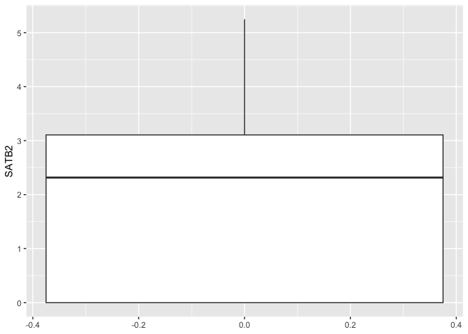<!-- -->

The box plot geom accepts a number of arguments that allow you to tune
its appearance. Take a look at the help statement to get an idea of the
options.

``` r
?geom_boxplot
```

The “notch” argument controls whether a notch will be drawn at the
median. Two boxes with non-overlapping notches likely represent
distributions with differing medians.

``` r
ggplot(data = sc.data, mapping = aes(y = SATB2)) +
  geom_boxplot(notch = TRUE)
```

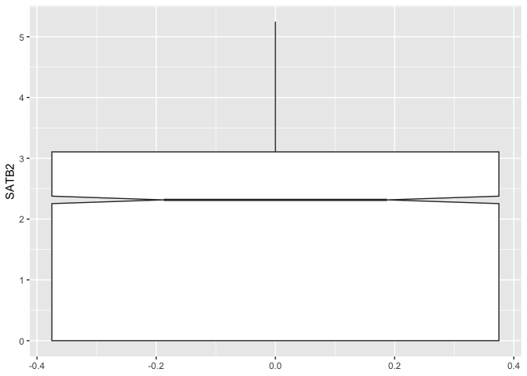<!-- -->

The “outlier” arguments control the appearance of any points plotted
outside of the box and whiskers.

``` r
ggplot(data = sc.data, mapping = aes(y = CNTN4)) +
  geom_boxplot(notch = TRUE,
               outliers = TRUE)
```

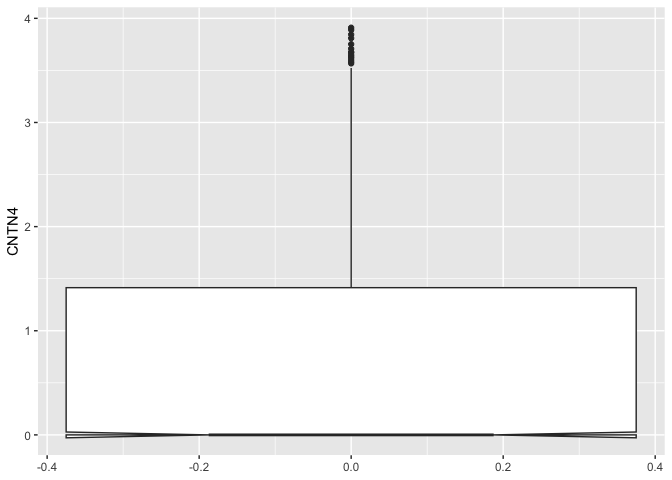<!-- -->

The computations underlying the box plot visualization are performed by
`stat_boxplot()`. By default, the length of the whiskers is 1.5 times
the interquartile range.

``` r
ggplot(data = sc.data, mapping = aes(y = CNTN4)) +
  geom_boxplot(notch = TRUE,
               coef = 2)
```

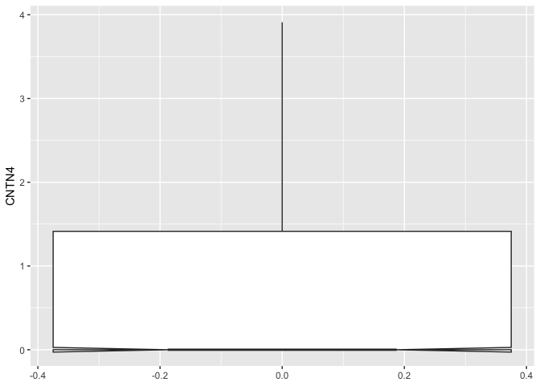<!-- -->

# Comparing distributions

Our basic box plot is not as informative (or decorative) as it could be.
Let’s add information from the metadata.

These cells have been grouped into clusters. The box plot can be split
across the groups, allowing us to compare the distribution of expression
values within each cell population.

Providing a categorical variable to the x axis produces a series of box
plots corresponding to the levels of the variable.

``` r
ggplot(data = sc.data, mapping = aes(x = subcluster, y = SATB2)) +
  geom_boxplot()
```

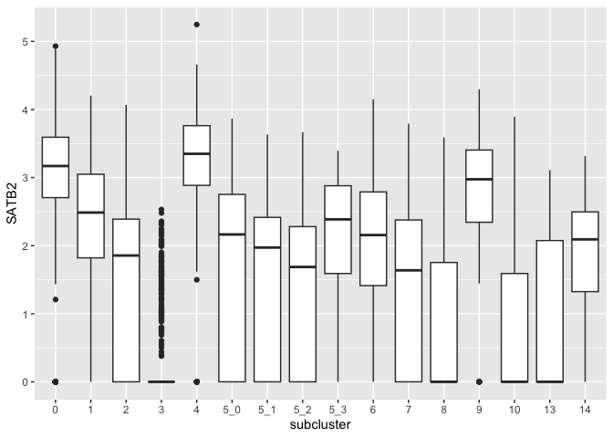<!-- -->

# Horizontal box plots

Sometimes it may be advantageous to flip the coordinate system on its
side so that the distribution stretches from left to right instead of
vertically. This is accomplished with `coord_flip()`.

``` r
ggplot(data = sc.data, mapping = aes(x = subcluster, y = SATB2)) +
  geom_boxplot() +
  coord_flip()
```

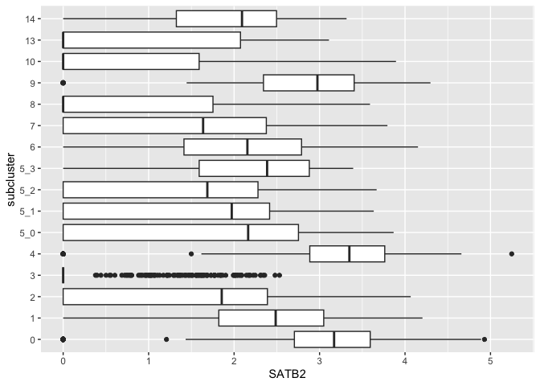<!-- -->

# Communicate additional information using graphical attributes

While the coordinate space of a box plot communicates the values of up
to two variables (one continuous and the optional second categorical),
other visual qualities (*aesthetics* in ggplot) can be used to encode
additional information, both categorical and continuous.

Box plots have the following mappable aesthetics:

- fill
- alpha
- color
- shape
- size
- linetype
- linewidth

You can assign variables to any number of these aesthetics. **Some
caveats apply.**

*Shape*, and *size* apply to the outlier points. Shape is only suitable
for categorical values, and cannot be used on very densely plotted
points, where distinguishing shape becomes difficult. Meanwhile, size
should be used with caution, as it implicitly communicates a sense of
quantitative difference that is not appropriate for some qualitative
measures (e.g. case vs control).

*Color*, *linetype*, and *linewidth* apply to the whiskers and box
outlines. Line-based attributes can be difficult to distinguish on box
plots, the interpretation of which relies heavily on the area of the
boxes.

*Alpha*, which controls opacity, and *fill* apply to the box area. While
alpha can be a difficult scale in which to visualize fine gradations of
a continuous variable, fill is the most-used aesthetic for box and
violin plots.

**Fill** and **stroke** are only useful with a subset of available point
shapes; explore [this
documentation](https://www.sthda.com/english/wiki/ggplot2-point-shapes)
to understand why.

## Color fill by x-axis category

You will often see filled box plots with fill colored using the same
variable as is used for the x axis. This can be useful across
multi-panel visualizations to tie together the same samples visualized
on different axes (e.g. a dimensionality reduction biplot and a box plot
may share a color scheme to aid comprehension).

``` r
ggplot(data = sc.data, mapping = aes(x = subcluster, y = SATB2, fill = subcluster)) +
  geom_boxplot()
```

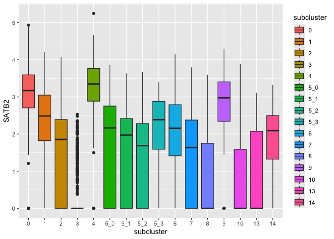<!-- -->

The default colors are notoriously difficult to distinguish for
colorblind users. Many libraries offer palettes to extend the default
color options, or you can set palettes manually.

Now that we have code for a working box plot, we can store our plot
object and add to it as we go.

``` r
p <- ggplot(data = sc.data, mapping = aes(x = subcluster, y = SATB2, fill = subcluster)) + geom_boxplot()
```

### Built-in palettes: viridis

[Viridis](https://cran.r-project.org/web/packages/viridis/vignettes/intro-to-viridis.html)
is one of many color palette resources. To access the viridis palettes
seamlessly within ggplot2, we can call the `scale_fill_viridis_` family
of functions: d for discrete data, b for binned data, and c for
continuous data.

``` r
p + scale_fill_viridis_d()
```

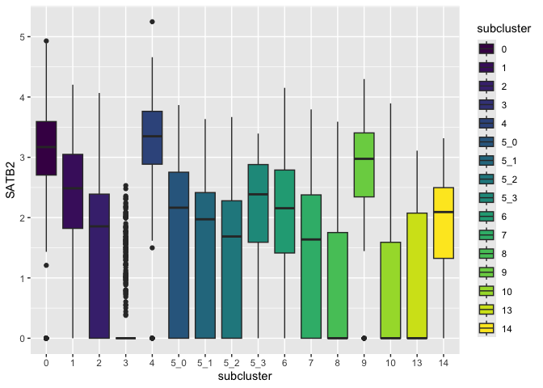<!-- -->

### Custom color palettes

The simplest way to set custom colors for a ggplot object is with
`scale_fill_manual()`. These colors are based on a selection of web
accessible colors generated by
[palette.es](https://palett.es/0074e6-eec1f1-b35e7e-534623-faa300).
While the 5 color version generated by the site is relatively
accessible, this expanded color palette is not.

``` r
custom.palette <- c("#0074e6", "#eec1f1", "#b35e7e", "#534623", "#faa300",
                    "#194d80", "white", "#ff0062", "black", "#ffd380",
                    "#80c0ff", "#f566ff", "#663648", "#b39b59", "#ffedcc",
                    "#ffa6c8")
p + scale_fill_manual(values = custom.palette)
```

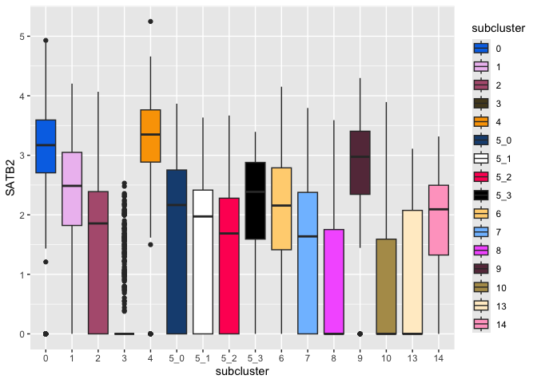<!-- -->

## Color fill independent of x-axis

When no value is supplied to x, the fill will be used to split the box
plot.

``` r
ggplot(data = sc.data, mapping = aes(y = SATB2, fill = subcluster_ScType_filtered)) +
  geom_boxplot() +
  scale_fill_viridis_d(option = "turbo", name = "Putative cell type") +
  theme(axis.text.x = element_text(angle = 45, hjust = 1))
```

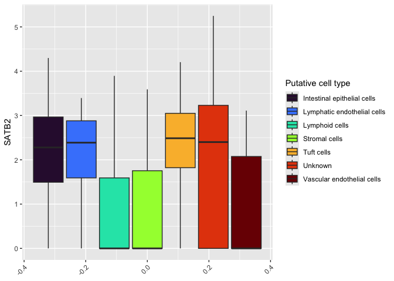<!-- -->

Coloring by putative cell reveals that cell type assignment was
inconclusive for a large number of cells. Locating this box toward the
center of our plot, and filling it with a bright color distracts from
the differences in expression we observe between cells that were
successfully assigned.

To do this, we convert the character vector “subcluster_ScType_filtered”
in our data frame to a factor, and set the levels to control the
ordering.

``` r
sc.data$putative <- factor(gsub("Unknown", NA, sc.data$subcluster_ScType_filtered),
                           levels = c("Vascular endothelial cells",
                                      "Lymphoid cells",
                                      "Stromal cells",
                                      "Tuft cells",
                                      "Lymphatic endothelial cells",
                                      "Intestinal epithelial cells"))
ggplot(data = sc.data, mapping = aes(y = SATB2, fill = putative)) +
  geom_boxplot() +
  scale_fill_viridis_d(option = "turbo",
                       name = "Putative cell type",
                       begin = 0.1,
                       end = 0.9,
                       na.value = "gray90")
```

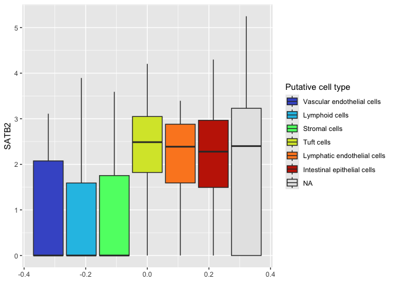<!-- -->

The fill scale function also offers the option of setting a shade for
missing data. Here we have selected a low-contrast light gray color.
With this gray color used for NA, a white background may be preferable.
All graphical elements of a ggplot object are modifiable, and a number
of pre-built *themes* exist. The default theme is `theme_gray()`.

``` r
ggplot(data = sc.data, mapping = aes(y = SATB2, fill = putative)) +
  geom_boxplot() +
  scale_fill_viridis_d(option = "turbo",
                       name = "Putative cell type",
                       begin = 0.1,
                       end = 0.9,
                       na.value = "gray90") +
  theme_bw()
```

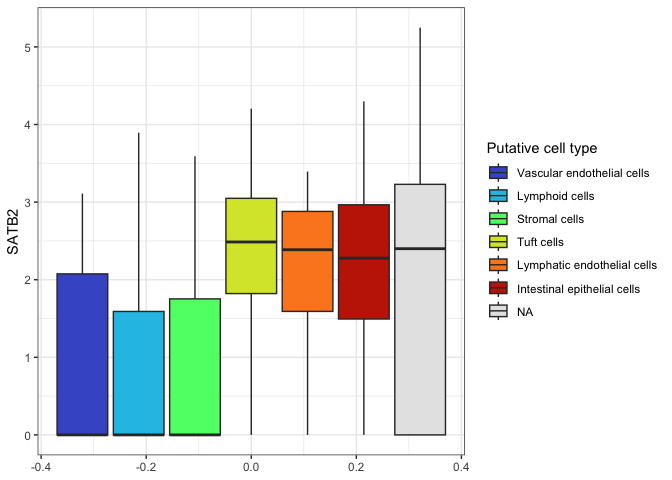<!-- -->

## Reshaping data for improved visualizations

If more than one marker is of interest, we can display these on a shared
set of axes by reshaping the data frame to put the expression values in
the same column. Associated gene symbols are moved to another column,
making the data frame much longer and narrower.

``` r
pivot_longer(sc.data, cols = SATB2:LEFTY1, names_to = "gene", values_to = "normalized.counts") %>%
  slice(1:50) %>%
  kable() %>%
  kable_styling("striped", fixed_thead = TRUE) %>%
  scroll_box(height = "200px")
```

<div style="border: 1px solid #ddd; padding: 0px; overflow-y: scroll; height:200px; ">

<table class="table table-striped" style="margin-left: auto; margin-right: auto;">

<thead>

<tr>

<th style="text-align:left;position: sticky; top:0; background-color: #FFFFFF;position: sticky; top:0; background-color: #FFFFFF;">

cell
</th>

<th style="text-align:left;position: sticky; top:0; background-color: #FFFFFF;position: sticky; top:0; background-color: #FFFFFF;">

subcluster
</th>

<th style="text-align:left;position: sticky; top:0; background-color: #FFFFFF;position: sticky; top:0; background-color: #FFFFFF;">

subcluster_ScType_filtered
</th>

<th style="text-align:left;position: sticky; top:0; background-color: #FFFFFF;position: sticky; top:0; background-color: #FFFFFF;">

putative
</th>

<th style="text-align:left;position: sticky; top:0; background-color: #FFFFFF;position: sticky; top:0; background-color: #FFFFFF;">

gene
</th>

<th style="text-align:right;position: sticky; top:0; background-color: #FFFFFF;position: sticky; top:0; background-color: #FFFFFF;">

normalized.counts
</th>

</tr>

</thead>

<tbody>

<tr>

<td style="text-align:left;">

AAACCCAAGTTATGGA_A001-C-007
</td>

<td style="text-align:left;">

2
</td>

<td style="text-align:left;">

Unknown
</td>

<td style="text-align:left;">

NA
</td>

<td style="text-align:left;">

SATB2
</td>

<td style="text-align:right;">

2.378576
</td>

</tr>

<tr>

<td style="text-align:left;">

AAACCCAAGTTATGGA_A001-C-007
</td>

<td style="text-align:left;">

2
</td>

<td style="text-align:left;">

Unknown
</td>

<td style="text-align:left;">

NA
</td>

<td style="text-align:left;">

NXPE1
</td>

<td style="text-align:right;">

2.378576
</td>

</tr>

<tr>

<td style="text-align:left;">

AAACCCAAGTTATGGA_A001-C-007
</td>

<td style="text-align:left;">

2
</td>

<td style="text-align:left;">

Unknown
</td>

<td style="text-align:left;">

NA
</td>

<td style="text-align:left;">

PDE3A
</td>

<td style="text-align:right;">

0.000000
</td>

</tr>

<tr>

<td style="text-align:left;">

AAACCCAAGTTATGGA_A001-C-007
</td>

<td style="text-align:left;">

2
</td>

<td style="text-align:left;">

Unknown
</td>

<td style="text-align:left;">

NA
</td>

<td style="text-align:left;">

CFTR
</td>

<td style="text-align:right;">

1.774064
</td>

</tr>

<tr>

<td style="text-align:left;">

AAACCCAAGTTATGGA_A001-C-007
</td>

<td style="text-align:left;">

2
</td>

<td style="text-align:left;">

Unknown
</td>

<td style="text-align:left;">

NA
</td>

<td style="text-align:left;">

HNF1A-AS1
</td>

<td style="text-align:right;">

1.774064
</td>

</tr>

<tr>

<td style="text-align:left;">

AAACCCAAGTTATGGA_A001-C-007
</td>

<td style="text-align:left;">

2
</td>

<td style="text-align:left;">

Unknown
</td>

<td style="text-align:left;">

NA
</td>

<td style="text-align:left;">

ADAMTSL1
</td>

<td style="text-align:right;">

0.000000
</td>

</tr>

<tr>

<td style="text-align:left;">

AAACCCAAGTTATGGA_A001-C-007
</td>

<td style="text-align:left;">

2
</td>

<td style="text-align:left;">

Unknown
</td>

<td style="text-align:left;">

NA
</td>

<td style="text-align:left;">

PID1
</td>

<td style="text-align:right;">

0.000000
</td>

</tr>

<tr>

<td style="text-align:left;">

AAACCCAAGTTATGGA_A001-C-007
</td>

<td style="text-align:left;">

2
</td>

<td style="text-align:left;">

Unknown
</td>

<td style="text-align:left;">

NA
</td>

<td style="text-align:left;">

NEO1
</td>

<td style="text-align:right;">

1.774064
</td>

</tr>

<tr>

<td style="text-align:left;">

AAACCCAAGTTATGGA_A001-C-007
</td>

<td style="text-align:left;">

2
</td>

<td style="text-align:left;">

Unknown
</td>

<td style="text-align:left;">

NA
</td>

<td style="text-align:left;">

XIST
</td>

<td style="text-align:right;">

0.000000
</td>

</tr>

<tr>

<td style="text-align:left;">

AAACCCAAGTTATGGA_A001-C-007
</td>

<td style="text-align:left;">

2
</td>

<td style="text-align:left;">

Unknown
</td>

<td style="text-align:left;">

NA
</td>

<td style="text-align:left;">

NR5A2
</td>

<td style="text-align:right;">

0.000000
</td>

</tr>

<tr>

<td style="text-align:left;">

AAACCCAAGTTATGGA_A001-C-007
</td>

<td style="text-align:left;">

2
</td>

<td style="text-align:left;">

Unknown
</td>

<td style="text-align:left;">

NA
</td>

<td style="text-align:left;">

CNTN4
</td>

<td style="text-align:right;">

0.000000
</td>

</tr>

<tr>

<td style="text-align:left;">

AAACCCAAGTTATGGA_A001-C-007
</td>

<td style="text-align:left;">

2
</td>

<td style="text-align:left;">

Unknown
</td>

<td style="text-align:left;">

NA
</td>

<td style="text-align:left;">

CNTN3
</td>

<td style="text-align:right;">

1.774064
</td>

</tr>

<tr>

<td style="text-align:left;">

AAACCCAAGTTATGGA_A001-C-007
</td>

<td style="text-align:left;">

2
</td>

<td style="text-align:left;">

Unknown
</td>

<td style="text-align:left;">

NA
</td>

<td style="text-align:left;">

SPON1
</td>

<td style="text-align:right;">

0.000000
</td>

</tr>

<tr>

<td style="text-align:left;">

AAACCCAAGTTATGGA_A001-C-007
</td>

<td style="text-align:left;">

2
</td>

<td style="text-align:left;">

Unknown
</td>

<td style="text-align:left;">

NA
</td>

<td style="text-align:left;">

LEFTY1
</td>

<td style="text-align:right;">

0.000000
</td>

</tr>

<tr>

<td style="text-align:left;">

AAACGCTTCTCTGCTG_A001-C-007
</td>

<td style="text-align:left;">

10
</td>

<td style="text-align:left;">

Lymphoid cells
</td>

<td style="text-align:left;">

Lymphoid cells
</td>

<td style="text-align:left;">

SATB2
</td>

<td style="text-align:right;">

0.000000
</td>

</tr>

<tr>

<td style="text-align:left;">

AAACGCTTCTCTGCTG_A001-C-007
</td>

<td style="text-align:left;">

10
</td>

<td style="text-align:left;">

Lymphoid cells
</td>

<td style="text-align:left;">

Lymphoid cells
</td>

<td style="text-align:left;">

NXPE1
</td>

<td style="text-align:right;">

0.000000
</td>

</tr>

<tr>

<td style="text-align:left;">

AAACGCTTCTCTGCTG_A001-C-007
</td>

<td style="text-align:left;">

10
</td>

<td style="text-align:left;">

Lymphoid cells
</td>

<td style="text-align:left;">

Lymphoid cells
</td>

<td style="text-align:left;">

PDE3A
</td>

<td style="text-align:right;">

0.000000
</td>

</tr>

<tr>

<td style="text-align:left;">

AAACGCTTCTCTGCTG_A001-C-007
</td>

<td style="text-align:left;">

10
</td>

<td style="text-align:left;">

Lymphoid cells
</td>

<td style="text-align:left;">

Lymphoid cells
</td>

<td style="text-align:left;">

CFTR
</td>

<td style="text-align:right;">

2.095889
</td>

</tr>

<tr>

<td style="text-align:left;">

AAACGCTTCTCTGCTG_A001-C-007
</td>

<td style="text-align:left;">

10
</td>

<td style="text-align:left;">

Lymphoid cells
</td>

<td style="text-align:left;">

Lymphoid cells
</td>

<td style="text-align:left;">

HNF1A-AS1
</td>

<td style="text-align:right;">

0.000000
</td>

</tr>

<tr>

<td style="text-align:left;">

AAACGCTTCTCTGCTG_A001-C-007
</td>

<td style="text-align:left;">

10
</td>

<td style="text-align:left;">

Lymphoid cells
</td>

<td style="text-align:left;">

Lymphoid cells
</td>

<td style="text-align:left;">

ADAMTSL1
</td>

<td style="text-align:right;">

0.000000
</td>

</tr>

<tr>

<td style="text-align:left;">

AAACGCTTCTCTGCTG_A001-C-007
</td>

<td style="text-align:left;">

10
</td>

<td style="text-align:left;">

Lymphoid cells
</td>

<td style="text-align:left;">

Lymphoid cells
</td>

<td style="text-align:left;">

PID1
</td>

<td style="text-align:right;">

0.000000
</td>

</tr>

<tr>

<td style="text-align:left;">

AAACGCTTCTCTGCTG_A001-C-007
</td>

<td style="text-align:left;">

10
</td>

<td style="text-align:left;">

Lymphoid cells
</td>

<td style="text-align:left;">

Lymphoid cells
</td>

<td style="text-align:left;">

NEO1
</td>

<td style="text-align:right;">

0.000000
</td>

</tr>

<tr>

<td style="text-align:left;">

AAACGCTTCTCTGCTG_A001-C-007
</td>

<td style="text-align:left;">

10
</td>

<td style="text-align:left;">

Lymphoid cells
</td>

<td style="text-align:left;">

Lymphoid cells
</td>

<td style="text-align:left;">

XIST
</td>

<td style="text-align:right;">

0.000000
</td>

</tr>

<tr>

<td style="text-align:left;">

AAACGCTTCTCTGCTG_A001-C-007
</td>

<td style="text-align:left;">

10
</td>

<td style="text-align:left;">

Lymphoid cells
</td>

<td style="text-align:left;">

Lymphoid cells
</td>

<td style="text-align:left;">

NR5A2
</td>

<td style="text-align:right;">

0.000000
</td>

</tr>

<tr>

<td style="text-align:left;">

AAACGCTTCTCTGCTG_A001-C-007
</td>

<td style="text-align:left;">

10
</td>

<td style="text-align:left;">

Lymphoid cells
</td>

<td style="text-align:left;">

Lymphoid cells
</td>

<td style="text-align:left;">

CNTN4
</td>

<td style="text-align:right;">

0.000000
</td>

</tr>

<tr>

<td style="text-align:left;">

AAACGCTTCTCTGCTG_A001-C-007
</td>

<td style="text-align:left;">

10
</td>

<td style="text-align:left;">

Lymphoid cells
</td>

<td style="text-align:left;">

Lymphoid cells
</td>

<td style="text-align:left;">

CNTN3
</td>

<td style="text-align:right;">

0.000000
</td>

</tr>

<tr>

<td style="text-align:left;">

AAACGCTTCTCTGCTG_A001-C-007
</td>

<td style="text-align:left;">

10
</td>

<td style="text-align:left;">

Lymphoid cells
</td>

<td style="text-align:left;">

Lymphoid cells
</td>

<td style="text-align:left;">

SPON1
</td>

<td style="text-align:right;">

0.000000
</td>

</tr>

<tr>

<td style="text-align:left;">

AAACGCTTCTCTGCTG_A001-C-007
</td>

<td style="text-align:left;">

10
</td>

<td style="text-align:left;">

Lymphoid cells
</td>

<td style="text-align:left;">

Lymphoid cells
</td>

<td style="text-align:left;">

LEFTY1
</td>

<td style="text-align:right;">

0.000000
</td>

</tr>

<tr>

<td style="text-align:left;">

AAAGAACGTGCTTATG_A001-C-007
</td>

<td style="text-align:left;">

5_1
</td>

<td style="text-align:left;">

Intestinal epithelial cells
</td>

<td style="text-align:left;">

Intestinal epithelial cells
</td>

<td style="text-align:left;">

SATB2
</td>

<td style="text-align:right;">

2.963201
</td>

</tr>

<tr>

<td style="text-align:left;">

AAAGAACGTGCTTATG_A001-C-007
</td>

<td style="text-align:left;">

5_1
</td>

<td style="text-align:left;">

Intestinal epithelial cells
</td>

<td style="text-align:left;">

Intestinal epithelial cells
</td>

<td style="text-align:left;">

NXPE1
</td>

<td style="text-align:right;">

3.237886
</td>

</tr>

<tr>

<td style="text-align:left;">

AAAGAACGTGCTTATG_A001-C-007
</td>

<td style="text-align:left;">

5_1
</td>

<td style="text-align:left;">

Intestinal epithelial cells
</td>

<td style="text-align:left;">

Intestinal epithelial cells
</td>

<td style="text-align:left;">

PDE3A
</td>

<td style="text-align:right;">

1.962901
</td>

</tr>

<tr>

<td style="text-align:left;">

AAAGAACGTGCTTATG_A001-C-007
</td>

<td style="text-align:left;">

5_1
</td>

<td style="text-align:left;">

Intestinal epithelial cells
</td>

<td style="text-align:left;">

Intestinal epithelial cells
</td>

<td style="text-align:left;">

CFTR
</td>

<td style="text-align:right;">

2.583235
</td>

</tr>

<tr>

<td style="text-align:left;">

AAAGAACGTGCTTATG_A001-C-007
</td>

<td style="text-align:left;">

5_1
</td>

<td style="text-align:left;">

Intestinal epithelial cells
</td>

<td style="text-align:left;">

Intestinal epithelial cells
</td>

<td style="text-align:left;">

HNF1A-AS1
</td>

<td style="text-align:right;">

0.000000
</td>

</tr>

<tr>

<td style="text-align:left;">

AAAGAACGTGCTTATG_A001-C-007
</td>

<td style="text-align:left;">

5_1
</td>

<td style="text-align:left;">

Intestinal epithelial cells
</td>

<td style="text-align:left;">

Intestinal epithelial cells
</td>

<td style="text-align:left;">

ADAMTSL1
</td>

<td style="text-align:right;">

1.962901
</td>

</tr>

<tr>

<td style="text-align:left;">

AAAGAACGTGCTTATG_A001-C-007
</td>

<td style="text-align:left;">

5_1
</td>

<td style="text-align:left;">

Intestinal epithelial cells
</td>

<td style="text-align:left;">

Intestinal epithelial cells
</td>

<td style="text-align:left;">

PID1
</td>

<td style="text-align:right;">

2.583235
</td>

</tr>

<tr>

<td style="text-align:left;">

AAAGAACGTGCTTATG_A001-C-007
</td>

<td style="text-align:left;">

5_1
</td>

<td style="text-align:left;">

Intestinal epithelial cells
</td>

<td style="text-align:left;">

Intestinal epithelial cells
</td>

<td style="text-align:left;">

NEO1
</td>

<td style="text-align:right;">

0.000000
</td>

</tr>

<tr>

<td style="text-align:left;">

AAAGAACGTGCTTATG_A001-C-007
</td>

<td style="text-align:left;">

5_1
</td>

<td style="text-align:left;">

Intestinal epithelial cells
</td>

<td style="text-align:left;">

Intestinal epithelial cells
</td>

<td style="text-align:left;">

XIST
</td>

<td style="text-align:right;">

0.000000
</td>

</tr>

<tr>

<td style="text-align:left;">

AAAGAACGTGCTTATG_A001-C-007
</td>

<td style="text-align:left;">

5_1
</td>

<td style="text-align:left;">

Intestinal epithelial cells
</td>

<td style="text-align:left;">

Intestinal epithelial cells
</td>

<td style="text-align:left;">

NR5A2
</td>

<td style="text-align:right;">

1.962901
</td>

</tr>

<tr>

<td style="text-align:left;">

AAAGAACGTGCTTATG_A001-C-007
</td>

<td style="text-align:left;">

5_1
</td>

<td style="text-align:left;">

Intestinal epithelial cells
</td>

<td style="text-align:left;">

Intestinal epithelial cells
</td>

<td style="text-align:left;">

CNTN4
</td>

<td style="text-align:right;">

0.000000
</td>

</tr>

<tr>

<td style="text-align:left;">

AAAGAACGTGCTTATG_A001-C-007
</td>

<td style="text-align:left;">

5_1
</td>

<td style="text-align:left;">

Intestinal epithelial cells
</td>

<td style="text-align:left;">

Intestinal epithelial cells
</td>

<td style="text-align:left;">

CNTN3
</td>

<td style="text-align:right;">

0.000000
</td>

</tr>

<tr>

<td style="text-align:left;">

AAAGAACGTGCTTATG_A001-C-007
</td>

<td style="text-align:left;">

5_1
</td>

<td style="text-align:left;">

Intestinal epithelial cells
</td>

<td style="text-align:left;">

Intestinal epithelial cells
</td>

<td style="text-align:left;">

SPON1
</td>

<td style="text-align:right;">

0.000000
</td>

</tr>

<tr>

<td style="text-align:left;">

AAAGAACGTGCTTATG_A001-C-007
</td>

<td style="text-align:left;">

5_1
</td>

<td style="text-align:left;">

Intestinal epithelial cells
</td>

<td style="text-align:left;">

Intestinal epithelial cells
</td>

<td style="text-align:left;">

LEFTY1
</td>

<td style="text-align:right;">

0.000000
</td>

</tr>

<tr>

<td style="text-align:left;">

AAAGAACGTTTCGCTC_A001-C-007
</td>

<td style="text-align:left;">

3
</td>

<td style="text-align:left;">

Unknown
</td>

<td style="text-align:left;">

NA
</td>

<td style="text-align:left;">

SATB2
</td>

<td style="text-align:right;">

0.000000
</td>

</tr>

<tr>

<td style="text-align:left;">

AAAGAACGTTTCGCTC_A001-C-007
</td>

<td style="text-align:left;">

3
</td>

<td style="text-align:left;">

Unknown
</td>

<td style="text-align:left;">

NA
</td>

<td style="text-align:left;">

NXPE1
</td>

<td style="text-align:right;">

0.000000
</td>

</tr>

<tr>

<td style="text-align:left;">

AAAGAACGTTTCGCTC_A001-C-007
</td>

<td style="text-align:left;">

3
</td>

<td style="text-align:left;">

Unknown
</td>

<td style="text-align:left;">

NA
</td>

<td style="text-align:left;">

PDE3A
</td>

<td style="text-align:right;">

0.000000
</td>

</tr>

<tr>

<td style="text-align:left;">

AAAGAACGTTTCGCTC_A001-C-007
</td>

<td style="text-align:left;">

3
</td>

<td style="text-align:left;">

Unknown
</td>

<td style="text-align:left;">

NA
</td>

<td style="text-align:left;">

CFTR
</td>

<td style="text-align:right;">

0.000000
</td>

</tr>

<tr>

<td style="text-align:left;">

AAAGAACGTTTCGCTC_A001-C-007
</td>

<td style="text-align:left;">

3
</td>

<td style="text-align:left;">

Unknown
</td>

<td style="text-align:left;">

NA
</td>

<td style="text-align:left;">

HNF1A-AS1
</td>

<td style="text-align:right;">

0.000000
</td>

</tr>

<tr>

<td style="text-align:left;">

AAAGAACGTTTCGCTC_A001-C-007
</td>

<td style="text-align:left;">

3
</td>

<td style="text-align:left;">

Unknown
</td>

<td style="text-align:left;">

NA
</td>

<td style="text-align:left;">

ADAMTSL1
</td>

<td style="text-align:right;">

0.000000
</td>

</tr>

<tr>

<td style="text-align:left;">

AAAGAACGTTTCGCTC_A001-C-007
</td>

<td style="text-align:left;">

3
</td>

<td style="text-align:left;">

Unknown
</td>

<td style="text-align:left;">

NA
</td>

<td style="text-align:left;">

PID1
</td>

<td style="text-align:right;">

0.000000
</td>

</tr>

<tr>

<td style="text-align:left;">

AAAGAACGTTTCGCTC_A001-C-007
</td>

<td style="text-align:left;">

3
</td>

<td style="text-align:left;">

Unknown
</td>

<td style="text-align:left;">

NA
</td>

<td style="text-align:left;">

NEO1
</td>

<td style="text-align:right;">

0.000000
</td>

</tr>

</tbody>

</table>

</div>

``` r
sc.pivot <- pivot_longer(sc.data, cols = SATB2:LEFTY1, names_to = "gene", values_to = "normalized.counts")
```

Reshaping the data frame this way allows us to use “gene” to set fill
color, while the y-axis is relabled “normalized.counts.”

``` r
filter(sc.pivot, gene %in% c("PDE3A", "CFTR", "ADAMTSL1")) %>%
  ggplot(mapping = aes(x = subcluster, y = normalized.counts, fill = gene)) +
  geom_boxplot() +
  scale_fill_viridis_d() +
  theme_bw()
```

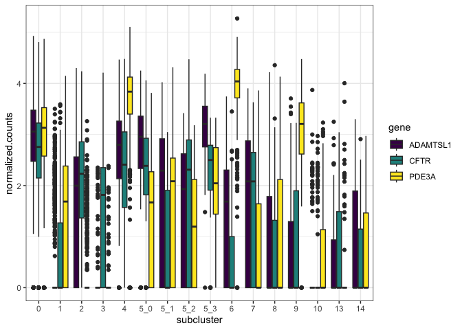<!-- -->

Notice that the x-axis and fill are assigned independently, resulting in
three boxes plotted for each sub-cluster.

# Displaying multiple categorical variables

If we want to examine the relationship between our three markers of
interest from the previous figure split over each putative cell type, we
can accomplish this one of three ways:

- use putative cell type as x and gene as fill
- use gene as fill and facet by putative cell type
- create a facet grid using gene ~ putative cell type

## Set fill and x independently

As in the previous figure, we can simply set assign the fill and x
aesthetics to different categorical values.

``` r
filter(sc.pivot, gene %in% c("PDE3A", "CFTR", "ADAMTSL1")) %>%
  ggplot(mapping = aes(x = putative, y = normalized.counts, fill = gene)) +
  geom_boxplot() +
  scale_fill_viridis_d() +
  theme_bw()
```

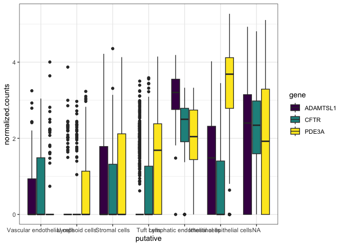<!-- -->

Due to the long cell type names, the x-axis is unreadable. Let’s change
the angle of the text in order to prevent overlapping. The `theme()`
function in ggplot2 allows access to the plot elements individually,
allowing us to fine-tune the axis text appearance (among many other
things!).

``` r
filter(sc.pivot, gene %in% c("PDE3A", "CFTR", "ADAMTSL1")) %>%
  ggplot(mapping = aes(x = putative, y = normalized.counts, fill = gene)) +
  geom_boxplot() +
  scale_fill_viridis_d() +
  theme_bw() +
  theme(axis.text.x = element_text(angle = 45, hjust = 1))
```

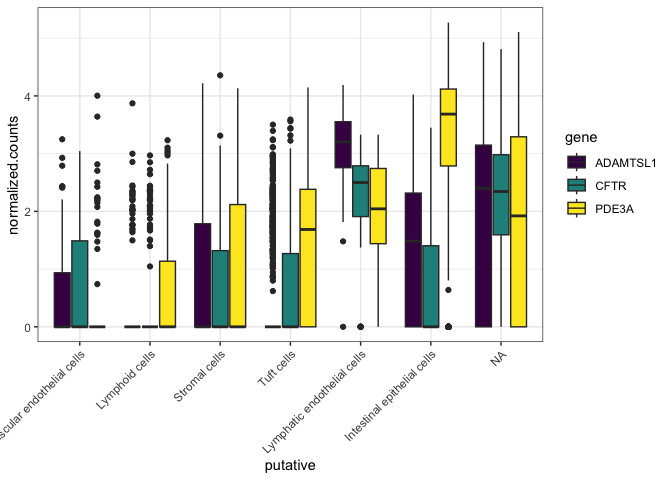<!-- -->

We can also suppress the unecessary plot x-axis and legend titles.

``` r
filter(sc.pivot, gene %in% c("PDE3A", "CFTR", "ADAMTSL1")) %>%
  ggplot(mapping = aes(x = putative, y = normalized.counts, fill = gene)) +
  geom_boxplot() +
  scale_fill_viridis_d() +
  theme_bw() +
  theme(axis.text.x = element_text(angle = 45, hjust = 1),
        axis.title.x = element_blank(),
        legend.title = element_blank())
```

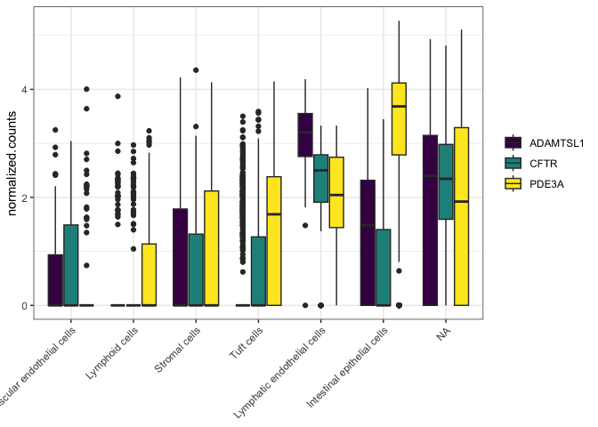<!-- -->

The `labs()` function lets us specify labels, captions and titles for
the plot.

``` r
filter(sc.pivot, gene %in% c("PDE3A", "CFTR", "ADAMTSL1")) %>%
  ggplot(mapping = aes(x = putative, y = normalized.counts, fill = gene)) +
  geom_boxplot() +
  scale_fill_viridis_d() +
  labs(y = "Normalized counts") +
  theme_bw() +
  theme(axis.text.x = element_text(angle = 45, hjust = 1),
        axis.title.x = element_blank(),
        legend.title = element_blank())
```

<!-- -->

To change the axis tick labels, use `scale_x_discrete()`.

``` r
filter(sc.pivot, gene %in% c("PDE3A", "CFTR", "ADAMTSL1")) %>%
  ggplot(mapping = aes(x = putative, y = normalized.counts, fill = gene)) +
  geom_boxplot() +
  scale_fill_viridis_d() +
  labs(y = "Normalized counts") +
  theme_bw() +
  scale_x_discrete(labels = c(levels(sc.pivot$putative), "Unassigned")) +
  theme(axis.text.x = element_text(angle = 45, hjust = 1),
        axis.title.x = element_blank(),
        legend.title = element_blank())
```

<!-- --> \##
Facets

Faceting creates multiple sub-plots, which allow us to visualize more
levels of categorical variation without adding additional colors.

### Fill by cell type and facet by gene

``` r
filter(sc.pivot, gene %in% c("PDE3A", "CFTR", "ADAMTSL1")) %>%
  ggplot(mapping = aes(y = normalized.counts, fill = putative)) +
  geom_boxplot() +
  facet_wrap(~gene) +
  scale_fill_viridis_d(option = "turbo",
                       name = "Putative cell type",
                       begin = 0.1,
                       end = 0.9,
                       na.value = "gray90") +
  theme_bw() +
  theme(legend.title = element_blank(),
        axis.text.x = element_blank(),
        axis.ticks.x = element_blank(),
        axis.title = element_blank())
```

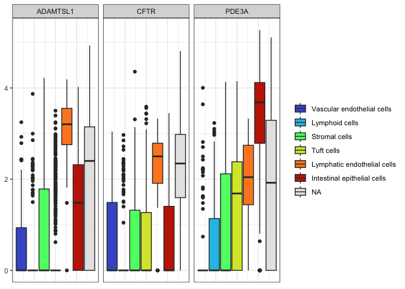<!-- -->

When crafting your box plot, try to make the most important comparison
easy for viewers. In this case, filling by gene and faceting by cell
type may be more useful.

### Fill by gene and facet by cell type

``` r
filter(sc.pivot, gene %in% c("PDE3A", "CFTR", "ADAMTSL1")) %>%
  ggplot(mapping = aes(y = normalized.counts, fill = gene)) +
  geom_boxplot() +
  facet_wrap(~putative) +
  scale_fill_viridis_d() +
  theme_linedraw() +
  theme(legend.title = element_blank(),
        axis.text.x = element_blank(),
        axis.ticks.x = element_blank(),
        axis.title = element_blank())
```

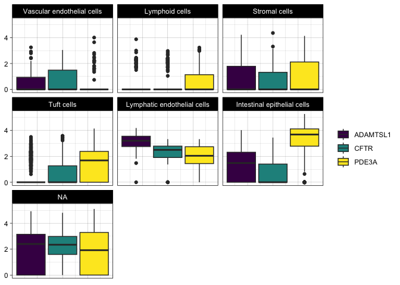<!-- -->

### Create a gene by cell type grid

If we wanted to examine the relationship between the sample identity,
cell type, and gene expression, we can create a grid that allows us to
view all three simultaneously.

``` r
sc.pivot$sample <- sapply(strsplit(sc.pivot$cell, split = "_", fixed = TRUE), "[[", 2L)
filter(sc.pivot, gene %in% c("PDE3A", "CFTR", "ADAMTSL1")) %>%
  ggplot(mapping = aes(y = normalized.counts, fill = sample)) +
  geom_boxplot() +                                                                
  facet_grid(gene~putative) +
  scale_fill_viridis_d(option = "mako") +
  theme_classic() +
  theme(axis.text.x = element_blank(),
        axis.ticks.x = element_blank()) +
  labs(y = "Normalized counts")
```

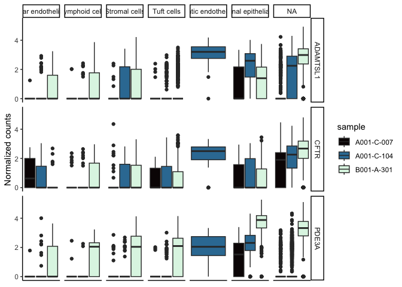<!-- -->

# Subset the data

If some comparisons are irrelevant, you can subset the data for the sake
of clarity.

``` r
filter(sc.pivot,
       gene %in% c("PDE3A", "CFTR", "ADAMTSL1"),
       putative %in% c("Intestinal epithelial cells", "Lymphatic endothelial cells", "Tuft cells")) %>%
  ggplot(mapping = aes(x = putative, y = normalized.counts, fill = gene)) +
  geom_boxplot() +
  scale_fill_viridis_d() +
  labs(y = "Normalized counts") +
  theme_linedraw() +
  theme(axis.title.x = element_blank(),
        legend.title = element_blank(),
        axis.text.x = element_text(angle = 45, hjust = 1))
```

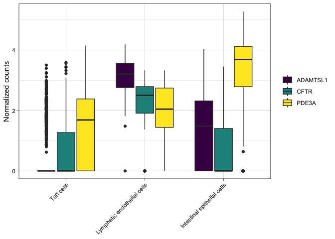<!-- -->

# Annotations

Box plots are, by their nature, fairly simple. Adding annotations to the
box plot to highlight comparisons of interest or communicate additional
information can make them more informative without becoming overly
complex.

One common annotation for box plots is the significance bracket. These
are visual indicators of statistically significant differences between
means. They may be marked with the p-value for the test, or with
asterisks.

It is possible to add significance annotations manually, but we will be
using the library ggsignif.

``` r
ggplot(data = sc.data, mapping = aes(x = putative, y = PDE3A, fill = putative)) +
  geom_boxplot() +
  scale_fill_viridis_d(option = "turbo",
                       begin = 0.1,
                       end = 0.9,
                       na.value = "gray90") +
  guides(fill = "none") +
  geom_signif(comparisons = list(c("Tuft cells", "Intestinal epithelial cells"))) +
  theme_bw() +
  theme(axis.title.x = element_blank(),
        axis.text.x = element_text(angle = 45, hjust = 1))
```

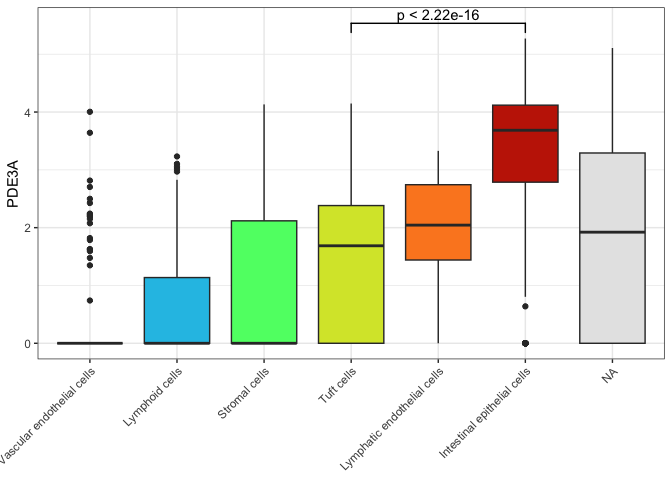<!-- -->

The significance test geom produced by ggsignif is compatible with
coord_flip and faceting, but does require manual adjustment when
categorical values on the x axis are broken up by the fill argument and
position_dodge comes into play.

``` r
anno <- t.test(sc.data$PDE3A[sc.data$subcluster == "6"],
               sc.data$PDE3A[sc.data$subcluster == "9"])
filter(sc.data, putative %in% c("Tuft cells", "Lymphatic endothelial cells", "Intestinal epithelial cells")) %>%
  ggplot(mapping = (aes(x = putative, y = PDE3A, fill = subcluster))) +
  geom_boxplot() +
  geom_signif(annotation = formatC(anno$p.value, digits = 1),
              y_position = 5.75,
              xmin = 3,
              xmax = 3.25,
              tip_length = c(0.05,0.2)) +
  scale_fill_viridis_d(option = "plasma") +
  theme_minimal() +
  theme(axis.title.x = element_blank(),
        legend.title = element_blank())
```

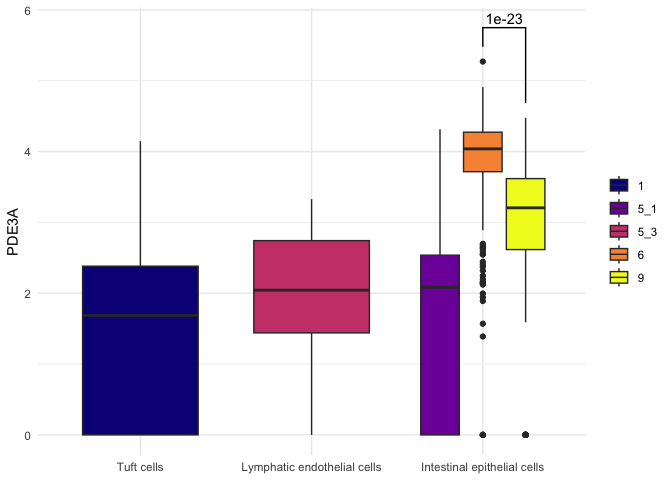<!-- -->

# Marginal plots

Box plots can also be useful in the context of annotating other types of
plots. For example, in a densely plotted scatter plot, you may want
marginal box plots to help readers accurately perceive the distribution
of values on one or both axes. This can help you combat misleading
over-plotting. The `ggMarginal()` function from ggExtra provides access
to three types of marginal plots, including a box plot.

``` r
p <- filter(sc.data, putative %in% c("Intestinal epithelial cells", "Tuft cells", "Stromal cells")) %>%
  ggplot(mapping = aes(x = ADAMTSL1, y = CFTR, color = putative, fill = putative)) +
  geom_point() +
  scale_color_manual(values = custom.palette[c(1,2,5)]) +
  coord_fixed() +
  theme_classic()
ggMarginal(p + theme(legend.position = "bottom", legend.title = element_blank()), type = "boxplot", groupFill = TRUE)
```

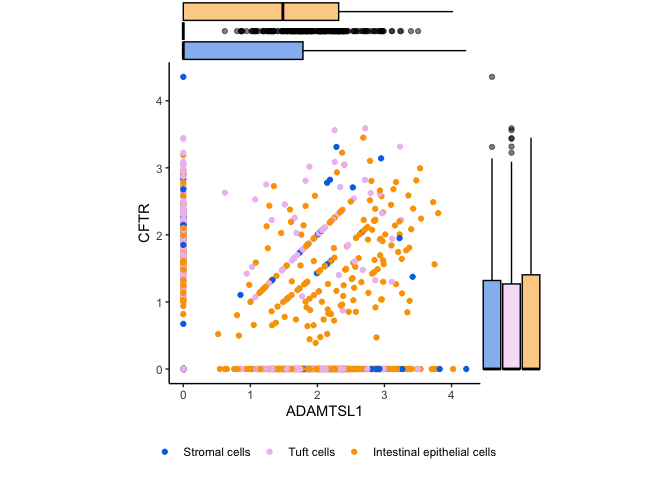<!-- -->

# Violin plots

Violin plots are very similar to box plots. In some cases, you can
simply substitute `geom_violin()` in place of `geom_boxplot()`. However,
be aware that violin plots require a mapping for the x aesthetic.

``` r
filter(sc.pivot, gene %in% c("PDE3A", "CFTR", "ADAMTSL1")) %>%
  ggplot(mapping = aes(x = putative, y = normalized.counts, fill = gene)) +
  geom_violin() +
  scale_fill_viridis_d() +
  labs(y = "Normalized counts") +
  theme_bw() +
  theme(axis.text.x = element_text(angle = 45, hjust = 1),
        axis.title.x = element_blank(),
        legend.title = element_blank())
```

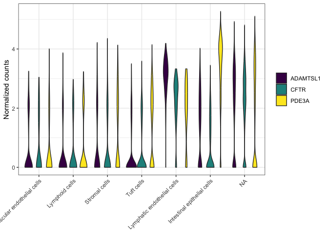<!-- -->

``` r
ggplot(data = sc.data, mapping = aes(x = putative, y = SATB2, fill = putative)) +
  geom_violin() +
  scale_fill_viridis_d(option = "turbo",
                       begin = 0.1,
                       end = 0.9,
                       na.value = "gray90") +
  guides(fill = "none") +
  labs(x = "Putative cell type") +
  coord_flip() +
  theme_bw()
```

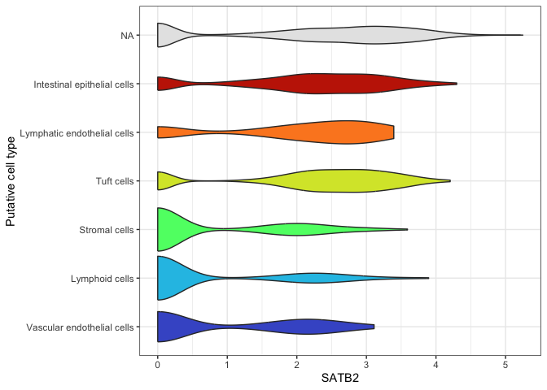<!-- -->

``` r
filter(sc.pivot, gene %in% c("PDE3A", "CFTR", "ADAMTSL1")) %>%
  ggplot(mapping = aes(y = normalized.counts, x = sample, fill = sample)) +
  geom_violin() +                                                                
  facet_grid(gene~putative) +
  scale_fill_viridis_d(option = "mako") +
  theme_classic() +
  theme(axis.text.x = element_blank(),
        axis.ticks.x = element_blank()) +
  labs(y = "Normalized counts")
```

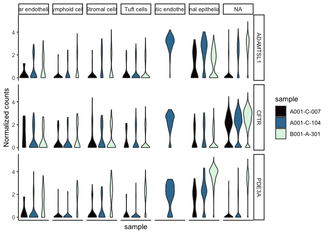<!-- -->

Significance brackets are not common on violin plots, but if desired, it
functions the same way as on a box plot.

``` r
ggplot(data = sc.data, mapping = aes(x = putative, y = PDE3A, fill = putative)) +
  geom_violin() +
  scale_fill_viridis_d(option = "turbo",
                       begin = 0.1,
                       end = 0.9,
                       na.value = "gray90") +
  guides(fill = "none") +
  geom_signif(comparisons = list(c("Tuft cells", "Intestinal epithelial cells"))) +
  theme_bw() +
  theme(axis.title.x = element_blank(),
        axis.text.x = element_text(angle = 45, hjust = 1))
```

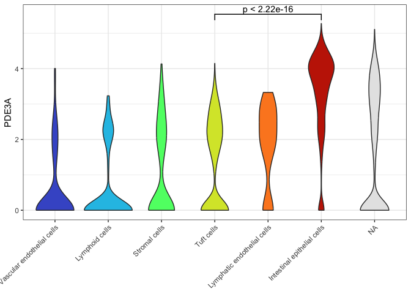<!-- -->
Occasionally, you will see a box plot superimposed on the violin forms.
In this case, be sure to move the fill assignment inside the
geom_violin() call so that the box plots remain unfilled (this makes
them easier to perceive).

``` r
ggplot(data = sc.data, mapping = aes(x = putative, y = PDE3A)) +
  geom_violin(mapping = aes(fill = putative)) +
  geom_boxplot(width = 0.1) +
  scale_fill_viridis_d(option = "turbo",
                       begin = 0.1,
                       end = 0.9,
                       na.value = "gray90") +
  guides(fill = "none") +
  geom_signif(comparisons = list(c("Tuft cells", "Intestinal epithelial cells"))) +
  theme_bw() +
  theme(axis.title.x = element_blank(),
        axis.text.x = element_text(angle = 45, hjust = 1))
```

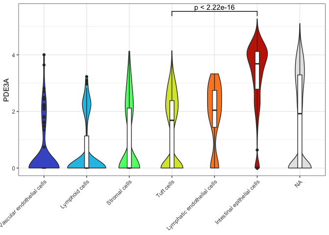<!-- -->

# Prepare for the next section
