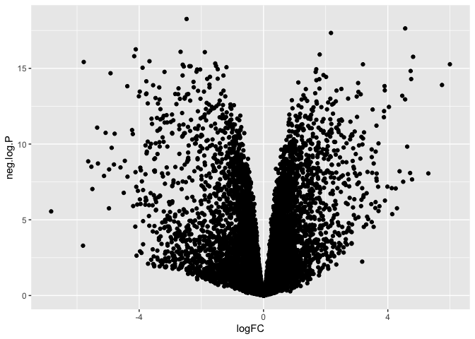
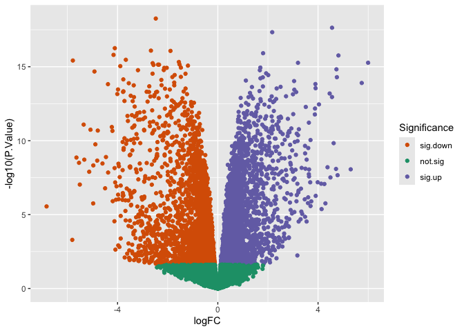
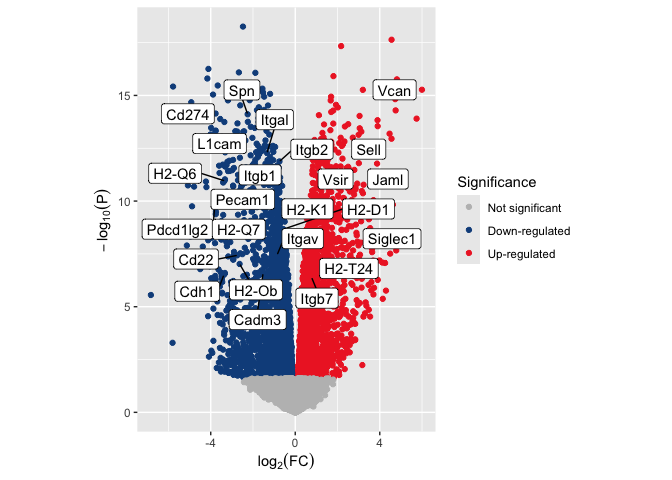
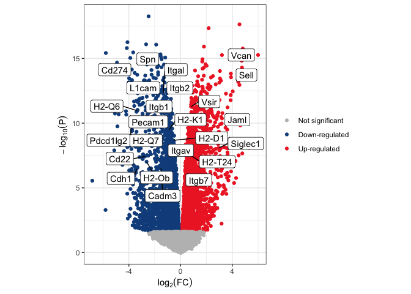
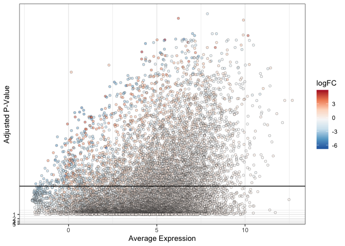

# Introduction to scatter plots

A scatter plot displays two values (x,y) from continuous scales for each
point, and can be used any time you want to show the relationship
between two continuous variables. Many popular bioinformatic
visualizations are simply highly customized forms of scatter plot. The
skills and tools covered in this chapter are generalizable to all
scatter plots.

# `{r example_gallery, echo=FALSE} # library(htmlwidgets) # library(slickR) # # slickR object # example.gallery <- data.frame(name = c("Volcano plot", "QA/QC figure", "MDS plot", "Faceted UMAP plot"), img = c("volcano_example.png", "qc_example.png", "mds_example.png", "umap_example.png")) # slickR(obj = example.gallery$img, height = 300, width = "80%") %synch% #   slickR(obj = example.gallery$name, slideType = "p") + #   settings(dots = TRUE, autoplay = TRUE, autoplaySpeed = 1500) #`

### QA/QC figures

The simplest type of scatter plots, QA/QC plots are produced for
diagnostic purposes. While they are often less polished than other
figures (as they are unlikely to be included in publication), QA/QC
plots are valuable tools for informing decisions during the course of
analysis.

### Dimensionality reduction biplots

PCA, MDS, tSNE, and UMAP are all popular methods of projecting variation
in a highly-dimensional data set onto a lower-dimensional space. Samples
are assigned coordinates on two or more axes that summarize across
hundreds or thousands of variables (e.g. gene expression values in an
RNA-seq experiment) to capture key features within the data While the
math behind these methods differs, the visualization is analogous; two
of the dimensions are assigned to the axes of the plot, and metadata can
be used to label the points.

### Volcano plots

Plotting -log<sub>10</sub>(P) against log<sub>2</sub>-fold change
produces the characteristic “volcano” shape that gives this plot its
name. Volcano plots provide an overview of the magnitude and
significance of gene expression changes in an experiment. Adding
call-out annotations gives a sense of where genes of interest lie with
regard to these features.

### Manhattan plots

A staple of GWAS studies, a Manhattan plot displays the relationship of
SNPs to the trait under investigation. Like a volcano plot, point
placement along the y axis is determined by -log<sub>10</sub>(P), but
the x value of each point represents genomic coordinate of the SNP,
rather than RNA expression data. Plots may be gray-scale or colored to
aid in distinguishing chromosomes.

# Set-up

In this chapter, we will begin with the fundamentals of assembling a
scatter plot, layer on additional information using graphical attributes
like color and point shape, and modify plot elements to customize figure
appearance and improve readability. The first example we will work with
is a volcano plot.

## Packages

We will be working extensively with ggplot2 over the course of this
workshop. Part of the tidyverse ecosystem, ggplot2 is a comprehensive,
flexible framework for producing highly customizable graphics of many
types. We will also make use of dplyr, another tidyverse package, to
clean and reshape data before plotting.

``` r
library(dplyr)
library(magrittr)
library(kableExtra)
library(ggplot2)
library(ggrepel)
```

## Data

The data for our volcano plot comes from our RNA-Seq workshop, at a
point in the analysis after the first contrast of the differential
expression analysis has been computed. The code assumes that a table of
differential expression results and an Ensembl Biomart annotation export
are available.

``` r
de <- read.delim("mouse_DE_result.txt", sep = " ")
de$Gene.stable.ID.version <- rownames(de)
anno <- read.delim("mouse_annotations.txt", sep = " ")
anno <- anno[!duplicated(anno$Gene.stable.ID.version),]
```

*Explore the data.* What values are available in each table? Which
columns are relevant to creating the volcano plot? Is the data ready to
plot as-is? If not, what transformations do you need to do in order
prepare for the plot?

# Plot points

In its most basic form, a volcano plot is simply a collection of scatter
plot showing the relationship between P-value and log fold change.

A ggplot2 object is built in layers, with each layer inheriting
parameters from the previous elements. The parent plot is created by the
`ggplot90` call, and subsequent layers are added with “geoms.” Here, we
have applied `geom_point()`, which creates scatter plots.

``` r
ggplot(data = de, mapping = aes(x = logFC, y = P.Value)) +
  geom_point()
```

<!-- -->

# Transformations

The plot above needs some adjustments to be useful; the points of
greatest interest (with near-zero p-values) are all squished into the
very bottom of the plot.

Transformations can be applied to either (or both) axes in two ways:
through scale axis functions, or by operating directly on the data
itself.

## Transform data using scale functions

There are a number of built-in scale functions, including
log<sub>10</sub> and reverse, which multiplies by -1. Neither of these
is sufficient on its own, and the scales package does not provide a
predefined -log<sub>10</sub>n transformation. We can construct a custom
transformation using the `new_transform()` function from the scales
library, one of ggplot2’s dependencies.

``` r
ggplot(data = de, mapping = aes(x = logFC, y = P.Value)) +
  geom_point() +
  scale_y_log10()
```

<figure>

<figcaption aria-hidden="true"><em>Transformations applied using
scale_y_ functions</em></figcaption>
</figure>

``` r
ggplot(data = de, mapping = aes(x = logFC, y = P.Value)) +
  geom_point() +
  scale_y_reverse()
```

<figure>

<figcaption aria-hidden="true"><em>Transformations applied using
scale_y_ functions</em></figcaption>
</figure>

``` r
ggplot(data = de, mapping = aes(x = logFC, y = P.Value)) +
  geom_point() +
  scale_y_continuous(transform = scales::new_transform(name = "neg.log.10", transform = function(x){-log10(x)},
                                                       inverse = function(x){1 / 10**x}))
```

<figure>

<figcaption aria-hidden="true"><em>Transformations applied using
scale_y_ functions</em></figcaption>
</figure>

## Transform data directly

Alternatively, in the case of the relatively simple -log<sub>10</sub>
transformation, we can apply it quickly and easily from within the
`ggplot()` call.

``` r
ggplot(data = de, mapping = aes(x = logFC, y = -log10(P.Value))) +
  geom_point()
```

<figure>

<figcaption aria-hidden="true"><em>Transformation applied within ggplot
call</em></figcaption>
</figure>

Note that the minor ticks on the y-axis behave differently!

Axis ticks are determined by “breaks” in the plotted data. When using
the scale axis commands, the breaks are applied ot the untransformed
data, and y-axis values reflect that. By contrast, when we compute the
transformation inside the plotting function, breaks are computed on the
transformed values.

Finally, if we need to perform a complex, multi-step transformation, and
do not wish to create a custom transformation for scale_y_continuous, we
can create a new column in our data frame that contains the transformed
values and plot that column instead.

``` r
neg.log.10 <- function(x){-log10(x)}
mutate(de, "neg.log.P" = neg.log.10(P.Value)) %>%
  ggplot(mapping = aes(x = logFC, y = neg.log.P)) +
  geom_point()
```

<figure>

<figcaption aria-hidden="true"><em>Transformation applied to
data.frame</em></figcaption>
</figure>

# Communicate additional information using point properties

While the coordinate space of a scatter plot communicates the values of
two continuous variables, other visual qualities (*aesthetics* in
ggplot) can be used to encode additional information, both categorical
and continuous.

Scatter plots have the following mappable aesthetics:

- shape
- size
- fill
- stroke
- alpha
- color

You can assign variables to any number of these aesthetics. **Some
caveats apply.**

**Shape** is only suitable for categorical values, and cannot be used on
very densely plotted points, where distinguishing shape becomes
difficult.

**Size** should be used with caution, as it implicitly communicates a
sense of quantitative difference that is not appropriate for some
qualitative measures (e.g. case vs control).

**Alpha**, which controls point opacity, can be a difficult scale in
which to visualize fine gradations of a continuous variable.

**Fill** and **stroke** are only useful with a subset of available point
shapes; explore [this
documentation](https://www.sthda.com/english/wiki/ggplot2-point-shapes)
to understand why.

For these reasons, color and shape are typically the most-used
aesthetics for `geom_point()`, with additional information mapped onto
subsequent layers as needed. We will address color with the volcano plot
example, and return to shape and size for other styles of scatter plot.

Often, volcano plots are colored by significance. Let’s add a column to
our data table that encodes the DE status of each gene (up, down, or not
significant).

``` r
de$de.status <- ifelse(de$adj.P.Val >= 0.05, "not.sig", ifelse(de$logFC > 0, "sig.up", "sig.down"))
```

At this point, our plot is starting to look a little like the example.
We can save the plot object and add layers using the `+` operator as we
go to save repeating the code.

``` r
p <- ggplot(data = de, mapping = aes(x = logFC, y = -log10(P.Value))) +
  geom_point(mapping = aes(color = de.status))
p
```

<!-- -->

To adjust the color, we can use one of two methods: built-in palettes,
or manual palette creation.

## Built-in palettes: Rcolorbrewer

The `scale_color_brewer()` function maps selections from the
[ColorBrewer](https://colorbrewer2.org/#type=qualitative&scheme=Dark2&n=6)
resource onto the color aesthetic. These were designed for maps, but
work in a wide variety of visualization types. The darker palettes tend
to be more readable in scatter plots, unless a dark background is
selected to make the most of a pastel color scheme.

``` r
p + scale_color_brewer(name = "Significance",
                       palette = "Dark2",
                       breaks = c("sig.down", "not.sig", "sig.up"))
```

<!-- -->

## Built-in palettes: viridis

[Viridis](https://cran.r-project.org/web/packages/viridis/vignettes/intro-to-viridis.html)
is another color palette resource. To access the viridis palettes
seamlessly within ggplot2, we can call the `scale_color_viridis_` family
of functions: d for discrete data, b for binned data, and c for
continuous data.

``` r
p + scale_color_viridis_d(name = "Significance",
                          option = "plasma",
                          breaks = c("sig.down", "not.sig", "sig.up"))
```

<!-- -->

Both viridis and ColorBrewer offer a selection of palettes designed to
be readable to users with color vision deficiencies and in print. Feel
free to explore, modifying the code to produce different appearances.

## Custom color palettes

There are two typical color schemes for volcano plots.

1.  A two-color scheme in which non-significant points are black or gray
    while significant points are colored (usually red or blue).
2.  A three-color scheme in which non-significant points are gray,
    down-regulated points are blue, and up-regulated points are red.

The simplest way to set custom colors for a ggplot object is with
`scale_color_manual()`.

``` r
p <- p + scale_color_manual(name = "Significance",
                            values = c("gray", "dodgerblue4", "firebrick2"),
                            labels = c("Not significant", "Down-regulated", "Up-regulated"))
p
```

<!-- -->

Notice that the “name” and “labels” arguments have changed the
appearance of the legend.

# Adding information with a second geom

Our data frame contains more information we have not been able to
display using the point geom. If we want to include some of that
information in our plot, we can add more layers.

## Adding lines

Sometimes guidelines can be useful on busy plots. The code below adds a
vertical line to aid in understanding expression change magnitude. These
are often particularly helpful in QA/QC plots, when discussing filtering
thresholds.

``` r
p + geom_vline(xintercept = c(-log2(20), log2(20)))
```

<figure>

<figcaption aria-hidden="true"><em>Vertical lines show 20-fold
expression change threshold.</em></figcaption>
</figure>

## Adding selected gene symbols

The example volcano plot has an additional layer calling out the
locations of genes of interest. In order to display gene symbols on the
plot, we must add them to our data frame.

``` r
volcano.data <- left_join(de, anno, by = "Gene.stable.ID.version") %>%
  select(Gene.name, logFC, P.Value, adj.P.Val, de.status)

slice(volcano.data, 1:50) %>%
  kable() %>%
  kable_styling("striped", fixed_thead = TRUE) %>%
  scroll_box(height = "200px")
```

<div style="border: 1px solid #ddd; padding: 0px; overflow-y: scroll; height:200px; ">

<table class="table table-striped" style="margin-left: auto; margin-right: auto;">
<thead>
<tr>
<th style="text-align:left;position: sticky; top:0; background-color: #FFFFFF;position: sticky; top:0; background-color: #FFFFFF;">
Gene.name
</th>
<th style="text-align:right;position: sticky; top:0; background-color: #FFFFFF;position: sticky; top:0; background-color: #FFFFFF;">
logFC
</th>
<th style="text-align:right;position: sticky; top:0; background-color: #FFFFFF;position: sticky; top:0; background-color: #FFFFFF;">
P.Value
</th>
<th style="text-align:right;position: sticky; top:0; background-color: #FFFFFF;position: sticky; top:0; background-color: #FFFFFF;">
adj.P.Val
</th>
<th style="text-align:left;position: sticky; top:0; background-color: #FFFFFF;position: sticky; top:0; background-color: #FFFFFF;">
de.status
</th>
</tr>
</thead>
<tbody>
<tr>
<td style="text-align:left;">
Smc6
</td>
<td style="text-align:right;">
-2.474865
</td>
<td style="text-align:right;">
0
</td>
<td style="text-align:right;">
0
</td>
<td style="text-align:left;">
sig.down
</td>
</tr>
<tr>
<td style="text-align:left;">
Cd177
</td>
<td style="text-align:right;">
4.558642
</td>
<td style="text-align:right;">
0
</td>
<td style="text-align:right;">
0
</td>
<td style="text-align:left;">
sig.up
</td>
</tr>
<tr>
<td style="text-align:left;">
Ccr2
</td>
<td style="text-align:right;">
2.171072
</td>
<td style="text-align:right;">
0
</td>
<td style="text-align:right;">
0
</td>
<td style="text-align:left;">
sig.up
</td>
</tr>
<tr>
<td style="text-align:left;">
Dusp16
</td>
<td style="text-align:right;">
-4.109923
</td>
<td style="text-align:right;">
0
</td>
<td style="text-align:right;">
0
</td>
<td style="text-align:left;">
sig.down
</td>
</tr>
<tr>
<td style="text-align:left;">
Spata13
</td>
<td style="text-align:right;">
-2.668725
</td>
<td style="text-align:right;">
0
</td>
<td style="text-align:right;">
0
</td>
<td style="text-align:left;">
sig.down
</td>
</tr>
<tr>
<td style="text-align:left;">
Pag1
</td>
<td style="text-align:right;">
-1.888581
</td>
<td style="text-align:right;">
0
</td>
<td style="text-align:right;">
0
</td>
<td style="text-align:left;">
sig.down
</td>
</tr>
<tr>
<td style="text-align:left;">
C3
</td>
<td style="text-align:right;">
1.807622
</td>
<td style="text-align:right;">
0
</td>
<td style="text-align:right;">
0
</td>
<td style="text-align:left;">
sig.up
</td>
</tr>
<tr>
<td style="text-align:left;">
Tgm2
</td>
<td style="text-align:right;">
-4.160120
</td>
<td style="text-align:right;">
0
</td>
<td style="text-align:right;">
0
</td>
<td style="text-align:left;">
sig.down
</td>
</tr>
<tr>
<td style="text-align:left;">
Fn1
</td>
<td style="text-align:right;">
4.813375
</td>
<td style="text-align:right;">
0
</td>
<td style="text-align:right;">
0
</td>
<td style="text-align:left;">
sig.up
</td>
</tr>
<tr>
<td style="text-align:left;">
Cd9
</td>
<td style="text-align:right;">
-3.669411
</td>
<td style="text-align:right;">
0
</td>
<td style="text-align:right;">
0
</td>
<td style="text-align:left;">
sig.down
</td>
</tr>
<tr>
<td style="text-align:left;">
Cd300e
</td>
<td style="text-align:right;">
-5.784074
</td>
<td style="text-align:right;">
0
</td>
<td style="text-align:right;">
0
</td>
<td style="text-align:left;">
sig.down
</td>
</tr>
<tr>
<td style="text-align:left;">
Rap1gap2
</td>
<td style="text-align:right;">
-1.553448
</td>
<td style="text-align:right;">
0
</td>
<td style="text-align:right;">
0
</td>
<td style="text-align:left;">
sig.down
</td>
</tr>
<tr>
<td style="text-align:left;">
Vcan
</td>
<td style="text-align:right;">
5.996912
</td>
<td style="text-align:right;">
0
</td>
<td style="text-align:right;">
0
</td>
<td style="text-align:left;">
sig.up
</td>
</tr>
<tr>
<td style="text-align:left;">
Plcb1
</td>
<td style="text-align:right;">
3.199356
</td>
<td style="text-align:right;">
0
</td>
<td style="text-align:right;">
0
</td>
<td style="text-align:left;">
sig.up
</td>
</tr>
<tr>
<td style="text-align:left;">
Pglyrp1
</td>
<td style="text-align:right;">
-2.598834
</td>
<td style="text-align:right;">
0
</td>
<td style="text-align:right;">
0
</td>
<td style="text-align:left;">
sig.down
</td>
</tr>
<tr>
<td style="text-align:left;">
Krt80
</td>
<td style="text-align:right;">
-1.527107
</td>
<td style="text-align:right;">
0
</td>
<td style="text-align:right;">
0
</td>
<td style="text-align:left;">
sig.down
</td>
</tr>
<tr>
<td style="text-align:left;">
Stap1
</td>
<td style="text-align:right;">
-2.385559
</td>
<td style="text-align:right;">
0
</td>
<td style="text-align:right;">
0
</td>
<td style="text-align:left;">
sig.down
</td>
</tr>
<tr>
<td style="text-align:left;">
Smpdl3b
</td>
<td style="text-align:right;">
-2.344597
</td>
<td style="text-align:right;">
0
</td>
<td style="text-align:right;">
0
</td>
<td style="text-align:left;">
sig.down
</td>
</tr>
<tr>
<td style="text-align:left;">
Cd82
</td>
<td style="text-align:right;">
-2.565359
</td>
<td style="text-align:right;">
0
</td>
<td style="text-align:right;">
0
</td>
<td style="text-align:left;">
sig.down
</td>
</tr>
<tr>
<td style="text-align:left;">
Myo1g
</td>
<td style="text-align:right;">
-1.191531
</td>
<td style="text-align:right;">
0
</td>
<td style="text-align:right;">
0
</td>
<td style="text-align:left;">
sig.down
</td>
</tr>
<tr>
<td style="text-align:left;">
Ikzf3
</td>
<td style="text-align:right;">
-3.891090
</td>
<td style="text-align:right;">
0
</td>
<td style="text-align:right;">
0
</td>
<td style="text-align:left;">
sig.down
</td>
</tr>
<tr>
<td style="text-align:left;">
Hip1
</td>
<td style="text-align:right;">
-1.472679
</td>
<td style="text-align:right;">
0
</td>
<td style="text-align:right;">
0
</td>
<td style="text-align:left;">
sig.down
</td>
</tr>
<tr>
<td style="text-align:left;">
Cd84
</td>
<td style="text-align:right;">
1.697589
</td>
<td style="text-align:right;">
0
</td>
<td style="text-align:right;">
0
</td>
<td style="text-align:left;">
sig.up
</td>
</tr>
<tr>
<td style="text-align:left;">
Ddit4
</td>
<td style="text-align:right;">
-2.038446
</td>
<td style="text-align:right;">
0
</td>
<td style="text-align:right;">
0
</td>
<td style="text-align:left;">
sig.down
</td>
</tr>
<tr>
<td style="text-align:left;">
Agpat4
</td>
<td style="text-align:right;">
-2.136703
</td>
<td style="text-align:right;">
0
</td>
<td style="text-align:right;">
0
</td>
<td style="text-align:left;">
sig.down
</td>
</tr>
<tr>
<td style="text-align:left;">
Ly6c2
</td>
<td style="text-align:right;">
4.733558
</td>
<td style="text-align:right;">
0
</td>
<td style="text-align:right;">
0
</td>
<td style="text-align:left;">
sig.up
</td>
</tr>
<tr>
<td style="text-align:left;">
Mdm1
</td>
<td style="text-align:right;">
-2.155969
</td>
<td style="text-align:right;">
0
</td>
<td style="text-align:right;">
0
</td>
<td style="text-align:left;">
sig.down
</td>
</tr>
<tr>
<td style="text-align:left;">
Rps6ka2
</td>
<td style="text-align:right;">
-3.185953
</td>
<td style="text-align:right;">
0
</td>
<td style="text-align:right;">
0
</td>
<td style="text-align:left;">
sig.down
</td>
</tr>
<tr>
<td style="text-align:left;">
Emb
</td>
<td style="text-align:right;">
1.677607
</td>
<td style="text-align:right;">
0
</td>
<td style="text-align:right;">
0
</td>
<td style="text-align:left;">
sig.up
</td>
</tr>
<tr>
<td style="text-align:left;">
Jade2
</td>
<td style="text-align:right;">
-4.922221
</td>
<td style="text-align:right;">
0
</td>
<td style="text-align:right;">
0
</td>
<td style="text-align:left;">
sig.down
</td>
</tr>
<tr>
<td style="text-align:left;">
Tgfbi
</td>
<td style="text-align:right;">
1.929852
</td>
<td style="text-align:right;">
0
</td>
<td style="text-align:right;">
0
</td>
<td style="text-align:left;">
sig.up
</td>
</tr>
<tr>
<td style="text-align:left;">
Cyth3
</td>
<td style="text-align:right;">
-2.603455
</td>
<td style="text-align:right;">
0
</td>
<td style="text-align:right;">
0
</td>
<td style="text-align:left;">
sig.down
</td>
</tr>
<tr>
<td style="text-align:left;">
Stk10
</td>
<td style="text-align:right;">
-1.289552
</td>
<td style="text-align:right;">
0
</td>
<td style="text-align:right;">
0
</td>
<td style="text-align:left;">
sig.down
</td>
</tr>
<tr>
<td style="text-align:left;">
Hjurp
</td>
<td style="text-align:right;">
-1.721442
</td>
<td style="text-align:right;">
0
</td>
<td style="text-align:right;">
0
</td>
<td style="text-align:left;">
sig.down
</td>
</tr>
<tr>
<td style="text-align:left;">
Notch1
</td>
<td style="text-align:right;">
2.013507
</td>
<td style="text-align:right;">
0
</td>
<td style="text-align:right;">
0
</td>
<td style="text-align:left;">
sig.up
</td>
</tr>
<tr>
<td style="text-align:left;">
Pou2f2
</td>
<td style="text-align:right;">
-1.474004
</td>
<td style="text-align:right;">
0
</td>
<td style="text-align:right;">
0
</td>
<td style="text-align:left;">
sig.down
</td>
</tr>
<tr>
<td style="text-align:left;">
Sipa1l1
</td>
<td style="text-align:right;">
-1.812531
</td>
<td style="text-align:right;">
0
</td>
<td style="text-align:right;">
0
</td>
<td style="text-align:left;">
sig.down
</td>
</tr>
<tr>
<td style="text-align:left;">
F13a1
</td>
<td style="text-align:right;">
4.751471
</td>
<td style="text-align:right;">
0
</td>
<td style="text-align:right;">
0
</td>
<td style="text-align:left;">
sig.up
</td>
</tr>
<tr>
<td style="text-align:left;">
Ifi209
</td>
<td style="text-align:right;">
1.796085
</td>
<td style="text-align:right;">
0
</td>
<td style="text-align:right;">
0
</td>
<td style="text-align:left;">
sig.up
</td>
</tr>
<tr>
<td style="text-align:left;">
Stard9
</td>
<td style="text-align:right;">
1.701745
</td>
<td style="text-align:right;">
0
</td>
<td style="text-align:right;">
0
</td>
<td style="text-align:left;">
sig.up
</td>
</tr>
<tr>
<td style="text-align:left;">
Tgfbr3
</td>
<td style="text-align:right;">
-3.770226
</td>
<td style="text-align:right;">
0
</td>
<td style="text-align:right;">
0
</td>
<td style="text-align:left;">
sig.down
</td>
</tr>
<tr>
<td style="text-align:left;">
Spn
</td>
<td style="text-align:right;">
-2.252719
</td>
<td style="text-align:right;">
0
</td>
<td style="text-align:right;">
0
</td>
<td style="text-align:left;">
sig.down
</td>
</tr>
<tr>
<td style="text-align:left;">
Lgals3
</td>
<td style="text-align:right;">
1.119943
</td>
<td style="text-align:right;">
0
</td>
<td style="text-align:right;">
0
</td>
<td style="text-align:left;">
sig.up
</td>
</tr>
<tr>
<td style="text-align:left;">
Cd93
</td>
<td style="text-align:right;">
3.043910
</td>
<td style="text-align:right;">
0
</td>
<td style="text-align:right;">
0
</td>
<td style="text-align:left;">
sig.up
</td>
</tr>
<tr>
<td style="text-align:left;">
Cyp2ab1
</td>
<td style="text-align:right;">
-1.738950
</td>
<td style="text-align:right;">
0
</td>
<td style="text-align:right;">
0
</td>
<td style="text-align:left;">
sig.down
</td>
</tr>
<tr>
<td style="text-align:left;">
Mmp8
</td>
<td style="text-align:right;">
5.743029
</td>
<td style="text-align:right;">
0
</td>
<td style="text-align:right;">
0
</td>
<td style="text-align:left;">
sig.up
</td>
</tr>
<tr>
<td style="text-align:left;">
Cd274
</td>
<td style="text-align:right;">
-3.551720
</td>
<td style="text-align:right;">
0
</td>
<td style="text-align:right;">
0
</td>
<td style="text-align:left;">
sig.down
</td>
</tr>
<tr>
<td style="text-align:left;">
Chil3
</td>
<td style="text-align:right;">
3.894182
</td>
<td style="text-align:right;">
0
</td>
<td style="text-align:right;">
0
</td>
<td style="text-align:left;">
sig.up
</td>
</tr>
<tr>
<td style="text-align:left;">
Ets1
</td>
<td style="text-align:right;">
-4.382721
</td>
<td style="text-align:right;">
0
</td>
<td style="text-align:right;">
0
</td>
<td style="text-align:left;">
sig.down
</td>
</tr>
<tr>
<td style="text-align:left;">
Cyfip2
</td>
<td style="text-align:right;">
-2.243993
</td>
<td style="text-align:right;">
0
</td>
<td style="text-align:right;">
0
</td>
<td style="text-align:left;">
sig.down
</td>
</tr>
</tbody>
</table>

</div>

Now we can use a vector of gene names to select rows of the volcano data
frame to add to an annotation layer which will be placed on top of the
plot. In this case, the selected genes are members of the KEGG pathway
mmu04514 (cell adhesion molecules).

``` r
highlight.genes <- c("Vcan", "Spn", "Cd274", "Sell", "Itgal", "L1cam", "Itgb1", "Itgb2", "Vsir", "H2-Q6", "Pecam1", "Jaml", "Pdcd1lg2", "H2-K1", "H2-Q7", "H2-Q4", "H2-D1", "Siglec1", "Itgav", "H2-T24", "Cd22", "H2-Ob", "Cadm3", "Cdh1", "Itgb7")

volcano.annotations <- volcano.data[volcano.data$Gene.name %in% highlight.genes,]

kable(volcano.annotations) %>%
  kable_styling("striped", fixed_thead = TRUE) %>%
  scroll_box(height = "200px")
```

<div style="border: 1px solid #ddd; padding: 0px; overflow-y: scroll; height:200px; ">

<table class="table table-striped" style="margin-left: auto; margin-right: auto;">
<thead>
<tr>
<th style="text-align:left;position: sticky; top:0; background-color: #FFFFFF;position: sticky; top:0; background-color: #FFFFFF;">
</th>
<th style="text-align:left;position: sticky; top:0; background-color: #FFFFFF;position: sticky; top:0; background-color: #FFFFFF;">
Gene.name
</th>
<th style="text-align:right;position: sticky; top:0; background-color: #FFFFFF;position: sticky; top:0; background-color: #FFFFFF;">
logFC
</th>
<th style="text-align:right;position: sticky; top:0; background-color: #FFFFFF;position: sticky; top:0; background-color: #FFFFFF;">
P.Value
</th>
<th style="text-align:right;position: sticky; top:0; background-color: #FFFFFF;position: sticky; top:0; background-color: #FFFFFF;">
adj.P.Val
</th>
<th style="text-align:left;position: sticky; top:0; background-color: #FFFFFF;position: sticky; top:0; background-color: #FFFFFF;">
de.status
</th>
</tr>
</thead>
<tbody>
<tr>
<td style="text-align:left;">
13
</td>
<td style="text-align:left;">
Vcan
</td>
<td style="text-align:right;">
5.9969115
</td>
<td style="text-align:right;">
0e+00
</td>
<td style="text-align:right;">
0.0e+00
</td>
<td style="text-align:left;">
sig.up
</td>
</tr>
<tr>
<td style="text-align:left;">
42
</td>
<td style="text-align:left;">
Spn
</td>
<td style="text-align:right;">
-2.2527187
</td>
<td style="text-align:right;">
0e+00
</td>
<td style="text-align:right;">
0.0e+00
</td>
<td style="text-align:left;">
sig.down
</td>
</tr>
<tr>
<td style="text-align:left;">
47
</td>
<td style="text-align:left;">
Cd274
</td>
<td style="text-align:right;">
-3.5517202
</td>
<td style="text-align:right;">
0e+00
</td>
<td style="text-align:right;">
0.0e+00
</td>
<td style="text-align:left;">
sig.down
</td>
</tr>
<tr>
<td style="text-align:left;">
86
</td>
<td style="text-align:left;">
Sell
</td>
<td style="text-align:right;">
4.5565518
</td>
<td style="text-align:right;">
0e+00
</td>
<td style="text-align:right;">
0.0e+00
</td>
<td style="text-align:left;">
sig.up
</td>
</tr>
<tr>
<td style="text-align:left;">
124
</td>
<td style="text-align:left;">
Itgal
</td>
<td style="text-align:right;">
-1.3401718
</td>
<td style="text-align:right;">
0e+00
</td>
<td style="text-align:right;">
0.0e+00
</td>
<td style="text-align:left;">
sig.down
</td>
</tr>
<tr>
<td style="text-align:left;">
136
</td>
<td style="text-align:left;">
L1cam
</td>
<td style="text-align:right;">
-2.9445201
</td>
<td style="text-align:right;">
0e+00
</td>
<td style="text-align:right;">
0.0e+00
</td>
<td style="text-align:left;">
sig.down
</td>
</tr>
<tr>
<td style="text-align:left;">
140
</td>
<td style="text-align:left;">
Itgb1
</td>
<td style="text-align:right;">
-1.0385589
</td>
<td style="text-align:right;">
0e+00
</td>
<td style="text-align:right;">
0.0e+00
</td>
<td style="text-align:left;">
sig.down
</td>
</tr>
<tr>
<td style="text-align:left;">
142
</td>
<td style="text-align:left;">
Itgb2
</td>
<td style="text-align:right;">
-0.7464864
</td>
<td style="text-align:right;">
0e+00
</td>
<td style="text-align:right;">
0.0e+00
</td>
<td style="text-align:left;">
sig.down
</td>
</tr>
<tr>
<td style="text-align:left;">
203
</td>
<td style="text-align:left;">
Vsir
</td>
<td style="text-align:right;">
0.8070507
</td>
<td style="text-align:right;">
0e+00
</td>
<td style="text-align:right;">
0.0e+00
</td>
<td style="text-align:left;">
sig.up
</td>
</tr>
<tr>
<td style="text-align:left;">
238
</td>
<td style="text-align:left;">
H2-Q6
</td>
<td style="text-align:right;">
-3.3463234
</td>
<td style="text-align:right;">
0e+00
</td>
<td style="text-align:right;">
0.0e+00
</td>
<td style="text-align:left;">
sig.down
</td>
</tr>
<tr>
<td style="text-align:left;">
272
</td>
<td style="text-align:left;">
Pecam1
</td>
<td style="text-align:right;">
-2.9416637
</td>
<td style="text-align:right;">
0e+00
</td>
<td style="text-align:right;">
0.0e+00
</td>
<td style="text-align:left;">
sig.down
</td>
</tr>
<tr>
<td style="text-align:left;">
304
</td>
<td style="text-align:left;">
Jaml
</td>
<td style="text-align:right;">
3.1502195
</td>
<td style="text-align:right;">
0e+00
</td>
<td style="text-align:right;">
0.0e+00
</td>
<td style="text-align:left;">
sig.up
</td>
</tr>
<tr>
<td style="text-align:left;">
376
</td>
<td style="text-align:left;">
Pdcd1lg2
</td>
<td style="text-align:right;">
-3.7972785
</td>
<td style="text-align:right;">
0e+00
</td>
<td style="text-align:right;">
0.0e+00
</td>
<td style="text-align:left;">
sig.down
</td>
</tr>
<tr>
<td style="text-align:left;">
465
</td>
<td style="text-align:left;">
H2-K1
</td>
<td style="text-align:right;">
-0.9120402
</td>
<td style="text-align:right;">
0e+00
</td>
<td style="text-align:right;">
0.0e+00
</td>
<td style="text-align:left;">
sig.down
</td>
</tr>
<tr>
<td style="text-align:left;">
470
</td>
<td style="text-align:left;">
H2-Q7
</td>
<td style="text-align:right;">
-2.4257076
</td>
<td style="text-align:right;">
0e+00
</td>
<td style="text-align:right;">
0.0e+00
</td>
<td style="text-align:left;">
sig.down
</td>
</tr>
<tr>
<td style="text-align:left;">
603
</td>
<td style="text-align:left;">
H2-Q4
</td>
<td style="text-align:right;">
-1.1425317
</td>
<td style="text-align:right;">
0e+00
</td>
<td style="text-align:right;">
0.0e+00
</td>
<td style="text-align:left;">
sig.down
</td>
</tr>
<tr>
<td style="text-align:left;">
606
</td>
<td style="text-align:left;">
H2-D1
</td>
<td style="text-align:right;">
-0.5604793
</td>
<td style="text-align:right;">
0e+00
</td>
<td style="text-align:right;">
0.0e+00
</td>
<td style="text-align:left;">
sig.down
</td>
</tr>
<tr>
<td style="text-align:left;">
746
</td>
<td style="text-align:left;">
Siglec1
</td>
<td style="text-align:right;">
2.9425501
</td>
<td style="text-align:right;">
0e+00
</td>
<td style="text-align:right;">
1.0e-07
</td>
<td style="text-align:left;">
sig.up
</td>
</tr>
<tr>
<td style="text-align:left;">
920
</td>
<td style="text-align:left;">
Itgav
</td>
<td style="text-align:right;">
-0.8565869
</td>
<td style="text-align:right;">
0e+00
</td>
<td style="text-align:right;">
4.0e-07
</td>
<td style="text-align:left;">
sig.down
</td>
</tr>
<tr>
<td style="text-align:left;">
923
</td>
<td style="text-align:left;">
H2-T24
</td>
<td style="text-align:right;">
0.8824936
</td>
<td style="text-align:right;">
0e+00
</td>
<td style="text-align:right;">
5.0e-07
</td>
<td style="text-align:left;">
sig.up
</td>
</tr>
<tr>
<td style="text-align:left;">
930
</td>
<td style="text-align:left;">
Cd22
</td>
<td style="text-align:right;">
-2.7476424
</td>
<td style="text-align:right;">
0e+00
</td>
<td style="text-align:right;">
5.0e-07
</td>
<td style="text-align:left;">
sig.down
</td>
</tr>
<tr>
<td style="text-align:left;">
1067
</td>
<td style="text-align:left;">
H2-Ob
</td>
<td style="text-align:right;">
-2.6340521
</td>
<td style="text-align:right;">
1e-07
</td>
<td style="text-align:right;">
1.0e-06
</td>
<td style="text-align:left;">
sig.down
</td>
</tr>
<tr>
<td style="text-align:left;">
1211
</td>
<td style="text-align:left;">
Cadm3
</td>
<td style="text-align:right;">
-1.5238668
</td>
<td style="text-align:right;">
3e-07
</td>
<td style="text-align:right;">
2.6e-06
</td>
<td style="text-align:left;">
sig.down
</td>
</tr>
<tr>
<td style="text-align:left;">
1248
</td>
<td style="text-align:left;">
Cdh1
</td>
<td style="text-align:right;">
-3.3816129
</td>
<td style="text-align:right;">
3e-07
</td>
<td style="text-align:right;">
3.0e-06
</td>
<td style="text-align:left;">
sig.down
</td>
</tr>
<tr>
<td style="text-align:left;">
1286
</td>
<td style="text-align:left;">
Itgb7
</td>
<td style="text-align:right;">
0.7741286
</td>
<td style="text-align:right;">
4e-07
</td>
<td style="text-align:right;">
3.7e-06
</td>
<td style="text-align:left;">
sig.up
</td>
</tr>
</tbody>
</table>

</div>

``` r
p <- p + geom_label_repel(data = volcano.annotations, mapping = aes(label = Gene.name))
p
```

<!-- -->

# Customize plot elements

Taking your figure from “complete” to “publication-ready” can be
laborious. Relatively minor details that you may not worry about when
preparing a plot for a meeting with collaborators become more noticeable
when printed on a poster, composed with other plots for a multi-panel
figure in a manuscript, or projected onto a large screen at a
conference. While it is not always necessary (or wise!) to spend the
time perfecting each element of your plot, having the tools to do so can
increase the impact of your visualizations.

## Format axis labels

The `labs()` function allows editing plot labels, including axes, title,
caption, and legend titles. The code below uses `bquote()` to include a
subscript within each axis label.

``` r
p <- p + labs(y = bquote(-log[10](P)),
              x = bquote(log[2](FC)))
p
```

<!-- -->

## Control aspect ratio

By default, plot area is controlled by the size of the graphics device
(e.g. html document or PDF) to which the plot is printed. The aspect
ratio will change to fit the available space, and can be altered by
things like the size of the legend. This behavior means that the same
plot saved to a US Letter sized PDF with and without the legend (or with
different length text in the legend) may have a very different
appearance, skewing perception of the data. To avoid this pitfall, we
can set an aspect ratio with `coord_fixed()` ensuring that the
relationship of points to one another will remain unchanged no matter
the dimension of the graphics device.

``` r
p <- p + coord_fixed(ratio = 1)
p
```

<!-- -->

## Change plot background

Because we’ve chosen a medium gray as our “not significant” color, it
may be a good idea to change the color of the plot panel background.
There are a number of pre-set plot designs within ggplot2 called
[*themes*](https://ggplot2-book.org/themes.html). The default is
`theme_gray()`. The example below shows `theme_bw()`.

``` r
p <- p + theme_bw() 
p
```

<!-- -->

**Explore the themes.** Which ones do you prefer? What uses do you see
for the differing themes?

## Remove redundant plot elements

In addition to the pre-built themes, ggplot2 provides the `theme()`
function, which gives access to the underlying plot elements. Using this
on top of the built-in themes gives you a greater degree of control over
the appearance of your plot.

``` r
p + theme(legend.title = element_blank())
```

<!-- -->

There are an enormous number of arguments accepted by `theme()`. Take a
look at the help statement, and try making a few alterations to your
plot.

# Complete volcano plot code

Once you are more familiar with the grammar of a ggplot object, you may
not need to view your plot after each layer. The code below produces a
volcano plot with five up- and five down-regulated genes highlighted
without saving any intermediate plot objects.

``` r
# select genes to highlight
v.anno <- volcano.data %>%
  arrange(adj.P.Val) %>%
  group_by(de.status) %>%
  slice(1:5) %>%
  ungroup() %>%
  filter(de.status %in% c("sig.up", "sig.down"))
# plot
ggplot(data = volcano.data, mapping = aes(x = logFC, y = -log10(P.Value))) +
  geom_point(mapping = aes(color = de.status)) +
  scale_color_manual(values = c("gray", "dodgerblue4", "firebrick2"),
                     breaks = c("not.sig", "sig.down", "sig.up"),
                     name = "Significance",
                     labels = c("Not significant", "Down-regulated", "Up-regulated")) +
  geom_label_repel(data = v.anno, mapping = aes(label = Gene.name)) +
  labs(y = bquote(-log[10](P)), x = bquote(log[2](FC))) +
  coord_fixed() +
  theme_bw() +
  theme(legend.title = element_blank())
```

<!-- -->

Everything we covered above applies to *all* scatter plots. For the next
few examples, there will be minimal documentation of functions we have
already used, but a more detailed breakdown of plot elements we have not
yet addressed.

# Adding shape

As mentioned above, shape can be very useful when mapping a categorical
value to a small number of points. For this example, we will use an MDS
plot.

``` r
mds <- read.csv("mouse_mds.csv")
ggplot(data = mds, mapping = aes(x = x, y = y, color = genotype, shape = cell_type)) +
  geom_point(size = 3) +
  labs(x = "Leading logFC dim 1", y = "Leading logFC dim 2", color = "Genotype", shape = "Cell type") +
  scale_color_viridis_d() +
  coord_fixed() +
  theme_bw()
```

<!-- -->

# Using point size

While not suitable for the volcano or dimensionality reduction plots
shown above, size *can* be a useful attribute in communicating
*quantitative* values in a scatter plot.

One of the challenges with using size in a scatter plot is that, in
densely plotted data, larger point sizes may collide, obscuring some of
the data. Dot plots, a use of `geom_point()` that violates the typical
guidelines about scatter plots, are an ideal time to use the point size.

Instead of continuous x and y values (standard for scatter plots), dot
plots require categorical values on both axes. Each x,y pair is
represented by a single point, so there’s no need to worry about larger
point sizes causing difficulty.

``` r
kegg <- read.csv("mouse_KEGG.csv")
kegg$displayName <- sapply(strsplit(kegg$Description, split = " -"), "[[", 1L)
kegg %>%
  arrange(p.adjust) %>%
  slice(1:25) %>%
  ggplot(mapping = aes(x = displayName, y = enrichmentScore)) +
  geom_point(mapping = aes(size = setSize, fill = p.adjust), shape = 21) +
  scale_size_area(breaks = seq(from = 0, to = 300, by = 50)) +
  scale_fill_viridis_c(option = "rocket", begin = 0.5) +
  labs(size = "Pathway size", fill = "Adjusted P", y = "Enrichment Score") +
  coord_flip() +
  theme_bw() +
  theme(axis.title.y = element_blank())
```

<!-- -->

# Axis text appearance

When dealing with long variable names, like the KEGG pathways listed
above, it is important to adjust the axis text appearance to maximize
readability. Consider the example below with pathway descriptions on the
x axis.

``` r
kegg %>%
  arrange(p.adjust) %>%
  slice(1:15) %>%
  ggplot(mapping = aes(x = displayName, y = enrichmentScore)) +
  geom_point(mapping = aes(size = setSize, fill = p.adjust), shape = 21) +
  scale_size_area(breaks = seq(from = 0, to = 300, by = 50)) +
  scale_fill_viridis_c(option = "rocket", begin = 0.5) +
  labs(size = "Pathway size", fill = "Adjusted P", y = "Enrichment Score") +
  theme_bw() +
  theme(axis.text.x = element_text(angle = 45, hjust = 1, vjust = 1),
        axis.title.x = element_blank())
```

<!-- -->

# Addressing over-plotting

While the MDS and dot plot data are sparse, some scatter plots may
visualize tens of thousands of points (or more). This can result in
over-plotting, where some of the data is obscured. Over-plotting is
problematic when it gives a false impression of the distribution of
variation within the data.

For the next few examples, we will use the data from our volcano plot.
Instead of plotting log\[2\] fold change on the x-axis, however, we will
use mean expression as our independent variable. This produces an
over-plotted cloud of points that works well for exploring methods of
handling densely plotted data.

``` r
ggplot(data = de, mapping = aes(x = AveExpr, y = adj.P.Val)) +
  geom_point(mapping = aes(color = logFC)) +
  geom_hline(yintercept = 0.01) +
  scale_color_viridis_c() +
  scale_y_continuous(transform = scales::new_transform(name = "neg.log.10", transform = function(x){-log10(x)},
                                                       inverse = function(x){1 / 10**x})) +
  theme_bw() +
  labs(x = "Average Expression", y = "Adjusted P-Value")
```

<!-- -->

## Size and alpha

When over-plotting is minimal, it may be sufficient to decrease point
size and / or opacity in order to render all points visible.

``` r
ggplot(data = de, mapping = aes(x = AveExpr, y = adj.P.Val)) +
  geom_point(mapping = aes(color = logFC), size = 0.1) +
  geom_hline(yintercept = 0.01) +
  scale_color_viridis_c() +
  scale_y_continuous(transform = scales::new_transform(name = "neg.log.10", transform = function(x){-log10(x)},
                                                       inverse = function(x){1 / 10**x})) +
  theme_bw() +
  labs(x = "Average Expression", y = "Adjusted P-Value")
```

<!-- -->

Reducing point size can give plots an *empty* appearance, while reducing
opacity creates a *fuzzy* cloud-like look.

``` r
ggplot(data = de, mapping = aes(x = AveExpr, y = adj.P.Val)) +
  geom_point(mapping = aes(color = logFC), alpha = 0.25) +
  geom_hline(yintercept = 0.01) +
  scale_color_viridis_c() +
  scale_y_continuous(transform = scales::new_transform(name = "neg.log.10", transform = function(x){-log10(x)},
                                                       inverse = function(x){1 / 10**x})) +
  theme_bw() +
  labs(x = "Average Expression", y = "Adjusted P-Value")
```

<!-- -->

**A note on color.** Sometimes, convention dictates color choices for a
plot. For example, red and blue on a volcano plot or a heat map,
typically represent up- and down-regulation, respectively. A red / blue
diverging color scheme often passes through white or near-white shades
around zero, as darker shades of red and blue are employed at the ends
of the spectrum. In the plot below, this creates a pale cloud of points
that are difficult to distinguish against a light background,
particularly if the point size or opacity is reduced.

``` r
ggplot(data = de, mapping = aes(x = AveExpr, y = adj.P.Val)) +
  geom_point(mapping = aes(color = logFC)) +
  geom_hline(yintercept = 0.01) +
  scale_color_distiller(palette = "RdBu") +
  scale_y_continuous(transform = scales::new_transform(name = "neg.log.10", transform = function(x){-log10(x)},
                                                       inverse = function(x){1 / 10**x})) +
  theme_bw() +
  labs(x = "Average Expression", y = "Adjusted P-Value")
```

<!-- -->

If maintaining a particular color scheme is vital, other plot elements
can be adjusted to compensate for the difficulty of visualization.

The “dark” theme provides increased contrast to pastel colored points.

``` r
ggplot(data = de, mapping = aes(x = AveExpr, y = adj.P.Val)) +
  geom_point(mapping = aes(color = logFC), size = 0.25) +
  geom_hline(yintercept = 0.01) +
  scale_color_distiller(palette = "RdBu") +
  scale_y_continuous(transform = scales::new_transform(name = "neg.log.10", transform = function(x){-log10(x)},
                                                       inverse = function(x){1 / 10**x})) +
  theme_dark() +
  labs(x = "Average Expression", y = "Adjusted P-Value")
```

<!-- -->

By changing the point shape to one that accepts both fill and color, we
can adjust opacity without losing the near-white paint against a white
background.

``` r
ggplot(data = de, mapping = aes(x = AveExpr, y = adj.P.Val)) +
  geom_point(mapping = aes(fill = logFC), alpha = 0.5, color = "black", shape = 21, stroke = 0.25) +
  geom_hline(yintercept = 0.01) +
  scale_fill_distiller(palette = "RdBu") +
  scale_y_continuous(transform = scales::new_transform(name = "neg.log.10", transform = function(x){-log10(x)},
                                                       inverse = function(x){1 / 10**x})) +
  theme_bw() +
  labs(x = "Average Expression", y = "Adjusted P-Value") 
```

<!-- -->

## Faceting data

Additionally, the data can be segmented into multiple sub-plots to
improve clarity.

``` r
de %>%
  mutate("direction" = ifelse(logFC > 0, "up-regulated", "down-regulated")) %>%
  ggplot(mapping = aes(x = AveExpr, y = adj.P.Val)) +
  geom_point(mapping = aes(color = logFC)) +
  geom_hline(yintercept = 0.01) +
  facet_wrap(~direction) +
  scale_color_distiller(palette = "RdBu") +
  scale_y_continuous(transform = scales::new_transform(name = "neg.log.10", transform = function(x){-log10(x)},
                                                       inverse = function(x){1 / 10**x})) +
  theme_dark() +
  labs(x = "Average Expression", y = "Adjusted P-Value")
```

<!-- -->

``` r
de %>%
  mutate("direction" = ifelse(logFC > 0, "up-regulated", "down-regulated")) %>%
  ggplot(mapping = aes(x = AveExpr, y = adj.P.Val)) +
  geom_point(mapping = aes(color = abs(logFC))) +
  geom_hline(yintercept = 0.01, color = "gray") +
  facet_wrap(~direction) +
  scale_color_viridis_c() +
  scale_y_continuous(transform = scales::new_transform(name = "neg.log.10", transform = function(x){-log10(x)},
                                                       inverse = function(x){1 / 10**x})) +
  labs(x = "Average Expression", y = "Adjusted P-Value", color = "Absolute value\nLog fold change") +
  theme_linedraw()
```

<!-- -->

## Density

If altering point size and opacity (or faceting the plot) is not enough
to reduce the over-plotting, the `geom_density_2d()` function can be
used to plot a contour layer over the points, showing which parts of the
plot have the highest number of observations.

``` r
ggplot(data = de, mapping = aes(x = AveExpr, y = adj.P.Val)) +
  geom_point(mapping = aes(color = logFC)) +
  geom_hline(yintercept = 0.01) +
  geom_density_2d(color = "white") +
  scale_color_viridis_c() +
  scale_y_continuous(transform = scales::new_transform(name = "neg.log.10", transform = function(x){-log10(x)},
                                                       inverse = function(x){1 / 10**x})) +
  theme_bw()
```

<!-- -->

The “filled” density geom and the hex geom divide the plot area into
bins and color each bin by the number of observations it contains. Now
that the observation count is using the color aesthetic, we will need to
facet to allow viewers to discern information related to the direction
of log\[2\] fold expression change.

``` r
de %>%
  mutate("direction" = ifelse(logFC > 0, "up-regulated", "down-regulated")) %>%
  ggplot(mapping = aes(x = AveExpr, y = adj.P.Val)) +
  geom_hex() +
  geom_hline(yintercept = 0.01, color = "red") +
  facet_wrap(~direction) +
  scale_y_continuous(transform = scales::new_transform(name = "neg.log.10", transform = function(x){-log10(x)},
                                                       inverse = function(x){1 / 10**x})) +
  theme_linedraw()
```

<!-- -->

# Prepare for the next section

Before closing out this section, download the .Rmd for the next section:
box plots, violin plots, and combining plots into multi-panel figures.

``` r
sessionInfo()
```

    ## R version 4.3.3 (2024-02-29)
    ## Platform: x86_64-pc-linux-gnu (64-bit)
    ## Running under: Ubuntu 24.04.2 LTS
    ## 
    ## Matrix products: default
    ## BLAS:   /usr/lib/x86_64-linux-gnu/blas/libblas.so.3.12.0 
    ## LAPACK: /usr/lib/x86_64-linux-gnu/lapack/liblapack.so.3.12.0
    ## 
    ## locale:
    ##  [1] LC_CTYPE=en_US.UTF-8       LC_NUMERIC=C              
    ##  [3] LC_TIME=en_US.UTF-8        LC_COLLATE=en_US.UTF-8    
    ##  [5] LC_MONETARY=en_US.UTF-8    LC_MESSAGES=en_US.UTF-8   
    ##  [7] LC_PAPER=en_US.UTF-8       LC_NAME=C                 
    ##  [9] LC_ADDRESS=C               LC_TELEPHONE=C            
    ## [11] LC_MEASUREMENT=en_US.UTF-8 LC_IDENTIFICATION=C       
    ## 
    ## time zone: America/Los_Angeles
    ## tzcode source: system (glibc)
    ## 
    ## attached base packages:
    ## [1] stats     graphics  grDevices utils     datasets  methods   base     
    ## 
    ## other attached packages:
    ## [1] ggrepel_0.9.6    ggplot2_3.5.1    kableExtra_1.4.0 magrittr_2.0.3  
    ## [5] dplyr_1.1.4     
    ## 
    ## loaded via a namespace (and not attached):
    ##  [1] gtable_0.3.5       highr_0.11         compiler_4.3.3     tidyselect_1.2.1  
    ##  [5] Rcpp_1.0.13        xml2_1.3.6         stringr_1.5.1      systemfonts_1.1.0 
    ##  [9] scales_1.3.0       yaml_2.3.9         fastmap_1.2.0      R6_2.5.1          
    ## [13] labeling_0.4.3     generics_0.1.3     isoband_0.2.7      knitr_1.48        
    ## [17] MASS_7.3-60.0.1    tibble_3.2.1       munsell_0.5.1      svglite_2.1.3     
    ## [21] RColorBrewer_1.1-3 pillar_1.9.0       rlang_1.1.4        utf8_1.2.4        
    ## [25] stringi_1.8.4      xfun_0.46          viridisLite_0.4.2  cli_3.6.3         
    ## [29] withr_3.0.1        digest_0.6.36      grid_4.3.3         rstudioapi_0.16.0 
    ## [33] lifecycle_1.0.4    vctrs_0.6.5        evaluate_0.24.0    glue_1.7.0        
    ## [37] farver_2.1.2       fansi_1.0.6        colorspace_2.1-0   rmarkdown_2.27    
    ## [41] tools_4.3.3        pkgconfig_2.0.3    htmltools_0.5.8.1
