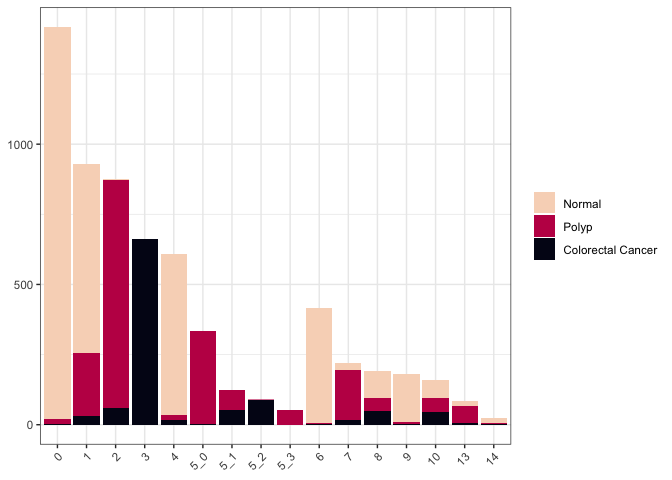
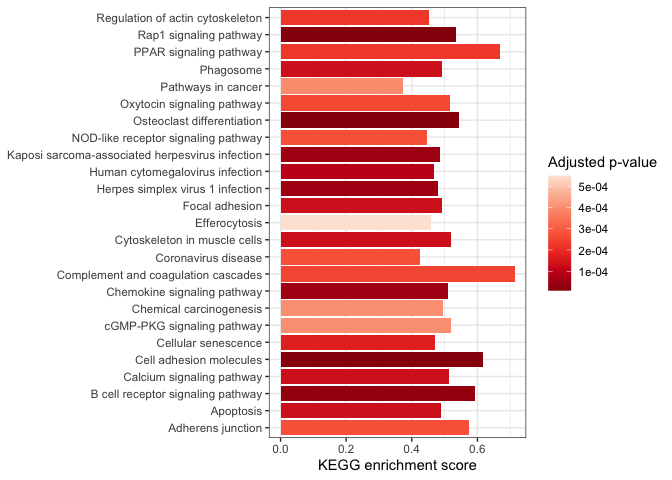
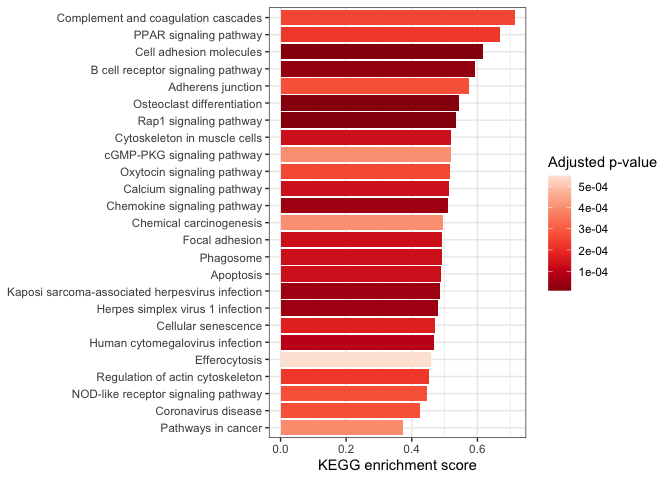
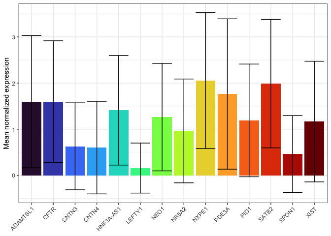
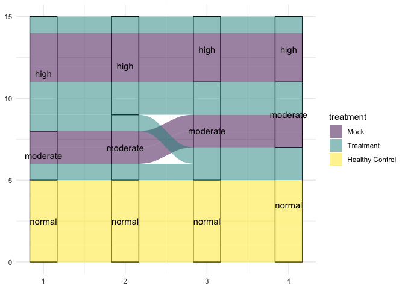

# Introduction to bar, column, alluvial, and chord plots

Bar and column charts are among the simplest visualizations available; a
rectangular area represents the relationship between a categorical value
and a quantitative one. The related alluvial diagram adds an additional
layer of complexity by overlaying connections between the bars. A chord
diagram is very similar to an alluvial diagram, but circularized.

## Bar chart

A bar chart is useful for displaying count data. The independent
variable is categorical, and the dependent variable (the bar’s height)
corresponds to the number of observations within each category.

## Column chart

A column chart is simply a more flexible bar chart. Column height may
represent data points, rather than counts.

## Alluvial diagram

Alluvial diagrams allow the display of one data point’s value across
several categorical variables, with each column representing a single
variable. All columns have the same height, and each is partitioned
(using fill) to display the frequency of values for the corresponding
variable. Ribbons connecting each column to the next reveal
relationships between categorical variables.

## Chord diagram

A chord diagram is effectively an alluvial diagram on polar coordinates.
It shares the characteristic flow indicator ribbons, but instead of a
horizontal axis, the “columns” are wrapped around a circle.

# Set up

## Packages

In addition to ggplot2, we will be using ggalluvial, which builds on
ggplot2 functions to create alluvial diagrams, and circlize, a package
design to bring [circos](https://circos.ca/)-style plots into R. The
tidyverse packages dplyr and tidyr are used to reshape data for ggplot2.

``` r
library(ggplot2)
library(dplyr)
library(tidyr)
library(ggalluvial)
library(circlize)
```

## Data

We will be using a few different data sources in this section.

``` r
# cluster membership data for bar chart
sc.data <- readRDS("scRNA_workshop-05.rds")@meta.data
sc.data$barcode <- rownames(sc.data)
sc.data$subcluster_ScType_filtered <- gsub("Unknown", NA, sc.data$subcluster_ScType_filtered)
sc.data <- sc.data[,c("barcode", "group", "Phase", "subcluster", "subcluster_ScType_filtered")]
# KEGG data for column chart
kegg <- read.csv("mouse_KEGG.csv")
# expression value data for column chart
expression.data <- as.matrix(readRDS("scRNA_workshop-05.rds")@assays$RNA$data)
markers <- c("SATB2", "NXPE1", "PDE3A", "CFTR", "HNF1A-AS1", "ADAMTSL1", "AC073050.1", "PID1", "NEO1", "XIST", "NR5A2", "AC019330.1", "CNTN4", "CNTN3", "SPON1", "LEFTY1")
markers <- markers[markers %in% rownames(expression.data)]
expression.data <- expression.data[markers,]
expression.df <- as.data.frame(t(expression.data))
expression.df$barcode <- rownames(expression.df)
expression.pivot <- pivot_longer(expression.df, names_to = "gene", values_to = "normalized.counts", cols = SATB2:LEFTY1)
rm(expression.data, markers, expression.df)
# treatment data for alluvial diagram
treatment.df <- read.csv("treatment.csv")
# VDJ data for chord diagrams
```

# Counting occurances with bar charts

Count-based data is the simplest and most straightforward application of
this type of chart.

``` r
ggplot(data = sc.data, mapping = aes(x = subcluster, fill = group)) +
  geom_bar() +
  scale_fill_viridis_d(option = "rocket", end = 0.95, direction = -1) +
  theme_bw() +
  theme(legend.title = element_blank(),
        axis.title = element_blank(),
        axis.text.x = element_text(angle = 45, hjust = 1))
```

<!-- -->

# Displaying numerical values with column charts

## A single value

Representing a single value with a column chart is simple, but there are
relatively few occasions in bioinformatics where this is the most useful
visualization style. When dealing with high-throughput data, it’s rare
to have a single observation of any variable.

One good application is as an alternative to dot plots in gene set
enrichment analyses.

``` r
kegg$short.description <- sapply(strsplit(kegg$Description, split = " - ", fixed = TRUE), "[[", 1L)

arrange(kegg, pvalue) %>%
  slice_head(n = 25) %>%
  ggplot(mapping = aes(x = short.description, y = enrichmentScore, fill = p.adjust)) +
  geom_col() +
  scale_fill_distiller(palette = "Reds") +
  labs(y = "KEGG enrichment score", fill = "Adjusted p-value") +
  coord_flip() +
  theme_bw() +
  theme(axis.title.y = element_blank())
```

<!-- --> By default,
ggplot2 arranges characters alphanumerically; our categorical axis is
arranged with “Adherens junction” at one end and “Regulation of actin
cytoskeleton” at the other. We can change the “short.description”
character vector to a factor to control the ordering (e.g. with the most
enriched pathway at the top).

``` r
kegg.small <- arrange(kegg, pvalue) %>%
  slice_head(n = 25)
kegg.small$short.description <- factor(kegg.small$short.description, levels = kegg.small$short.description[order(kegg.small$enrichmentScore, decreasing = FALSE)])

ggplot(data = kegg.small,
       mapping = aes(x = short.description,
                     y = enrichmentScore,
                     fill = p.adjust)) +
  geom_col() +
  scale_fill_distiller(palette = "Reds") +
  labs(y = "KEGG enrichment score", fill = "Adjusted p-value") +
  coord_flip() +
  theme_bw() +
  theme(axis.title.y = element_blank())
```

<!-- -->

## A computed value

Think carefully about the appropriateness of using column charts to
display a computed mean. In many cases a box or violin plot may be more
informative; these visualizations are designed to for comparing
distributions.

If the standard for your field is a column chart, or you have few enough
observations that a column chart is more readable than a box or violin
plot, make sure to add an indication of the variability of your data
(e.g. an error bar).

``` r
summarise(expression.pivot,
          .by = gene,
          mean = mean(normalized.counts),
          sd = sd(normalized.counts)) %>%
  ggplot(mapping = aes(x = gene, fill = gene)) +
  geom_col(mapping = aes(y = mean)) +
  geom_errorbar(mapping = aes(ymin = mean - sd, ymax = mean + sd)) +
  scale_fill_viridis_d(option = "turbo") +
  guides(fill = "none") +
  labs(y = "Mean normalized expression") +
  theme_bw() +
  theme(axis.title.x = element_blank(),
        axis.text.x = element_text(angle = 45, hjust = 1))
```

<!-- -->

# Connecting categorical values with alluvial diagrams

Alluvial diagrams are particularly useful for showing the transition of
data from one state to another over time.

``` r
treatment.df
```

    ##     X id treatment day_0 day_14 day_28 day_42
    ## 1   1  A         A  53.8   45.4   32.9   27.4
    ## 2   2  B         A  65.6   65.1   53.4   51.0
    ## 3   3  C         A  62.2   57.4   44.5   43.2
    ## 4   4  D         A  43.7   38.0   31.7   17.4
    ## 5   5  E         A  67.0   53.0   45.5   37.0
    ## 6   6  F         B  55.4   55.0   52.5   50.7
    ## 7   7  G         B  67.4   66.7   63.9   62.9
    ## 8   8  H         B  91.7   90.3   85.3   83.2
    ## 9   9  I         B  99.5   97.2   96.3   94.4
    ## 10 10  J         B  50.7   46.2   44.9   42.5
    ## 11 11  K   Control  45.5   47.4   49.6   49.8
    ## 12 12  L   Control  86.7   88.3   90.0   90.8
    ## 13 13  M   Control  97.0   97.8  100.4  102.5
    ## 14 14  N   Control  32.3   33.1   33.2   35.2
    ## 15 15  O   Control  93.0   95.2   96.8   98.4
    ## 16 16  P   Healthy  13.4   13.5   13.6   14.1
    ## 17 17  Q   Healthy  18.9   19.3   19.4   19.9
    ## 18 18  R   Healthy  20.9   21.3   21.7   21.9
    ## 19 19  S   Healthy  10.1   10.4   10.4   10.8
    ## 20 20  T   Healthy   0.9    1.1    1.3    1.5

``` r
treatment.df <- treatment.df[treatment.df$treatment != "B",]
treatment.categorical <- apply(treatment.df[,c("day_0", "day_14", "day_28", "day_42")], 2, function(x){
  ifelse(x > 50, "high", ifelse(x > 30, "moderate", "normal"))
})
treatment.categorical <- cbind(treatment.df[,c("id", "treatment")], treatment.categorical)
treatment.categorical$treatment <- gsub("Control", "Mock", treatment.categorical$treatment)
treatment.categorical$treatment <- gsub("Healthy", "Healthy Control", treatment.categorical$treatment)
treatment.categorical$treatment <- gsub("A", "Treatment", treatment.categorical$treatment)
treatment.categorical$treatment <- factor(treatment.categorical$treatment,
                                          levels = c("Mock", "Treatment", "Healthy Control"))

ggplot(data = treatment.categorical, mapping = aes(axis1 = day_0,
                                                   axis2 = day_14,
                                                   axis3 = day_28,
                                                   axis4 = day_42)) +
  geom_stratum() +
  geom_alluvium(aes(fill = treatment)) +
  geom_text(stat = "stratum", aes(label = paste(after_stat(stratum)))) +
  scale_fill_viridis_d() +
  theme_minimal()
```

<!-- -->

# Circularization

## Further uses for circos-style visualizations

# Prepare for the next section

``` r
download.file("https://raw.githubusercontent.com/ucdavis-bioinformatics-training/2025-August-Intermediate-Visualization-for-Bioinformatics/R/04-custom.Rmd")
sessionInfo()
```
