# Advanced and custom plots

In this section we will cover a number of unrelated types of plots that
require extensions to ggplot2 or different libraries. While many unique
visualizations exist, we have limited time to cover them in class and
have selected a few popular styles:

- Expression heat map
- Dendrogram
- TSS enrichment
- Genomic coverage

# Set up

## Packages

In addition to ggplot2, we will use the ggplot extension libraries
ggtree and ggcoverage as well as ComplexHeatmap, which uses a completely
different “grammar.” Seurat and Signac functions create wrappers around
ggplot2, and produce plot objects that can be further modified using
ggplot grammar.

``` r
library(ComplexHeatmap)
library(viridis)
library(ggplot2)
library(Signac)
library(Seurat)
library(ggtree)
library(ggcoverage)
```

## Data

We will be making use of a few different data sets in this section: one
for each of the plots.

``` r
# scRNA for heat map
sc.data <- read.csv("sc_data.csv")
# dendrogram data
download.file("https://raw.githubusercontent.com/GuangchuangYu/ggtree-current-protocols/refs/heads/master/mskcc.txt", "mskcc.txt")
tree.data <- read.delim("mskcc.txt", row.names = 1)
# ATAC-seq for TSS enrichment
# genomic coverage data
track.df <- LoadTrackFile(track.folder = system.file("extdata", "RNA-seq", package = "ggcoverage"),
              format = "bw",
              region = "chr14:21,677,306-21,737,601",
              extend = 2000,
              meta.info = read.csv(system.file("extdata", "RNA-seq", "meta_info.csv", package = "ggcoverage")))
gtf <- rtracklayer::import.gff(con = system.file("extdata", "used_hg19.gtf", package = "ggcoverage"), format = "gtf")
```

# Heat map

Heat maps use areas of color to display expression intensity for samples
across a number of markers. While it is possible to create heat maps
that display expression values for all genes, reading these plots
becomes difficult when the number of markers is much greater than 25-30.
For single cell or single nucleus experiments, the number of samples may
be in the tens or hundreds of thousands. In this case, the purpose of
the plot is to get a general overview, not assess expression in any
given sample, and the area corresponding to each cell or nucleus is very
small.

## Basic heat map

``` r
sc.mat <- as.matrix(sc.data[,5:18])
rownames(sc.mat) <- sc.data$cell
sc.mat <- t(sc.mat)
Heatmap(matrix = sc.mat,
        name = "normalized\ncounts")
```

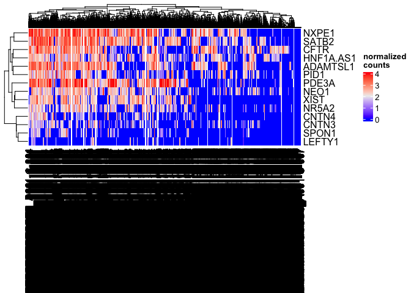<!-- -->

The column dendrogram and names are illegible; with more than six
thousand cells, the overlap between lines is extensive. The length of
the column names has also caused vertical compression of the heat map as
the plot area is reduced to accommodate the axis text.

``` r
Heatmap(matrix = sc.mat,
        name = "normalized\ncounts",
        show_column_dend = FALSE,
        show_column_names = FALSE)
```

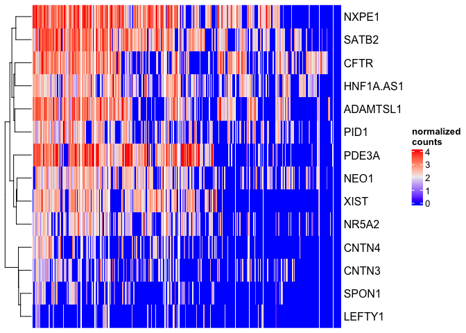<!-- -->

There are many excellent features in ComplexHeatmap that allow you to
tune the readability of your visualization and emphasize the findings of
the greatest importance.

## Annotated heat map

Having removed the cell names and dendrogram in pursuit of readability,
we now lack any information about the sample identity of the cells in
our heatmap. This can be added back in with a column annotation.

``` r
sc.data$subcluster_ScType_filtered <- gsub("Unknown", NA, sc.data$subcluster_ScType_filtered)
celltype.colors <- viridis(length(names(table(sc.data$subcluster_ScType_filtered))))
names(celltype.colors) <- names(table(sc.data$subcluster_ScType_filtered))
cluster.colors <- viridis(length(unique(sc.data$subcluster)), option = "turbo")
names(cluster.colors) <- unique(sc.data$subcluster)
top.anno <- columnAnnotation("cluster" = sc.data$subcluster,
                             "celltype" = sc.data$subcluster_ScType_filtered,
                             col = list("cluster" = cluster.colors,
                                        "celltype" = celltype.colors),
                             na_col = "gray90")
Heatmap(matrix = sc.mat,
        name = "normalized\ncounts",
        show_column_dend = FALSE,
        show_column_names = FALSE,
        top_annotation = top.anno)
```

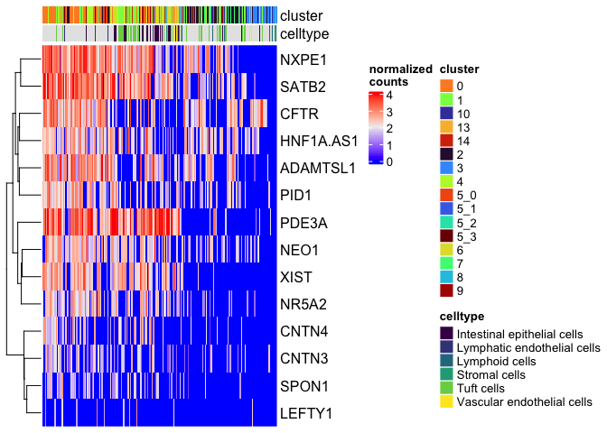<!-- -->

Since we have so many missing values in our cell type data, we may not
want to include that annotation.

## Split heat map

These heat maps can be divided into slices to group rows, columns, or
both. Heat maps can be split following variation in the data (using
k-means clustering), or by categorical values in the metadata.

### Split on k-means clustering

The code below demonstrates k-means clustering on the rows (markers) of
the heat map. K is provided by the user.

``` r
Heatmap(matrix = sc.mat,
        name = "normalized\ncounts",
        show_column_dend = FALSE,
        show_column_names = FALSE,
        top_annotation = top.anno,
        row_km = 3)
```

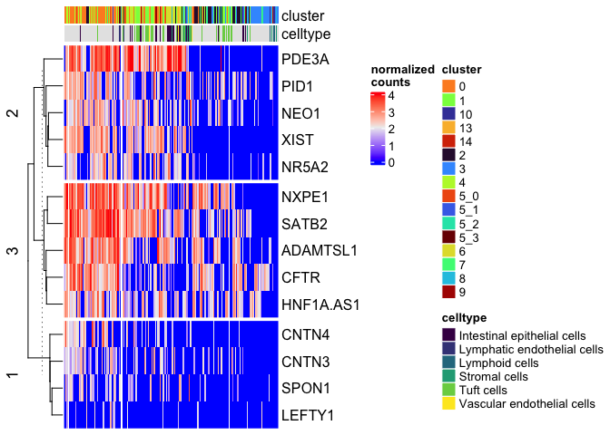<!-- -->

### Split on metadata

We can add a column split on the sub-cluster as well.

``` r
Heatmap(matrix = sc.mat,
        name = "normalized\ncounts",
        show_column_dend = FALSE,
        show_column_names = FALSE,
        top_annotation = top.anno,
        row_km = 3,
        column_split = sc.data$subcluster)
```

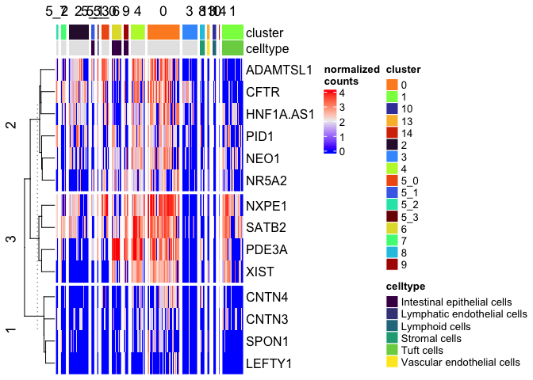<!-- -->

## Overriding default row and column ordering

The row and column order of the matrix can be set manually, as well.

``` r
Heatmap(matrix = sc.mat,
        name = "normalized\ncounts",
        show_column_dend = FALSE,
        show_column_names = FALSE,
        top_annotation = top.anno,
        row_order = sort(colnames(sc.data)[5:18]),
        column_split = sc.data$subcluster)
```

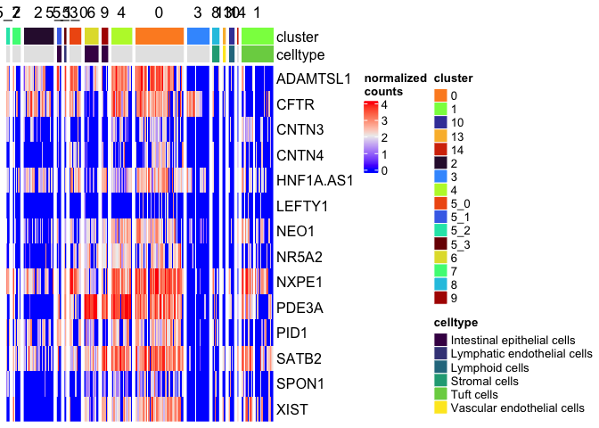<!-- -->

Let’s arrange the legends and labels to improve readability. We don’t
need a legend for the cluster identities, since the splits are labeled.
To simplify, I am also going to remove the “celltype” annotation, which
has many missing values.

``` r
Heatmap(matrix = sc.mat,
        name = "normalized\ncounts",
        show_column_dend = FALSE,
        show_column_names = FALSE,
        top_annotation = HeatmapAnnotation("cluster" = sc.data$subcluster,
                                           col = list("cluster" = cluster.colors),
                                           na_col = "gray90",
                                           show_legend = c("cluster" = FALSE)),
        row_order = sort(colnames(sc.data)[5:18]),
        column_split = sc.data$subcluster,
        column_title_gp = gpar(fontsize = 8),
        column_title_rot = 90)
```

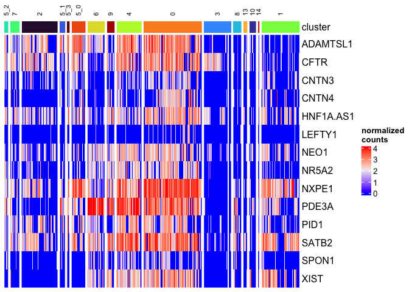<!-- -->

## … And so much more

ComplexHeatmap, is, as the name suggests a complex package with many,
many options to explore. If you don’t see the modification you’re
looking for here, take a look at the
[documentation](https://jokergoo.github.io/ComplexHeatmap-reference/book/).

# Dendrogram

Dendrograms diagram similarity. They may appear on the axes of heatmaps
and other visualizations (as we saw above), or on their own.

``` r
tree.distance <- as.dist(1 - cor(tree.data, method = "pearson"))
tree.clusters <- hclust(tree.distance, method = "ward.D")
```

``` r
p <- ggtree(tree.clusters) +
  layout_dendrogram() +
  geom_tiplab(hjust = 1) +
  theme_dendrogram()
p
```

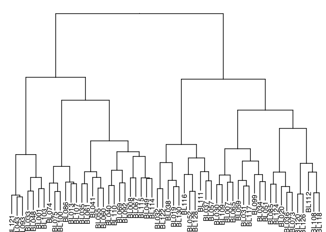<!-- -->

``` r
clusters <- cutree(tree.clusters, k = 2)
groupOTU(p, split(names(clusters), clusters), group_name = "Cluster") +
  aes(color = Cluster) +
  scale_color_manual(breaks = c(1, 2), values = c("goldenrod2", "deepskyblue3"))
```

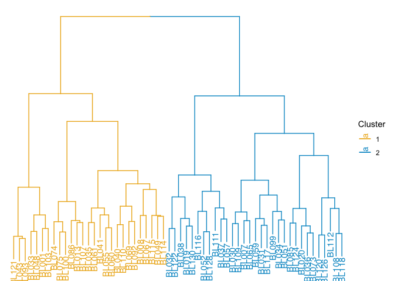<!-- -->

# TSS enrichment

A TSS enrichment plot is a very simple line-based visualization showing
the increase in coverage around the transcription start site in an
ATAC-Seq or other chromatin accessibility assay.

# Genomic coverage

Coverage plots allow visualization of counts-based data (RNA
transcripts, ChIP, etc) on a genomic coordinate system. Unlike the TSS
enrichment plot above, results are typically not aggregated across a
group of features of the same type, but instead displayed on unique
genomic ranges. These plots are frequently annotated with a cartoon
displaying features of interest and / or an ideogram showing the
chromosomal structure.

``` r
ggcoverage(data = track.df, plot.type = "joint", facet.key = "Type", group.key = "Type")
```

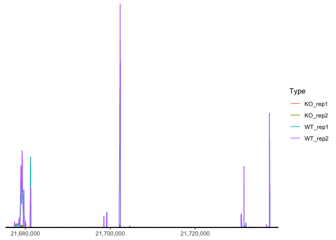<!-- -->

``` r
region <- data.frame(start = c(21678900, 21732001, 21737590),
                     end = c(21679900, 21732400, 21737650),
                     label = c("M1", "M2", "M3"))
ggcoverage(data = track.df, plot.type = "joint", facet.key = "Type", group.key = "Type", mark.region = region, range.position = "out")
```

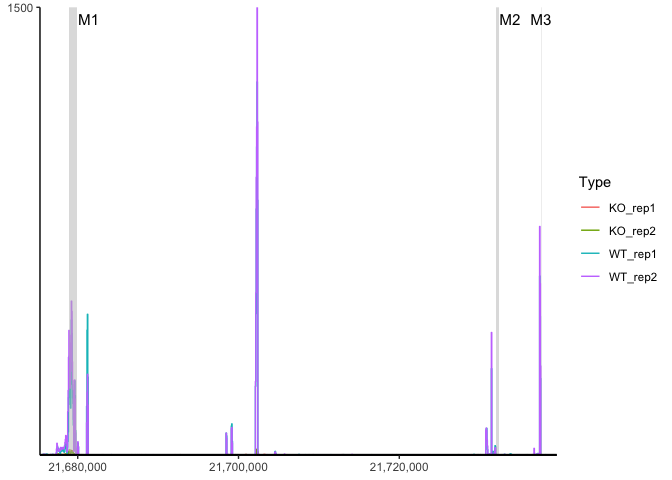<!-- -->

``` r
ggcoverage(data = track.df, plot.type = "joint", facet.key = "Type", group.key = "Type", mark.region = region, range.position = "out") +
  geom_gene(gtf.gr = gtf)
```

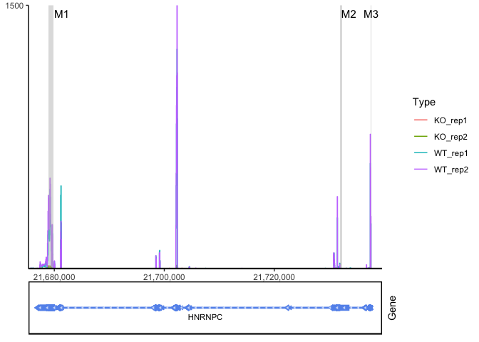<!-- -->

``` r
ggcoverage(data = track.df, plot.type = "facet", facet.key = "Type", group.key = "Type", mark.region = region, range.position = "out") +
  geom_gene(gtf.gr = gtf)
```

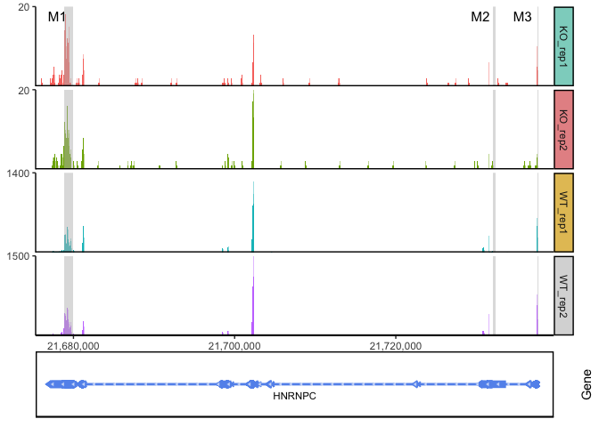<!-- -->

``` r
ggcoverage(data = track.df, plot.type = "facet", facet.key = "Type", group.key = "Type", mark.region = region, range.position = "out", facet.y.scale = "fixed") +
  geom_gene(gtf.gr = gtf)
```

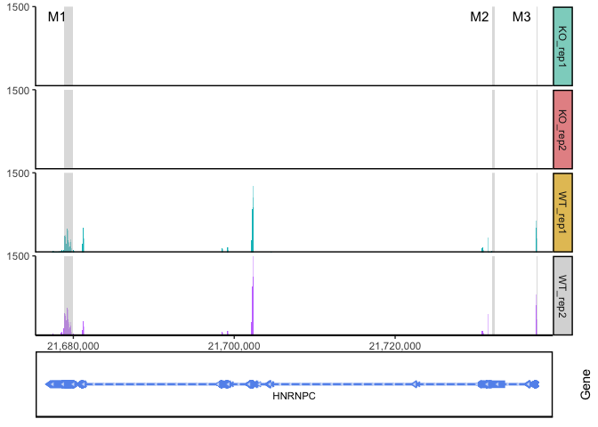<!-- -->

# Final thoughts

There are many types of visualizations we haven’t had the chance to
cover, and more visualizations are developed all the time. We hope that
what you’ve learned within this course will allow you to customize your
plots and figures to communicate your findings.

Here are a few things to think about as you choose how to present your
work using graphics:

- **Color** Make sure to choose colors that provide sufficient contrast
  between relevant data. Try to keep color palettes small; using a
  limited number of colors (typically no more than 12 within one figure)
  increases the readability of figures.

- **Size** Accurately estimating differences in area is difficult, so
  consider alternatives to pie charts and other area-based
  visualizations. Additionally, differences in size (e.g. of points)
  imply quantitative differences within the data; point size should not
  be mapped to a qualitative measure. Make sure that any plot elements
  are sized so that they are easily distinguishable. Ideally, they will
  be large enough to see clearly, but small enough to avoid extensive
  overlaps.

- **Redundancy** Each graphical attribute of a plot communicates
  information. When choosing which to use in any given figure, consider
  whether redundancy (e.g. using both point color and point shape to
  denote treatment group) increases clarity or introduces unnecessary
  complexity. Sometimes, using fewer aesthetics speeds reader
  comprehension.

- **Consistency** Maintain the order of categorical values on axes
  across figures. Any time a color palette is re-used within a
  publication, poster, or presentation, it should map to the same values
  to avoid confusion.

We hope this workshop has been helpful for you! Please email us at
<bioinformatics-training@ucdavis.edu> with any questions or comments
about the course or course materials, and alert us to any issues on
[GitHub](https://github.com/ucdavis-bioinformatics-training/2025-August-Intermediate-Visualization-for-Bioinformatics/issues).

``` r
sessionInfo()
```

    ## R version 4.5.1 (2025-06-13)
    ## Platform: aarch64-apple-darwin20
    ## Running under: macOS Monterey 12.4
    ## 
    ## Matrix products: default
    ## BLAS:   /Library/Frameworks/R.framework/Versions/4.5-arm64/Resources/lib/libRblas.0.dylib 
    ## LAPACK: /Library/Frameworks/R.framework/Versions/4.5-arm64/Resources/lib/libRlapack.dylib;  LAPACK version 3.12.1
    ## 
    ## locale:
    ## [1] en_US.UTF-8/en_US.UTF-8/en_US.UTF-8/C/en_US.UTF-8/en_US.UTF-8
    ## 
    ## time zone: America/Los_Angeles
    ## tzcode source: internal
    ## 
    ## attached base packages:
    ## [1] grid      stats     graphics  grDevices utils     datasets  methods  
    ## [8] base     
    ## 
    ## other attached packages:
    ##  [1] ggcoverage_1.4.1      ggtree_3.16.3         Seurat_5.3.0         
    ##  [4] SeuratObject_5.1.0    sp_2.2-0              Signac_1.14.0        
    ##  [7] ggplot2_3.5.2         viridis_0.6.5         viridisLite_0.4.2    
    ## [10] ComplexHeatmap_2.24.1
    ## 
    ## loaded via a namespace (and not attached):
    ##   [1] RcppAnnoy_0.0.22            splines_4.5.1              
    ##   [3] later_1.4.2                 BiocIO_1.18.0              
    ##   [5] bitops_1.0-9                ggplotify_0.1.2            
    ##   [7] tibble_3.3.0                polyclip_1.10-7            
    ##   [9] XML_3.99-0.18               fastDummies_1.7.5          
    ##  [11] lifecycle_1.0.4             doParallel_1.0.17          
    ##  [13] globals_0.18.0              lattice_0.22-7             
    ##  [15] MASS_7.3-65                 magrittr_2.0.3             
    ##  [17] plotly_4.11.0               rmarkdown_2.29             
    ##  [19] yaml_2.3.10                 httpuv_1.6.16              
    ##  [21] sctransform_0.4.2           spam_2.11-1                
    ##  [23] spatstat.sparse_3.1-0       reticulate_1.43.0          
    ##  [25] cowplot_1.2.0               pbapply_1.7-4              
    ##  [27] RColorBrewer_1.1-3          abind_1.4-8                
    ##  [29] Rtsne_0.17                  GenomicRanges_1.60.0       
    ##  [31] purrr_1.1.0                 RCurl_1.98-1.17            
    ##  [33] BiocGenerics_0.54.0         yulab.utils_0.2.0          
    ##  [35] circlize_0.4.16             GenomeInfoDbData_1.2.14    
    ##  [37] ggpattern_1.1.4             IRanges_2.42.0             
    ##  [39] S4Vectors_0.46.0            ggrepel_0.9.6              
    ##  [41] irlba_2.3.5.1               listenv_0.9.1              
    ##  [43] spatstat.utils_3.1-5        tidytree_0.4.6             
    ##  [45] goftest_1.2-3               RSpectra_0.16-2            
    ##  [47] spatstat.random_3.4-1       fitdistrplus_1.2-4         
    ##  [49] parallelly_1.45.1           DelayedArray_0.34.1        
    ##  [51] codetools_0.2-20            RcppRoll_0.3.1             
    ##  [53] tidyselect_1.2.1            shape_1.4.6.1              
    ##  [55] aplot_0.2.8                 UCSC.utils_1.4.0           
    ##  [57] farver_2.1.2                matrixStats_1.5.0          
    ##  [59] stats4_4.5.1                spatstat.explore_3.5-2     
    ##  [61] GenomicAlignments_1.44.0    jsonlite_2.0.0             
    ##  [63] GetoptLong_1.0.5            progressr_0.15.1           
    ##  [65] ggridges_0.5.6              survival_3.8-3             
    ##  [67] iterators_1.0.14            foreach_1.5.2              
    ##  [69] tools_4.5.1                 treeio_1.32.0              
    ##  [71] ica_1.0-3                   Rcpp_1.1.0                 
    ##  [73] glue_1.8.0                  SparseArray_1.8.1          
    ##  [75] gridExtra_2.3               xfun_0.52                  
    ##  [77] MatrixGenerics_1.20.0       GenomeInfoDb_1.44.1        
    ##  [79] dplyr_1.1.4                 withr_3.0.2                
    ##  [81] fastmap_1.2.0               ggh4x_0.3.1                
    ##  [83] digest_0.6.37               R6_2.6.1                   
    ##  [85] mime_0.13                   gridGraphics_0.5-1         
    ##  [87] colorspace_2.1-1            scattermore_1.2            
    ##  [89] tensor_1.5.1                spatstat.data_3.1-6        
    ##  [91] tidyr_1.3.1                 generics_0.1.4             
    ##  [93] data.table_1.17.8           rtracklayer_1.68.0         
    ##  [95] httr_1.4.7                  htmlwidgets_1.6.4          
    ##  [97] S4Arrays_1.8.1              uwot_0.2.3                 
    ##  [99] pkgconfig_2.0.3             gtable_0.3.6               
    ## [101] lmtest_0.9-40               XVector_0.48.0             
    ## [103] htmltools_0.5.8.1           dotCall64_1.2              
    ## [105] clue_0.3-66                 scales_1.4.0               
    ## [107] Biobase_2.68.0              png_0.1-8                  
    ## [109] spatstat.univar_3.1-4       ggfun_0.2.0                
    ## [111] knitr_1.50                  rstudioapi_0.17.1          
    ## [113] reshape2_1.4.4              rjson_0.2.23               
    ## [115] curl_6.4.0                  nlme_3.1-168               
    ## [117] zoo_1.8-14                  GlobalOptions_0.1.2        
    ## [119] stringr_1.5.1               KernSmooth_2.23-26         
    ## [121] parallel_4.5.1              miniUI_0.1.2               
    ## [123] restfulr_0.0.16             pillar_1.11.0              
    ## [125] vctrs_0.6.5                 RANN_2.6.2                 
    ## [127] promises_1.3.3              xtable_1.8-4               
    ## [129] cluster_2.1.8.1             evaluate_1.0.4             
    ## [131] cli_3.6.5                   compiler_4.5.1             
    ## [133] Rsamtools_2.24.0            rlang_1.1.6                
    ## [135] crayon_1.5.3                future.apply_1.20.0        
    ## [137] labeling_0.4.3              plyr_1.8.9                 
    ## [139] fs_1.6.6                    stringi_1.8.7              
    ## [141] deldir_2.0-4                BiocParallel_1.42.1        
    ## [143] Biostrings_2.76.0           lazyeval_0.2.2             
    ## [145] spatstat.geom_3.5-0         Matrix_1.7-3               
    ## [147] RcppHNSW_0.6.0              patchwork_1.3.1            
    ## [149] future_1.67.0               shiny_1.11.1               
    ## [151] SummarizedExperiment_1.38.1 ROCR_1.0-11                
    ## [153] igraph_2.1.4                fastmatch_1.1-6            
    ## [155] ape_5.8-1
