#### BASE R GRAPHICS

First let’s download some data to work with and take a look at it:

``` r
counts = read.delim("https://raw.githubusercontent.com/ucdavis-bioinformatics-training/2025-August-Intermediate-Visualization-for-Bioinformatics/refs/heads/master/R/raw_counts.txt", header=T)
head(counts)
```

    ##            C61  C62  C63  C64  C91  C92  C93 C94 I561 I562 I563 I564 I591 I592
    ## AT1G01010  322  346  256  396  372  506  361 342  638  488  440  479  770  430
    ## AT1G01020  149   87  162  144  189  169  147 108  163  141  119  147  182  156
    ## AT1G01030   15   32   35   22   24   33   21  35   18    8   54   35   23    8
    ## AT1G01040  687  469  568  651  885  978  794 862  799  769  725  715  811  567
    ## AT1G01046    1    1    5    4    5    3    0   2    4    3    1    0    2    8
    ## AT1G01050 1447 1032 1083 1204 1413 1484 1138 938 1247 1516  984 1044 1374 1355
    ##           I593 I594 I861 I862 I863 I864 I891 I892 I893 I894
    ## AT1G01010  656  467  143  453  429  206  567  458  520  474
    ## AT1G01020  153  177   43  144  114   50  161  195  157  144
    ## AT1G01030   16   24   42   17   22   39   26   28   39   30
    ## AT1G01040  831  694  345  575  605  404  735  651  725  591
    ## AT1G01046    8    1    0    4    0    3    5    7    0    5
    ## AT1G01050 1437 1577  412 1338 1051  621 1434 1552 1248 1186

Let’s start with a simple plot with axis labels:

``` r
plot(counts[,"C61"], counts[,"C62"], xlab="C61", ylab="C62")
```

<!-- -->

Let’s add a x=y line:

``` r
plot(counts[,"C61"], counts[,"C62"], xlab="C61", ylab="C62")
abline(0,1)
```

<!-- -->

Change the plotting character:

``` r
plot(counts[,"C61"], counts[,"C62"], xlab="C61", ylab="C62", pch=23)
abline(0,1)
```

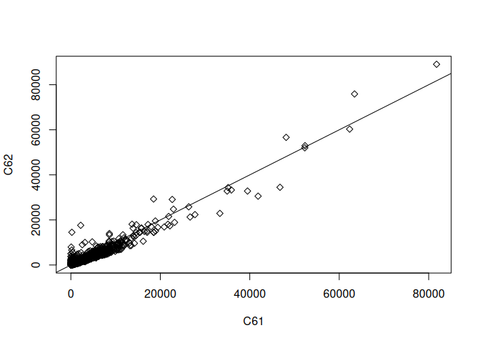<!-- -->

Create your own axes:

``` r
plot(counts[,"C61"], counts[,"C62"], xlab="C61", ylab="C62", pch=23, axes=F)
axis(1, at=seq(0,80000,by=10000))
axis(2, at=seq(0,100000,by=10000))
```

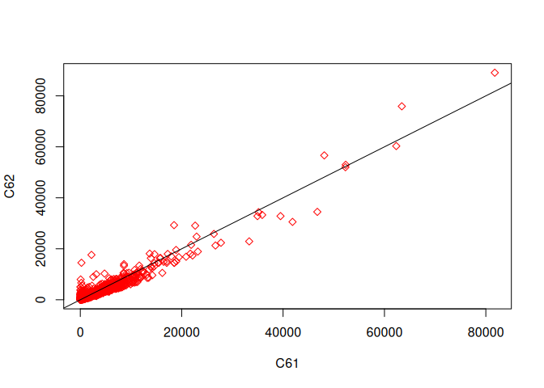<!-- -->

Add color to various things:

``` r
plot(counts[,"C61"], counts[,"C62"], xlab="C61", ylab="C62", pch=23, axes=F, col="red")
axis(1, at=seq(0,80000,by=10000), col="blue", col.ticks="orange", col.axis="green")
axis(2, at=seq(0,100000,by=10000), col="blue", col.ticks="orange", col.axis="green")
```

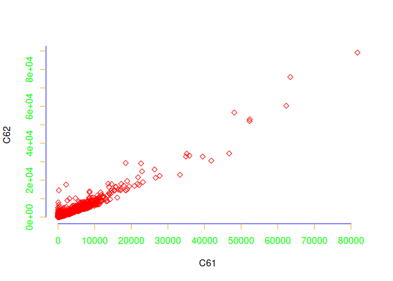<!-- -->

Specify the ticks in a different way:

``` r
# xaxp=c(start,end,number of intervals)
plot(counts[,"C61"], counts[,"C62"], xlab="C61", ylab="C62", 
     xaxp=c(0,80000,4), 
     yaxp=c(0,100000,4))
```

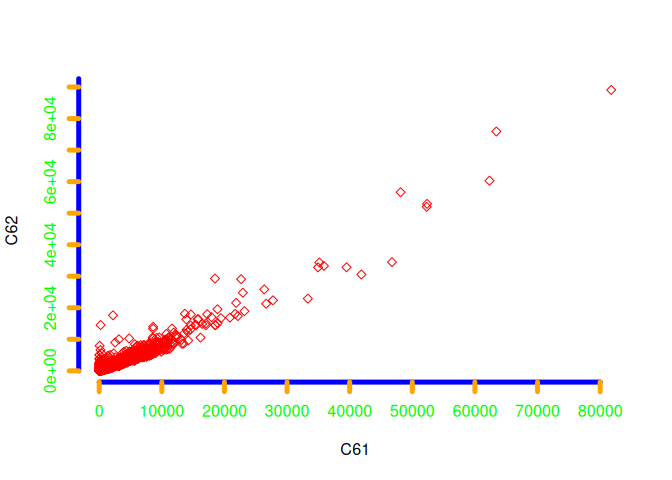<!-- -->

Now, a simple boxplot:

``` r
boxplot(counts)
```

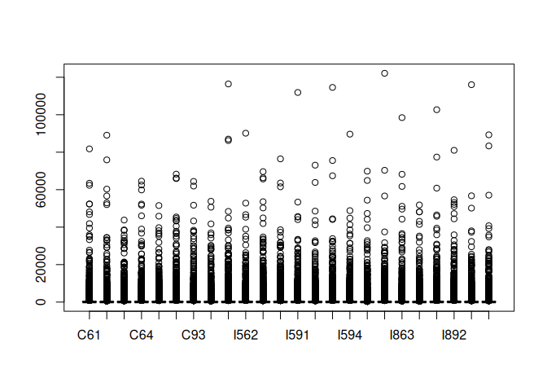<!-- -->

Let’s create a smaller dataset to work with, add some factor data, and
then use the melt function to change the shape of our data:

``` r
library(reshape2)
tc = as.data.frame(t(counts))
regions = c(rep("region1",6), rep("region2",6), rep("region3",6), rep("region4",6))
tc2 = tc[,1:6]
tc2$regions = regions
tcm = melt(tc2)
```

    ## Using regions as id variables

``` r
head(tcm)
```

    ##   regions  variable value
    ## 1 region1 AT1G01010   322
    ## 2 region1 AT1G01010   346
    ## 3 region1 AT1G01010   256
    ## 4 region1 AT1G01010   396
    ## 5 region1 AT1G01010   372
    ## 6 region1 AT1G01010   506

Now create a boxplot with colors and with the data separated by region:

``` r
cols <- c("red", "blue", "orange", "green")
boxplot(value ~ regions, data=tcm, col = cols, xlab="GeneIDs", ylab="Counts")
```

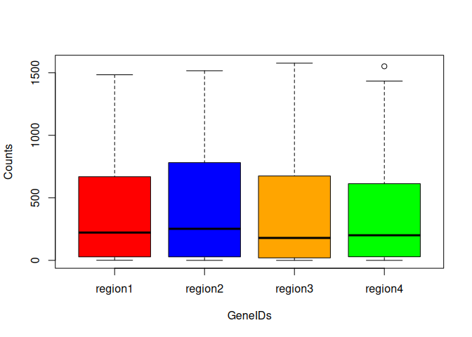<!-- -->

Something a little more complicated. Boxplots of regions vs. values, but
separated by variable (GeneIDs):

``` r
boxplot(value ~ regions + variable, data=tcm, col = cols, xaxt="n", yaxt="n", xlab="GeneIDs", ylab="Counts")
# use the par function to get the dimensions of the plot
xlen = par("usr")[2]
axis(side=1, labels=colnames(tc2)[1:6], at=seq(2,xlen-2,length.out=6), cex.axis=0.7)
axis(side=2, las=2)
# add a legend
legend("topleft", fill=cols, legend=unique(regions))
```

<!-- -->

Boxplot for a single gene, separated by regions:

``` r
tc3 = data.frame(AT1G01010=tc$AT1G01010, regions=regions)
rownames(tc3) = rownames(tc)
boxplot(AT1G01010 ~ regions, data=tc3)
```

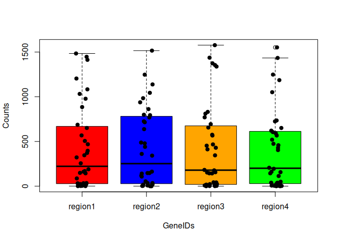<!-- -->

xyplot (bivariate scatterplot) of count data, separated by GeneID:

``` r
library(lattice)
xyplot(value ~ variable, data=tcm, scales=list(rot=90), xlab="GeneIDs", ylab="Counts")
```

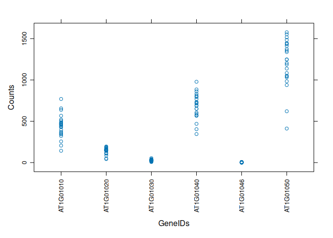<!-- -->

Same xyplot, but also separated by regions:

``` r
xyplot(value ~ variable | regions, data=tcm, scales=list(rot=90), xlab="GeneIDs", ylab="Counts")
```

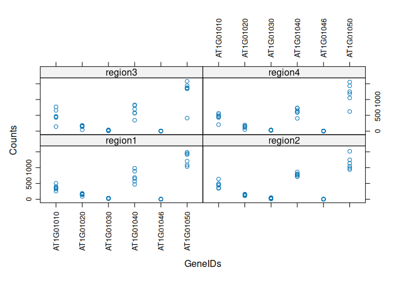<!-- -->

Same xyplot but with both GeneIDs and regions:

``` r
xyplot(value ~ variable + regions, data=tcm, scales=list(rot=90), xlab="GeneIDs", ylab="Counts")
```

<!-- -->

Boxplot for each GeneID in one plot:

``` r
boxplot(value ~ variable, data = tcm, las=2, ylab="Counts", xlab="")
```

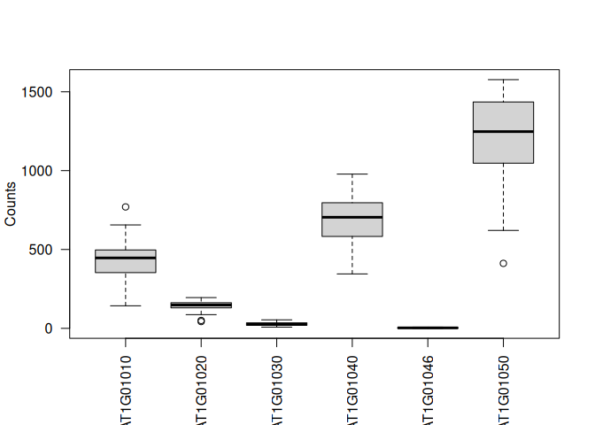<!-- -->

Now, the same boxplot but separating by GeneIDs and regions together:

``` r
# need to change the margins of the plot to fit the labels
par(mar = c(10, 5, 2, 0))
boxplot(value ~ variable * regions, data = tcm, las=2, ylab="Counts", xlab="")
# use mtext to create an x-axis label above the graph
mtext("GeneID:Region", side = 3, line = 1)
```

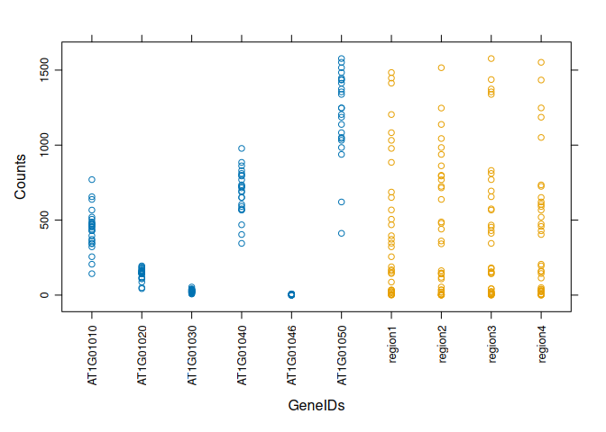<!-- -->

Simple histogram:

``` r
hist(counts[,"C61"], xlab="Counts")
```

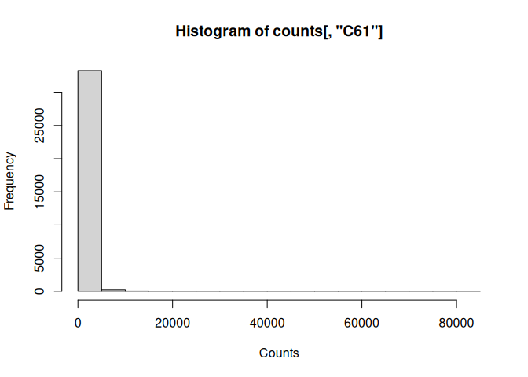<!-- -->

Refine the histogram:

``` r
hist(counts[,"C61"], xlab="Counts", breaks=1000, xlim=c(0,3000))
```

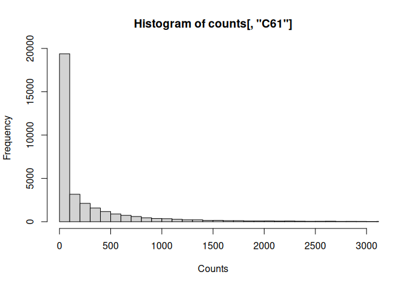<!-- -->

## VISUALIZATION CHALLENGE

Download the gapminder dataset to your Rstudio session using the
following URL:

<https://github.com/ucdavis-bioinformatics-training/2025-August-Intermediate-Visualization-for-Bioinformatics/raw/main/R/gapminder.csv>

Take a look at the dataset. Subset the data to only look at rows from
1982. Then make a scatterplot of gdp vs life exp (using the plot
function) of the subset, adding x and y labels. Find out how to log
scale the x axis from the “plot.default” documentation.

Next, make a named vector of colors with the names being the continents.
Use the vector to add colors to each point based on the continent for
that point. You may need to look at the “col” section in the
“plot.default” documentation. You can also use the “colors()” function
to get a list of all of the available colors. Add a legend to the plot
showing which colors correspond to which continent.

Finally, create a function that takes in a numeric vector and a minimum
and maximum circle size. Within the function, take the square root of
the vector, then use the min-max normalization method to normalize each
element of the vector. Once you have normalized data, use those values
to scale between the minimum and maximum circle size. Use this function
to change the size of the circles to correspond to the population of the
country using the “cex” parameter for the scatter plot.
